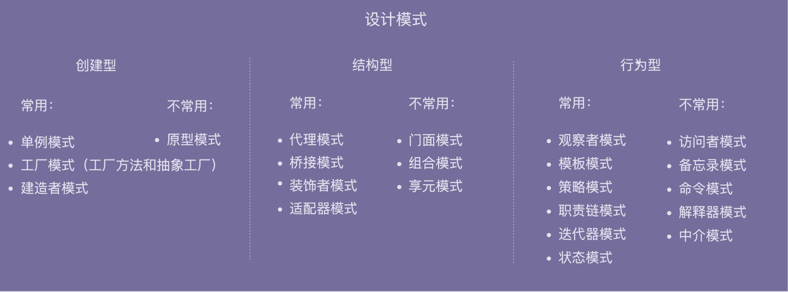

## Code Quality
1. Clarify
2. Core objects
3. Use cases and test cases
4. Classes and relations
  - 功能相近在同一个类中
  - relations: 一个类改动很少导致另一个类改动
    - Generalization + Realization
    - Dependency
      - Association: Aggregation + Composition

5. Correctness
6. Document
  - class and function: what, why, and how


### OOP
1. encapsulation: to control how to access (get and set) and hide details
  - Collections.unmodifiableList
  - avoid global variable and method as much as possible
2. abstraction: to hide details of implementation and only expose what to do
3. inheritance: is-a, to increase reusability
  - review interface and abstract class
  - if inheritance relations among classes will not change frequently, and there are few horizontally and vertically, can use
4. polymorphism

### Principle
#### SOLID
* Single Responsibility Principle
* Open Closed Principle: open for extension , but closed for modification
  - abstract changable codes
* Liskov Substitution Principle: functions that use references to base classes must be able to use objects of derived classes without knowing it
  - respect the contract: what to do, input, output, exception
* Interface Segregation Principle: clients should not be forced to depend upon interfaces that they do not use  
* Dependency Inversion Principle: High-level modules shouldn’t depend on low-level modules. Both modules should depend on abstractions.
  - Program to interface, if there may be multiple implementation ways
  - 调用者属于高层，被调用者属于低层。

#### 多用组合少用继承
  * change is-a to has-a to avoid too many layers of inheritance

#### KISS and YAGNI
* don't write features that we don't need now
* don't introduce a dependency that we don't need now
* don't recreate a wheel
* colleagues can understand
* don't optimize non-bottleneck

#### DRY
* 功能重复、代码执行重复，而非实现重复

#### Modularity
* 业务逻辑与非业务逻辑分离
  - AOP

#### Law of Demeter: The Least Knowledge Principle
* 避免依赖不该依赖的模块，有依赖关系的类只依赖必要的接口

#### Layer
* 通用代码下沉

#### Reusability
* 第一次编写代码不用考虑复用性，第二次使用时重构
* what to do, input, output, exception

#### Testability
* 避免未决行为


### Design Pattern: Create

#### Singleton
* create and provide only one instance by itself
* implementation
    - private constructor
    - private static reference to object
    - public static method to create and get. Need to consider whether to add lock
* type
    - hungry: Instantiate when loading the class; thread-safe
    - lazy: instantiate when using; not thread-safe
      ```java
      //懒汉式：类内实例对象创建时并不直接初始化，直到第一次调用get方法时，才完成初始化操作
      //时间换空间

      public class IdGenerator {
        private AtomicLong id = new AtomicLong(0);
        private static IdGenerator instance;
        private IdGenerator() {}

        // add lock 并发度很低
        public static synchronized IdGenerator getInstance() {
          if (instance == null) {
            instance = new IdGenerator();
          }
          return instance;
        }
        public long getId() {
          return id.incrementAndGet();
        }
      }
      ```
    - double checked locking
      ```java
      public class IdGenerator {
        private AtomicLong id = new AtomicLong(0);
        private static IdGenerator instance;
        private IdGenerator() {}
        public static IdGenerator getInstance() {
          if (instance == null) {
            synchronized(IdGenerator.class) { // 此处为类级别的锁
              if (instance == null) {
                instance = new IdGenerator();
              }
            }
          }
          return instance;
        }
        public long getId() {
          return id.incrementAndGet();
        }
      }
      ```  
    - 静态内部类: 类似饿汉式，但又能做到了延迟加载
      ```java

        public class IdGenerator {
          private AtomicLong id = new AtomicLong(0);
          private IdGenerator() {}

          // static class intance created when getInstance() is called
          private static class SingletonHolder {
            private static final IdGenerator instance = new IdGenerator();
          }

          public static IdGenerator getInstance() {
            return SingletonHolder.instance;
          }

          public long getId() {
            return id.incrementAndGet();
          }
        }
      ```  
    - 枚举
      ```java

        public enum IdGenerator {
          INSTANCE;
          private AtomicLong id = new AtomicLong(0);

          public long getId() {
            return id.incrementAndGet();
          }
        }
      ```
* con
  - 违背了基于接口而非实现的设计原则，难以继承
  - 会隐藏类之间的依赖关系
  - 如果未来某一天，我们需要在代码中创建两个实例或多个实例，那就要对代码有比较大的改动
  - 对代码的可测试性不友好：单例类这种硬编码式的使用方式，导致无法实现 mock 替换。
  - 不支持有参数的构造函数
* 解决不支持有参数的构造函数的问题
  ```java

  public class Config {
    public static final int PARAM_A = 123;
    public static final int PARAM_B = 245;
  }

  public class Singleton {
    private static Singleton instance = null;
    private final int paramA;
    private final int paramB;

    private Singleton() {
      this.paramA = Config.PARAM_A;
      this.paramB = Config.PARAM_B;
    }

    public synchronized static Singleton getInstance() {
      if (instance == null) {
        instance = new Singleton();
      }
      return instance;
    }
  }
  ```  
* 解决隐藏类之间的依赖关系的问题
  ```java

  // 1. 老的使用方式
  public demofunction() {
    //...
    long id = IdGenerator.getInstance().getId();
    //...
  }

  // 2. 新的使用方式：依赖注入
  public demofunction(IdGenerator idGenerator) {
    long id = idGenerator.getId();
  }
  // 外部调用demofunction()的时候，传入idGenerator
  IdGenerator idGenerator = IdGenerator.getInsance();
  demofunction(idGenerator);
  ```

#### Factory
* when to use
  - 隔离复杂性：封装复杂的创建逻辑，调用者无需了解如何创建对象。
  - 控制复杂度：将创建代码抽离出来，让原本的函数或类职责更单一，代码更简洁。
  - 封装变化：创建逻辑有可能变化
  - 代码复用：创建代码抽离到独立的工厂类之后可以复用。


##### Simple Factory / Static Factory Method Pattern
* 当每个对象的创建逻辑都比较简单的时候，使用简单工厂模式
  ```java

  public class RuleConfigSource {
    public RuleConfig load(String ruleConfigFilePath) {
      String ruleConfigFileExtension = getFileExtension(ruleConfigFilePath);
      IRuleConfigParser parser = RuleConfigParserFactory.createParser(ruleConfigFileExtension);
      if (parser == null) {
        throw new InvalidRuleConfigException(
                "Rule config file format is not supported: " + ruleConfigFilePath);
      }

      String configText = "";
      //从ruleConfigFilePath文件中读取配置文本到configText中
      RuleConfig ruleConfig = parser.parse(configText);
      return ruleConfig;
    }

    private String getFileExtension(String filePath) {
      //...解析文件名获取扩展名，比如rule.json，返回json
      return "json";
    }
  }

  public class RuleConfigParserFactory {
    public static IRuleConfigParser createParser(String configFormat) {
      IRuleConfigParser parser = null;
      if ("json".equalsIgnoreCase(configFormat)) {
        parser = new JsonRuleConfigParser();
      } else if ("xml".equalsIgnoreCase(configFormat)) {
        parser = new XmlRuleConfigParser();
      } else if ("yaml".equalsIgnoreCase(configFormat)) {
        parser = new YamlRuleConfigParser();
      } else if ("properties".equalsIgnoreCase(configFormat)) {
        parser = new PropertiesRuleConfigParser();
      }
      return parser;
    }
  }
  ```

  ```java

  public class RuleConfigParserFactory {
    private static final Map<String, RuleConfigParser> cachedParsers = new HashMap<>();

    static {
      cachedParsers.put("json", new JsonRuleConfigParser());
      cachedParsers.put("xml", new XmlRuleConfigParser());
      cachedParsers.put("yaml", new YamlRuleConfigParser());
      cachedParsers.put("properties", new PropertiesRuleConfigParser());
    }

    public static IRuleConfigParser createParser(String configFormat) {
      if (configFormat == null || configFormat.isEmpty()) {
        return null;//返回null还是IllegalArgumentException全凭你自己说了算
      }
      IRuleConfigParser parser = cachedParsers.get(configFormat.toLowerCase());
      return parser;
    }
  }
  ```
##### Factory Method
  * 如果我们非得要将 if 分支逻辑去掉，那该怎么办呢？比较经典处理方法就是利用多态. 工厂方法模式比起简单工厂模式更加符合开闭原则. 当对象的创建逻辑比较复杂，不只是简单的 new 一下就可以，而是要组合其他类对象，做各种初始化操作的时候，我们推荐使用工厂方法模式，将复杂的创建逻辑拆分到多个工厂类中，让每个工厂类都不至于过于复杂。而使用简单工厂模式，将所有的创建逻辑都放到一个工厂类中，会导致这个工厂类变得很复杂。
  ```java

  public interface IRuleConfigParserFactory {
    IRuleConfigParser createParser();
  }

  public class JsonRuleConfigParserFactory implements IRuleConfigParserFactory {
    @Override
    public IRuleConfigParser createParser() {
      return new JsonRuleConfigParser();
    }
  }

  public class XmlRuleConfigParserFactory implements IRuleConfigParserFactory {
    @Override
    public IRuleConfigParser createParser() {
      return new XmlRuleConfigParser();
    }
  }

  public class YamlRuleConfigParserFactory implements IRuleConfigParserFactory {
    @Override
    public IRuleConfigParser createParser() {
      return new YamlRuleConfigParser();
    }
  }

  public class PropertiesRuleConfigParserFactory implements IRuleConfigParserFactory {
    @Override
    public IRuleConfigParser createParser() {
      return new PropertiesRuleConfigParser();
    }
  }
  ```


  ```java

  public class RuleConfigSource {
    public RuleConfig load(String ruleConfigFilePath) {
      String ruleConfigFileExtension = getFileExtension(ruleConfigFilePath);

      IRuleConfigParserFactory parserFactory = RuleConfigParserFactoryMap.getParserFactory(ruleConfigFileExtension);
      if (parserFactory == null) {
        throw new InvalidRuleConfigException("Rule config file format is not supported: " + ruleConfigFilePath);
      }
      IRuleConfigParser parser = parserFactory.createParser();

      String configText = "";
      //从ruleConfigFilePath文件中读取配置文本到configText中
      RuleConfig ruleConfig = parser.parse(configText);
      return ruleConfig;
    }

    private String getFileExtension(String filePath) {
      //...解析文件名获取扩展名，比如rule.json，返回json
      return "json";
    }
  }

  //因为工厂类只包含方法，不包含成员变量，完全可以复用，
  //不需要每次都创建新的工厂类对象，所以，简单工厂模式的第二种实现思路更加合适。
  public class RuleConfigParserFactoryMap { //工厂的工厂
    private static final Map<String, IRuleConfigParserFactory> cachedFactories = new HashMap<>();

    static {
      cachedFactories.put("json", new JsonRuleConfigParserFactory());
      cachedFactories.put("xml", new XmlRuleConfigParserFactory());
      cachedFactories.put("yaml", new YamlRuleConfigParserFactory());
      cachedFactories.put("properties", new PropertiesRuleConfigParserFactory());
    }

    public static IRuleConfigParserFactory getParserFactory(String type) {
      if (type == null || type.isEmpty()) {
        return null;
      }
      IRuleConfigParserFactory parserFactory = cachedFactories.get(type.toLowerCase());
      return parserFactory;
    }
  }
  ```


* 当每个对象的创建逻辑都比较复杂的时候，为了避免设计一个过于庞大的简单工厂类，使用工厂方法模式，将创建逻辑拆分得更细，每个对象的创建逻辑独立到各自的工厂类中

##### Abstract Factory
  * not used frequently
  ```java

  针对规则配置的解析器：基于接口IRuleConfigParser
  JsonRuleConfigParser
  XmlRuleConfigParser
  YamlRuleConfigParser
  PropertiesRuleConfigParser

  针对系统配置的解析器：基于接口ISystemConfigParser
  JsonSystemConfigParser
  XmlSystemConfigParser
  YamlSystemConfigParser
  PropertiesSystemConfigParser
  ```
  针对这种特殊的场景，如果还是继续用工厂方法来实现的话，我们要针对每个 parser 都编写一个工厂类，也就是要编写 8 个工厂类。如果我们未来还需要增加针对业务配置的解析器（比如 IBizConfigParser），那就要再对应地增加 4 个工厂类。而我们知道，过多的类也会让系统难维护。这个问题该怎么解决呢？抽象工厂就是针对这种非常特殊的场景而诞生的。我们可以让一个工厂负责创建多个不同类型的对象（IRuleConfigParser、ISystemConfigParser 等），而不是只创建一种 parser 对象。这样就可以有效地减少工厂类的个数。具体的代码实现如下所示：
  ```java

  public interface IConfigParserFactory {
    IRuleConfigParser createRuleParser();
    ISystemConfigParser createSystemParser();
    //此处可以扩展新的parser类型，比如IBizConfigParser
  }

  public class JsonConfigParserFactory implements IConfigParserFactory {
    @Override
    public IRuleConfigParser createRuleParser() {
      return new JsonRuleConfigParser();
    }

    @Override
    public ISystemConfigParser createSystemParser() {
      return new JsonSystemConfigParser();
    }
  }

  public class XmlConfigParserFactory implements IConfigParserFactory {
    @Override
    public IRuleConfigParser createRuleParser() {
      return new XmlRuleConfigParser();
    }

    @Override
    public ISystemConfigParser createSystemParser() {
      return new XmlSystemConfigParser();
    }
  }

  // 省略YamlConfigParserFactory和PropertiesConfigParserFactory代码
  ```
#### Builder
* 创建一种类型的复杂对象，通过设置不同的可选参数，“定制化”地创建不同的对象
* When to use
  - 如果必填的属性有很多：若把这些必填属性放到构造函数中设置，构造函数参数列表太长；若把必填属性通过 set() 方法设置，无法校验这些必填属性是否已经填写。
  - 如果类的属性之间有依赖关系，使用构造函数配合 set()  的方法，无法校验约束条件。
  - 如果希望对象在创建好之后不能再修改属性值，就不能暴露 并使用set() 方法。

* Example
  校验逻辑放置到 Builder 类中，先创建建造者，并且通过 set() 方法设置建造者的变量值，然后在使用 build() 方法真正创建对象之前，做集中的校验，校验通过之后才会创建对象。除此之外，我们把 ResourcePoolConfig 的构造函数改为 private 私有权限。这样我们就只能通过建造者来创建 ResourcePoolConfig 类对象。并且，ResourcePoolConfig 没有提供任何 set() 方法，这样我们创建出来的对象就是不可变对象了。
  ```java

    public class ResourcePoolConfig {
      private String name;
      private int maxTotal;
      private int maxIdle;
      private int minIdle;

      private ResourcePoolConfig(Builder builder) {
        this.name = builder.name;
        this.maxTotal = builder.maxTotal;
        this.maxIdle = builder.maxIdle;
        this.minIdle = builder.minIdle;
      }
      //...省略getter方法...

      //我们将Builder类设计成了ResourcePoolConfig的内部类。
      //我们也可以将Builder类设计成独立的非内部类ResourcePoolConfigBuilder。
      public static class Builder {
        private static final int DEFAULT_MAX_TOTAL = 8;
        private static final int DEFAULT_MAX_IDLE = 8;
        private static final int DEFAULT_MIN_IDLE = 0;

        private String name;
        private int maxTotal = DEFAULT_MAX_TOTAL;
        private int maxIdle = DEFAULT_MAX_IDLE;
        private int minIdle = DEFAULT_MIN_IDLE;

        public ResourcePoolConfig build() {
          // 校验逻辑放到这里来做，包括必填项校验、依赖关系校验、约束条件校验等
          if (StringUtils.isBlank(name)) {
            throw new IllegalArgumentException("...");
          }
          if (maxIdle > maxTotal) {
            throw new IllegalArgumentException("...");
          }
          if (minIdle > maxTotal || minIdle > maxIdle) {
            throw new IllegalArgumentException("...");
          }

          return new ResourcePoolConfig(this);
        }

        public Builder setName(String name) {
          if (StringUtils.isBlank(name)) {
            throw new IllegalArgumentException("...");
          }
          this.name = name;
          return this;
        }

        public Builder setMaxTotal(int maxTotal) {
          if (maxTotal <= 0) {
            throw new IllegalArgumentException("...");
          }
          this.maxTotal = maxTotal;
          return this;
        }

        public Builder setMaxIdle(int maxIdle) {
          if (maxIdle < 0) {
            throw new IllegalArgumentException("...");
          }
          this.maxIdle = maxIdle;
          return this;
        }

        public Builder setMinIdle(int minIdle) {
          if (minIdle < 0) {
            throw new IllegalArgumentException("...");
          }
          this.minIdle = minIdle;
          return this;
        }
      }
    }

    // 这段代码会抛出IllegalArgumentException，因为minIdle>maxIdle
    ResourcePoolConfig config = new ResourcePoolConfig.Builder()
            .setName("dbconnectionpool")
            .setMaxTotal(16)
            .setMaxIdle(10)
            .setMinIdle(12)
            .build();
    ```

#### Prototype
* not frequently used
* creating is expensive and instances are similar
* ways
  - shallow clone, deep clone, shallow clone + deep clone

### Design Pattern: Structure
#### Proxy
* 在不改变原始类，通过引入代理类来给原始类附加功能。
  -

* Types
  UserController 类只负责业务功能。代理类 UserControllerProxy 负责在业务代码执行前后附加其他逻辑代码，并通过委托的方式调用原始类来执行业务代码
  - 代理类和原始类实现相同接口
    ```java

    public interface IUserController {
      UserVo login(String telephone, String password);
      UserVo register(String telephone, String password);
    }

    public class UserController implements IUserController {
      //...省略其他属性和方法...

      @Override
      public UserVo login(String telephone, String password) {
        //...省略login逻辑...
        //...返回UserVo数据...
      }

      @Override
      public UserVo register(String telephone, String password) {
        //...省略register逻辑...
        //...返回UserVo数据...
      }
    }

    public class UserControllerProxy implements IUserController {
      private MetricsCollector metricsCollector;
      private UserController userController;

      public UserControllerProxy(UserController userController) {
        this.userController = userController;
        this.metricsCollector = new MetricsCollector();
      }

      @Override
      public UserVo login(String telephone, String password) {
        long startTimestamp = System.currentTimeMillis();

        // 委托
        UserVo userVo = userController.login(telephone, password);

        long endTimeStamp = System.currentTimeMillis();
        long responseTime = endTimeStamp - startTimestamp;
        RequestInfo requestInfo = new RequestInfo("login", responseTime, startTimestamp);
        metricsCollector.recordRequest(requestInfo);

        return userVo;
      }

      @Override
      public UserVo register(String telephone, String password) {
        long startTimestamp = System.currentTimeMillis();

        UserVo userVo = userController.register(telephone, password);

        long endTimeStamp = System.currentTimeMillis();
        long responseTime = endTimeStamp - startTimestamp;
        RequestInfo requestInfo = new RequestInfo("register", responseTime, startTimestamp);
        metricsCollector.recordRequest(requestInfo);

        return userVo;
      }
    }

    //UserControllerProxy使用举例
    //因为原始类和代理类实现相同的接口，是基于接口而非实现编程
    //将UserController类对象替换为UserControllerProxy类对象，不需要改动太多代码
    IUserController userController = new UserControllerProxy(new UserController());
    ```
  - 代理类继承原始类  
    ```java

    public class UserControllerProxy extends UserController {
      private MetricsCollector metricsCollector;

      public UserControllerProxy() {
        this.metricsCollector = new MetricsCollector();
      }

      public UserVo login(String telephone, String password) {
        long startTimestamp = System.currentTimeMillis();

        UserVo userVo = super.login(telephone, password);

        long endTimeStamp = System.currentTimeMillis();
        long responseTime = endTimeStamp - startTimestamp;
        RequestInfo requestInfo = new RequestInfo("login", responseTime, startTimestamp);
        metricsCollector.recordRequest(requestInfo);

        return userVo;
      }

      public UserVo register(String telephone, String password) {
        long startTimestamp = System.currentTimeMillis();

        UserVo userVo = super.register(telephone, password);

        long endTimeStamp = System.currentTimeMillis();
        long responseTime = endTimeStamp - startTimestamp;
        RequestInfo requestInfo = new RequestInfo("register", responseTime, startTimestamp);
        metricsCollector.recordRequest(requestInfo);

        return userVo;
      }
    }
    //UserControllerProxy使用举例
    UserController userController = new UserControllerProxy();  
    ```
  - dynamic proxy

    ```java

    public class MetricsCollectorProxy {
      private MetricsCollector metricsCollector;

      public MetricsCollectorProxy() {
        this.metricsCollector = new MetricsCollector();
      }

      public Object createProxy(Object proxiedObject) {
        Class<?>[] interfaces = proxiedObject.getClass().getInterfaces();
        DynamicProxyHandler handler = new DynamicProxyHandler(proxiedObject);
        return Proxy.newProxyInstance(proxiedObject.getClass().getClassLoader(), interfaces, handler);
      }

      private class DynamicProxyHandler implements InvocationHandler {
        private Object proxiedObject;

        public DynamicProxyHandler(Object proxiedObject) {
          this.proxiedObject = proxiedObject;
        }

        @Override
        public Object invoke(Object proxy, Method method, Object[] args) throws Throwable {
          long startTimestamp = System.currentTimeMillis();
          Object result = method.invoke(proxiedObject, args);
          long endTimeStamp = System.currentTimeMillis();
          long responseTime = endTimeStamp - startTimestamp;
          String apiName = proxiedObject.getClass().getName() + ":" + method.getName();
          RequestInfo requestInfo = new RequestInfo(apiName, responseTime, startTimestamp);
          metricsCollector.recordRequest(requestInfo);
          return result;
        }
      }
    }

    //MetricsCollectorProxy使用举例
    MetricsCollectorProxy proxy = new MetricsCollectorProxy();
    IUserController userController = (IUserController) proxy.createProxy(new UserController());  
    ```
#### Bridge
* 组合优于继承，有一个骨架代码，业务逻辑委派给具体的library。例如JDBC委派给MySQL Driver
```java

public interface MsgSender {
  void send(String message);
}

public class TelephoneMsgSender implements MsgSender {
  private List<String> telephones;

  public TelephoneMsgSender(List<String> telephones) {
    this.telephones = telephones;
  }

  @Override
  public void send(String message) {
    //...
  }

}

public class EmailMsgSender implements MsgSender {
  // 与TelephoneMsgSender代码结构类似，所以省略...
}

public class WechatMsgSender implements MsgSender {
  // 与TelephoneMsgSender代码结构类似，所以省略...
}

public abstract class Notification {
  protected MsgSender msgSender;

  public Notification(MsgSender msgSender) {
    this.msgSender = msgSender;
  }

  public abstract void notify(String message);
}

public class SevereNotification extends Notification {
  public SevereNotification(MsgSender msgSender) {
    super(msgSender);
  }

  @Override
  public void notify(String message) {
    msgSender.send(message);
  }
}

public class UrgencyNotification extends Notification {
  // 与SevereNotification代码结构类似，所以省略...
}
public class NormalNotification extends Notification {
  // 与SevereNotification代码结构类似，所以省略...
}
public class TrivialNotification extends Notification {
  // 与SevereNotification代码结构类似，所以省略...
}
```

#### Decorator
* 组合关系；装饰器类和原始类继承同样的父类，这样我们可以对原始类嵌套多个装饰器类；附加的是跟原始类相关的增强功能
```
// 代理模式的代码结构(下面的接口也可以替换成抽象类)
public interface IA {
  void f();
}
public class A impelements IA {
  public void f() { //... }
}
public class AProxy implements IA {
  private IA a;
  public AProxy(IA a) {
    this.a = a;
  }

  public void f() {
    // 新添加的代理逻辑
    a.f();
    // 新添加的代理逻辑
  }
}

// 装饰器模式的代码结构(下面的接口也可以替换成抽象类)
public interface IA {
  void f();
}
public class A implements IA {
  public void f() { //... }
}
public class ADecorator implements IA {
  private IA a;
  public ADecorator(IA a) {
    this.a = a;
  }

  public void f() {
    // 功能增强代码
    a.f();
    // 功能增强代码
  }
}
```


#### Adapter
* 它将不兼容的接口转换为可兼容的接口。类适配器使用继承关系来实现，对象适配器使用组合关系来实现
  - 统一多个类的接口设计
    ```java

    public class ASensitiveWordsFilter { // A敏感词过滤系统提供的接口
      //text是原始文本，函数输出用***替换敏感词之后的文本
      public String filterSexyWords(String text) {
        // ...
      }

      public String filterPoliticalWords(String text) {
        // ...
      }
    }

    public class BSensitiveWordsFilter  { // B敏感词过滤系统提供的接口
      public String filter(String text) {
        //...
      }
    }

    public class CSensitiveWordsFilter { // C敏感词过滤系统提供的接口
      public String filter(String text, String mask) {
        //...
      }
    }

    // 未使用适配器模式之前的代码：代码的可测试性、扩展性不好
    public class RiskManagement {
      private ASensitiveWordsFilter aFilter = new ASensitiveWordsFilter();
      private BSensitiveWordsFilter bFilter = new BSensitiveWordsFilter();
      private CSensitiveWordsFilter cFilter = new CSensitiveWordsFilter();

      public String filterSensitiveWords(String text) {
        String maskedText = aFilter.filterSexyWords(text);
        maskedText = aFilter.filterPoliticalWords(maskedText);
        maskedText = bFilter.filter(maskedText);
        maskedText = cFilter.filter(maskedText, "***");
        return maskedText;
      }
    }

    // 使用适配器模式进行改造
    public interface ISensitiveWordsFilter { // 统一接口定义
      String filter(String text);
    }

    public class ASensitiveWordsFilterAdaptor implements ISensitiveWordsFilter {
      private ASensitiveWordsFilter aFilter;
      public String filter(String text) {
        String maskedText = aFilter.filterSexyWords(text);
        maskedText = aFilter.filterPoliticalWords(maskedText);
        return maskedText;
      }
    }
    //...省略BSensitiveWordsFilterAdaptor、CSensitiveWordsFilterAdaptor...

    // 扩展性更好，更加符合开闭原则，如果添加一个新的敏感词过滤系统，
    // 这个类完全不需要改动；而且基于接口而非实现编程，代码的可测试性更好。
    public class RiskManagement {
      private List<ISensitiveWordsFilter> filters = new ArrayList<>();

      public void addSensitiveWordsFilter(ISensitiveWordsFilter filter) {
        filters.add(filter);
      }

      public String filterSensitiveWords(String text) {
        String maskedText = text;
        for (ISensitiveWordsFilter filter : filters) {
          maskedText = filter.filter(maskedText);
        }
        return maskedText;
      }
    }    
    ```
  - 假设我们依赖的外部系统在接口设计方面有缺陷（比如包含大量静态方法），引入之后会影响到我们自身代码的可测试性。为了隔离设计上的缺陷，我们希望对外部系统提供的接口进行二次封装，抽象出更好的接口设计，这个时候就可以使用适配器模式了。
    ```

    public class CD { //这个类来自外部sdk，我们无权修改它的代码
      //...
      public static void staticFunction1() { //... }

      public void uglyNamingFunction2() { //... }

      public void tooManyParamsFunction3(int paramA, int paramB, ...) { //... }

       public void lowPerformanceFunction4() { //... }
    }

    // 使用适配器模式进行重构
    public interface ITarget {
      void function1();
      void function2();
      void fucntion3(ParamsWrapperDefinition paramsWrapper);
      void function4();
      //...
    }
    // 注意：适配器类的命名不一定非得末尾带Adaptor
    public class CDAdaptor extends CD implements ITarget {
      //...
      public void function1() {
         super.staticFunction1();
      }

      public void function2() {
        super.uglyNamingFucntion2();
      }

      public void function3(ParamsWrapperDefinition paramsWrapper) {
         super.tooManyParamsFunction3(paramsWrapper.getParamA(), ...);
      }

      public void function4() {
        //...reimplement it...
      }
    }
    ```
  - 替换依赖的外部系统
    ```
    // 外部系统A
    public interface IA {
      //...
      void fa();
    }
    public class A implements IA {
      //...
      public void fa() { //... }
    }
    // 在我们的项目中，外部系统A的使用示例
    public class Demo {
      private IA a;
      public Demo(IA a) {
        this.a = a;
      }
      //...
    }
    Demo d = new Demo(new A());

    // 将外部系统A替换成外部系统B
    public class BAdaptor implemnts IA {
      private B b;
      public BAdaptor(B b) {
        this.b= b;
      }
      public void fa() {
        //...
        b.fb();
      }
    }
    // 借助BAdaptor，Demo的代码中，调用IA接口的地方都无需改动，
    // 只需要将BAdaptor如下注入到Demo即可。
    Demo d = new Demo(new BAdaptor(new B()));
    ```
  - 在做版本升级的时候，对于一些要废弃的接口，我们不直接将其删除，而是暂时保留，并且标注为 deprecated，并将内部实现逻辑委托为新的接口实现。
    ```java

    public class Collections {
      public static Emueration emumeration(final Collection c) {
        return new Enumeration() {
          Iterator i = c.iterator();

          public boolean hasMoreElments() {
            return i.hashNext();
          }

          public Object nextElement() {
            return i.next():
          }
        }
      }
    }    
    ```
  - 适配不同格式的数据
    ```java
      List stooges = Arrays.asList("Larry", "Moe", "Curly");
    ```  
* 如果 Adaptee 接口并不多，那两种实现方式都可以。
* 如果 Adaptee 接口很多，而且 Adaptee 和 ITarget 接口定义大部分都相同，那我们推荐使用类适配器，因为 Adaptor 复用父类 Adaptee 的接口，比起对象适配器的实现方式，Adaptor 的代码量要少一些。
* 如果 Adaptee 接口很多，而且 Adaptee 和 ITarget 接口定义大部分都不相同，那我们推荐使用对象适配器，因为组合结构相对于继承更加灵活。
```
  // 类适配器: 基于继承
  public interface ITarget {
    void f1();
    void f2();
    void fc();
  }

  public class Adaptee {
    public void fa() { //... }
    public void fb() { //... }
    public void fc() { //... }
  }

  public class Adaptor extends Adaptee implements ITarget {
    public void f1() {
      super.fa();
    }

    public void f2() {
      //...重新实现f2()...
    }

    // 这里fc()不需要实现，直接继承自Adaptee，这是跟对象适配器最大的不同点
  }

  // 对象适配器：基于组合
  public interface ITarget {
    void f1();
    void f2();
    void fc();
  }

  public class Adaptee {
    public void fa() { //... }
    public void fb() { //... }
    public void fc() { //... }
  }

  public class Adaptor implements ITarget {
    private Adaptee adaptee;

    public Adaptor(Adaptee adaptee) {
      this.adaptee = adaptee;
    }

    public void f1() {
      adaptee.fa(); //委托给Adaptee
    }

    public void f2() {
      //...重新实现f2()...
    }

    public void fc() {
      adaptee.fc();
    }
  }
```

### Design Pattern: Behavior
* 类或对象之间的交互
#### Observer
* Define a one-to-many dependency between objects so that when one object changes state, all its dependents are notified and updated automatically
```java

public interface Subject {
  void registerObserver(Observer observer);
  void removeObserver(Observer observer);
  void notifyObservers(Message message);
}

public interface Observer {
  void update(Message message);
}

public class ConcreteSubject implements Subject {
  private List<Observer> observers = new ArrayList<Observer>();

  @Override
  public void registerObserver(Observer observer) {
    observers.add(observer);
  }

  @Override
  public void removeObserver(Observer observer) {
    observers.remove(observer);
  }

  @Override
  public void notifyObservers(Message message) {
    for (Observer observer : observers) {
      observer.update(message);
    }
  }

}

public class ConcreteObserverOne implements Observer {
  @Override
  public void update(Message message) {
    //TODO: 获取消息通知，执行自己的逻辑...
    System.out.println("ConcreteObserverOne is notified.");
  }
}

public class ConcreteObserverTwo implements Observer {
  @Override
  public void update(Message message) {
    //TODO: 获取消息通知，执行自己的逻辑...
    System.out.println("ConcreteObserverTwo is notified.");
  }
}

public class Demo {
  public static void main(String[] args) {
    ConcreteSubject subject = new ConcreteSubject();
    subject.registerObserver(new ConcreteObserverOne());
    subject.registerObserver(new ConcreteObserverTwo());
    subject.notifyObservers(new Message());
  }
}
```

### Other
* naming consistency  
* sorting
  - sort imported packaging alphabetically
  - static to normal
  - high level to low level
  - public, protected, private
