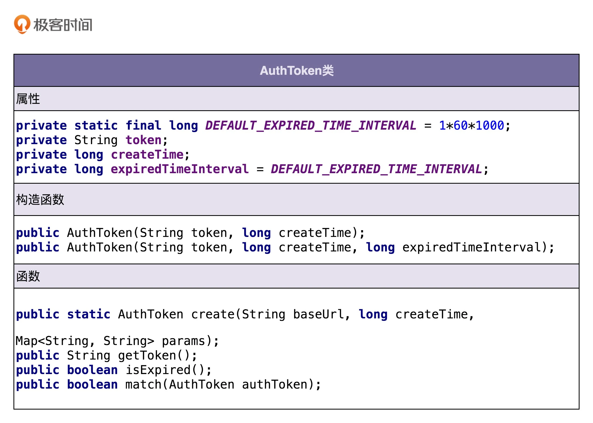

## Ability
What:
1. 简历：履历、学历、项目
2. 正确 + 写代码快 + 性能 + 质量
3. 架构、高可用、高并发、分布式
4. 沟通能力、公司贡献
How:
1. 编程语言，数据结构和算法，设计思想、原则和模式
2. 想想如何用
3. 如果要想在技术上形成壁垒，我们就要从事一些有技术难度、技术挑战的岗位，比如基础架构、中间件、数据库等偏底层的开发，又或者是人工智能算法等入行门槛比较高的细分领域。

## Code Quality
* maintainability: quickly update without bugs
  - well layered
  - modularity, high cohesion loose coupling
  - well-documented
  - interface-oriented programming
  - OOP: encapsulation, abstraction
* readability
* extensibility: open close principle
* simplicity
* reusability
  - inheritance and polymorphism
  - SRP
  - high cohesion loose coupling
  - modularity
* testability
// todo

## Paradigm
* Process-oriented programming: a process is a unit, featuring separation of data structures and methods.
* Object-oriented programming: based on class and object. Data structures and methods are in a class.   
* Functional programming


### OOP
#### Four features

* encapsulation: control how to access (get and set) and hide details

* abstraction: hide details of implementation and only expose what to do
   - may use `interface`, `abstract`, or function
   - when naming a function, avoid implementation details. E.g. `getPictureUrl()` is better than `getAWSPictureUrl()` is bad, in case later we change AWS to something else
   - to increase maintainability and extensibility

* inheritance: is-a, e.g. dog is an animal
  - Java: a class can only extend a superclass rater than multiple superclasses
  - if there are too many inheritance layers, maintainability and readability suffer

* polymorphism: a subclass can replace a superclass
  - override
  - to increase extensibility and reusability

#### Compared to Process-oriented Programming
pros:
* complex application, not linear but like a network
* modularity
* four features
* think like a human

#### Fake OOP
* add unnecessary getter and setter
* the getter returns an object, which may be modified unintendedly. Can use `Collections.unmodifiableList()`

```java
public class ShoppingCart {
  // ...other codes...
  public List<ShoppingCartItem> getItems() {
    return Collections.unmodifiableList(this.items);
  }
}

public class UnmodifiableList<E> extends UnmodifiableCollection<E> implements List<E> {
  public boolean add(E e) {
    throw new UnsupportedOperationException();
  }
  public void clear() {
    throw new UnsupportedOperationException();
  }
  // ...other codes...
}

ShoppingCart cart = new ShoppingCart();
List<ShoppingCartItem> items = cart.getItems();
items.clear();//will throw UnsupportedOperationException
```

* global variable and method
  - singleton
  - static attribute
  - static method: used to manipulate static attribute or data outside
  - constant: can put config attributes in a class `Constants`

##### POP example: Constants

```Jave
public class Constants {
  public static final String MYSQL_ADDR_KEY = "mysql_addr";
  public static final String MYSQL_DB_NAME_KEY = "db_name";
  public static final String MYSQL_USERNAME_KEY = "mysql_username";
  public static final String MYSQL_PASSWORD_KEY = "mysql_password";

  public static final String REDIS_DEFAULT_ADDR = "192.168.7.2:7234";
  public static final int REDIS_DEFAULT_MAX_TOTAL = 50;
  public static final int REDIS_DEFAULT_MAX_IDLE = 50;
  public static final int REDIS_DEFAULT_MIN_IDLE = 20;
  public static final String REDIS_DEFAULT_KEY_PREFIX = "rt:";

}
```

Using a single Constants may be bad because:
 - when there are too many lines, hard to find one and may conflict with others
 - long compilation time. Each time `Constants` is changed, other classes depend on that will be compiled again. When the project is large and we need to do unit test, it will take long.
 - reusability. If we need to use only some variables in  `Constants` in another project, we have to import the whole file, which is a waste.

 How to improve?
 - method 1: Break down  `Constants` into `MysqlConstants`, `RedisConstants`, etc
 - method 2: put constant in the class that uses it. E.g.  `RedisConfig` class

##### POP example: Utils
Class A and class B use the same methods. To avoid repetition, we put it in `XxxUtils`. Use static methods.

##### POP example: VO/BO/Entity and Controller/Service/Repository
* Anemic Demain Model: separation of data and logic
  - Entity and Repository
  - BO and Service
  - VO and Controller
* Rich Demain Model: data and logic are in the same class. Service layer includes service classes and domain classes (similar to BO). 贫血模式重Service轻BO，充血模式轻Service重Domain。适合业务复杂，improve reusability.

#### Interface vs Abstract Class
##### Abstract Class
* is-a
* 抽象类不允许被实例化，只能被继承
* 抽象类可以包含属性和方法。方法既可以包含代码实现（比如 Logger 中的 log() 方法），也可以不包含代码实现（比如 Logger 中的 doLog() 方法）。不包含代码实现的方法叫作抽象方法。
* 子类继承抽象类，必须实现抽象类中的所有抽象方法。
##### interface
* has a, contract
* 接口不能包含属性（也就是成员变量）。
* 接口只能声明方法，方法不能包含代码实现。
* 类实现接口的时候，必须实现接口中声明的所有方法。

#### Program to interface
* Program to an interface, not an implementation
* because when requirements change, implementation will change
* 如果在我们的业务场景中，某个功能只有一种实现方式，未来也不可能被其他实现方式替换，那我们就没有必要为其设计接口


#### 多用组合少用继承
* Why: too many layers of inheritance -> hurt maintainability
* change "is a" to "has a"
* Con: 继承改写成组合意味着要做更细粒度的类的拆分. 如果类之间的继承结构稳定（不会轻易改变），继承层次比较浅（比如，最多有两层继承关系），继承关系不复杂，我们就可以大胆地使用继承

  ```

  public interface Flyable {
    void fly()；
  }
  public class FlyAbility implements Flyable {
    @Override
    public void fly() { //... }
  }
  //省略Tweetable/TweetAbility/EggLayable/EggLayAbility

  public class Ostrich implements Tweetable, EggLayable {//鸵鸟
    private TweetAbility tweetAbility = new TweetAbility(); //组合
    private EggLayAbility eggLayAbility = new EggLayAbility(); //组合
    //... 省略其他属性和方法...
    @Override
    public void tweet() {
      tweetAbility.tweet(); // 委托
    }
    @Override
    public void layEgg() {
      eggLayAbility.layEgg(); // 委托
    }
  }
  ```

#### Example：接口鉴权的面向对象分析
* 调用方进行接口请求的时候，将 URL、AppID、密码、时间戳拼接在一起，通过加密算法生成 token，并且将 token、AppID、时间戳拼接在 URL 中，一并发送到微服务端。
* 微服务端在接收到调用方的接口请求之后，从请求中拆解出 token、AppID、时间戳。
* 微服务端首先检查传递过来的时间戳跟当前时间，是否在 token 失效时间窗口内。如果已经超过失效时间，那就算接口调用鉴权失败，拒绝接口调用请求。
* 如果 token 验证没有过期失效，微服务端再从自己的存储中，取出 AppID 对应的密码，通过同样的 token 生成算法，生成另外一个 token，与调用方传递过来的 token 进行匹配；如果一致，则鉴权成功，允许接口调用，否则就拒绝接口调用。

##### 划分职责进而识别出有哪些类
* method 1:把需求描述中的名词罗列出来，作为可能的候选类，然后再进行筛选
* method 2 (better):根据需求描述，把其中涉及的功能点，一个一个罗列出来，然后再去看哪些功能点职责相近，操作同样的属性，是否应该归为同一个类
  * Example: 功能点
    - 把 URL、AppID、密码、时间戳拼接为一个字符串；
    - 对字符串通过加密算法加密生成 token；
    - 将 token、AppID、时间戳拼接到 URL 中，形成新的 URL；
    - 解析 URL，得到 token、AppID、时间戳等信息；
    - 从存储中取出 AppID 和对应的密码；
    - 根据时间戳判断 token 是否过期失效；
    - 验证两个 token 是否匹配；

  * 从上面的功能列表中，我们发现，1、2、6、7 都是跟 token 有关，负责 token 的生成、验证；3、4 都是在处理 URL，负责 URL 的拼接、解析；5 是操作   AppID 和密码，负责从存储中读取 AppID 和密码。所以，我们可以粗略地得到三个核心的类：AuthToken、Url、CredentialStorage。AuthToken 负责实现 1、2、6、7 这四个操作；Url 负责 3、4 两个操作；CredentialStorage 负责 5 这个操作。

##### 定义类及其属性和方法



##### 定义类与类之间的交互关系
* Generalization: 继承
* Realization: implement
* Aggregation: A 类对象包含 B 类对象，B 类对象的生命周期可以不依赖 A 类对象的生命周期，也就是说可以单独销毁 A 类对象而不影响 B 对象
* Composition: A 类对象包含 B 类对象，B 类对象的生命周期依赖 A 类对象的生命周期，B 类对象不可单独存在，比如鸟与翅膀之间的关系
* Association: 包含聚合、组合两种关系。 如果 B 类对象是 A 类的成员变量，那 B 类和 A 类就是关联关系
* Dependency: 包含关联关系。不管是 B 类对象是 A 类对象的成员变量，还是 A 类的方法使用 B 类对象作为参数或者返回值、局部变量，只要 B 类对象和 A 类对象有任何使用关系，我们都称它们有依赖关系。
* 下文中，只要 B 类对象是 A 类对象的成员变量，那我们就称，A 类跟 B 类是组合关系。

```java

public interface ApiAuthenticator {
  void auth(String url);
  void auth(ApiRequest apiRequest);
}

public class DefaultApiAuthenticatorImpl implements ApiAuthenticator {
  private CredentialStorage credentialStorage;

  public DefaultApiAuthenticatorImpl() {
    this.credentialStorage = new MysqlCredentialStorage();
  }

  public DefaultApiAuthenticatorImpl(CredentialStorage credentialStorage) {
    this.credentialStorage = credentialStorage;
  }

  @Override
  public void auth(String url) {
    ApiRequest apiRequest = ApiRequest.buildFromUrl(url);
    auth(apiRequest);
  }

  @Override
  public void auth(ApiRequest apiRequest) {
    String appId = apiRequest.getAppId();
    String token = apiRequest.getToken();
    long timestamp = apiRequest.getTimestamp();
    String originalUrl = apiRequest.getOriginalUrl();

    AuthToken clientAuthToken = new AuthToken(token, timestamp);
    if (clientAuthToken.isExpired()) {
      throw new RuntimeException("Token is expired.");
    }

    String password = credentialStorage.getPasswordByAppId(appId);
    AuthToken serverAuthToken = AuthToken.generate(originalUrl, appId, password, timestamp);
    if (!serverAuthToken.match(clientAuthToken)) {
      throw new RuntimeException("Token verfication failed.");
    }
  }
}
```


##### 将类组装起来并提供执行入口

#### SOLID principles
* Single Responsibility Principle: A class or module should have a single responsibility. Whether the module is too big depends on the situation. At the beginning, can have a big module. Later when the module becomes too big, we can break it down. Usually should be less than 200 lines and 10 members.
* Open Closed Principle: software entities (modules, classes, functions, etc.) should be open for extension , but closed for modification. 没有破坏原有代码的正常运行和单元测试。时刻具备扩展意识、抽象意识、封装意识。在识别出代码可变部分和不可变部分之后，我们要将可变部分封装起来，隔离变化，提供抽象化的不可变接口，给上层系统使用。当具体的实现发生变化的时候，我们只需要基于相同的抽象接口，扩展一个新的实现，替换掉老的实现即可，上游系统的代码几乎不需要修改。多态、依赖注入、基于接口而非实现编程。

最合理的做法是，对于一些比较确定的、短期内可能就会扩展，或者需求改动对代码结构影响比较大的情况，或者实现成本不高的扩展点，在编写代码的时候之后，我们就可以事先做些扩展性设计。但对于一些不确定未来是否要支持的需求，或者实现起来比较复杂的扩展点，我们可以等到有需求驱动的时候，再通过重构代码的方式来支持扩展的需求。

在扩展性和可读性之间做权衡

* Liskov Substitution Principle: Functions that use references to base classes must be able to use objects of derived classes without knowing it
子类在设计的时候，要遵守父类的行为约定（或者叫协议）。父类定义了函数的行为约定，那子类可以改变函数的内部实现逻辑，但不能改变函数原有的行为约定。这里的行为约定包括：函数声明要实现的功能；对输入、输出、异常的约定；甚至包括注释中所罗列的任何特殊说明。实际上，定义中父类和子类之间的关系，也可以替换成接口和实现类之间的关系。
* Interface Segregation Principle: Clients should not be forced to depend upon interfaces that they do not use, or clients shouldn’t be forced to depend on methods they do not use

* Dependency Inversion Principle: High-level modules shouldn’t depend on low-level modules. Both modules should depend on abstractions. In addition, abstractions shouldn’t depend on details. Details depend on abstractions.调用者属于高层，被调用者属于低层。

“控制”指的是对程序执行流程的控制，而“反转”指的是在没有使用框架之前，程序员自己控制整个程序的执行。在使用框架之后，整个程序的执行流程通过框架来控制。流程的控制权从程序员“反转”给了框架。

依赖注入和控制反转恰恰相反，它是一种具体的编码技巧。我们不通过 new 的方式在类内部创建依赖类的对象，而是将依赖的类对象在外部创建好之后，通过构造函数、函数参数等方式传递（或注入）给类来使用。

#### KISS and YAGNI
* Example
  - 一个合法的 IP 地址由四个数字组成，并且通过“.”来进行分割。每组数字的取值范围是 0~255。第一组数字比较特殊，不允许为 0
    ```java

// 第一种实现方式: 使用正则表达式
public boolean isValidIpAddressV1(String ipAddress) {
  if (StringUtils.isBlank(ipAddress)) return false;
  String regex = "^(1\\d{2}|2[0-4]\\d|25[0-5]|[1-9]\\d|[1-9])\\."
          + "(1\\d{2}|2[0-4]\\d|25[0-5]|[1-9]\\d|\\d)\\."
          + "(1\\d{2}|2[0-4]\\d|25[0-5]|[1-9]\\d|\\d)\\."
          + "(1\\d{2}|2[0-4]\\d|25[0-5]|[1-9]\\d|\\d)$";
  return ipAddress.matches(regex);
}

// 第二种实现方式: 使用现成的工具类
public boolean isValidIpAddressV2(String ipAddress) {
  if (StringUtils.isBlank(ipAddress)) return false;
  String[] ipUnits = StringUtils.split(ipAddress, '.');
  if (ipUnits.length != 4) {
    return false;
  }
  for (int i = 0; i < 4; ++i) {
    int ipUnitIntValue;
    try {
      ipUnitIntValue = Integer.parseInt(ipUnits[i]);
    } catch (NumberFormatException e) {
      return false;
    }
    if (ipUnitIntValue < 0 || ipUnitIntValue > 255) {
      return false;
    }
    if (i == 0 && ipUnitIntValue == 0) {
      return false;
    }
  }
  return true;
}

// 第三种实现方式: 不使用任何工具类
public boolean isValidIpAddressV3(String ipAddress) {
  char[] ipChars = ipAddress.toCharArray();
  int length = ipChars.length;
  int ipUnitIntValue = -1;
  boolean isFirstUnit = true;
  int unitsCount = 0;
  for (int i = 0; i < length; ++i) {
    char c = ipChars[i];
    if (c == '.') {
      if (ipUnitIntValue < 0 || ipUnitIntValue > 255) return false;
      if (isFirstUnit && ipUnitIntValue == 0) return false;
      if (isFirstUnit) isFirstUnit = false;
      ipUnitIntValue = -1;
      unitsCount++;
      continue;
    }
    if (c < '0' || c > '9') {
      return false;
    }
    if (ipUnitIntValue == -1) ipUnitIntValue = 0;
    ipUnitIntValue = ipUnitIntValue * 10 + (c - '0');
  }
  if (ipUnitIntValue < 0 || ipUnitIntValue > 255) return false;
  if (unitsCount != 3) return false;
  return true;
}
    ```
  - 尽管第三种实现方式性能更高些，但我还是更倾向于选择第二种实现方法。那是因为第三种实现方式实际上是一种过度优化。除非 isValidIpAddress() 函数是影响系统性能的瓶颈代码，否则，这样优化的投入产出比并不高，增加了代码实现的难度、牺牲了代码的可读性，性能上的提升却并不明显

* 不要使用同事可能不懂的技术来实现代码。比如前面例子中的正则表达式，还有一些编程语言中过于高级的语法等。如果在 code review 的时候，同事对你的代码有很多疑问，那就说明你的代码有可能不够“简单”，需要优化啦。
* 不要重复造轮子，要善于使用已经有的工具类库。经验证明，自己去实现这些类库，出 bug 的概率会更高，维护的成本也比较高。不要过度优化。
* 不要过度使用一些奇技淫巧（比如，位运算代替算术运算、复杂的条件语句代替 if-else、使用一些过于底层的函数等）来优化代码，牺牲代码的可读性。
* 不要去设计当前用不到的功能；不要去编写当前用不到的代码。当然，这并不是说我们就不需要考虑代码的扩展性。我们还是要预留好扩展点，等到需要的时候，再去实现 ZooKeeper 存储配置信息这部分代码。
* 我们不要在项目中提前引入不需要依赖的开发包


## Design Pattern
### Singleton
* create and provide only one instance by itself
* implementation
    - private constructor
    - private static reference to object
    - public static method to create and get. Need to consider whether to add lock
* type
    - hungry: Instantiate when loading the class; thread-safe
    ```java
    //饿汉式：创建对象实例的时候直接初始化  空间换时间
public class SingletonOne {
	//1、创建类中私有构造
	private SingletonOne(){

	}

	//2、创建该类型的私有静态实例
	private static SingletonOne instance = new SingletonOne();

	//3、创建公有静态方法返回静态实例对象
	public static SingletonOne getInstance(){
		return instance;
	}
}
    ```
    - lazy: instantiate when using; not thread-safe if not add lock
    ```java
    //懒汉式：类内实例对象创建时并不直接初始化，直到第一次调用get方法时，才完成初始化操作
    //时间换空间

    public class IdGenerator {
      private AtomicLong id = new AtomicLong(0);
      private static IdGenerator instance;
      private IdGenerator() {}

      // add lock 并发度很低
      public static synchronized IdGenerator getInstance() {
        if (instance == null) {
          instance = new IdGenerator();
        }
        return instance;
      }
      public long getId() {
        return id.incrementAndGet();
      }
    }
    ```

    - 双重校验锁: 既支持延迟加载、又支持高并发的单例实现方式
      ```java
public class IdGenerator {
  private AtomicLong id = new AtomicLong(0);
  private static IdGenerator instance;
  private IdGenerator() {}
  public static IdGenerator getInstance() {
    if (instance == null) {
      synchronized(IdGenerator.class) { // 此处为类级别的锁
        if (instance == null) {
          instance = new IdGenerator();
        }
      }
    }
    return instance;
  }
  public long getId() {
    return id.incrementAndGet();
  }
}
      ```
    - 静态内部类: 类似饿汉式，但又能做到了延迟加载
      ```java

        public class IdGenerator {
        private AtomicLong id = new AtomicLong(0);
        private IdGenerator() {}

        // static class: holder  
        private static class SingletonHolder {
          private static final IdGenerator instance = new IdGenerator();
        }

        public static IdGenerator getInstance() {
          return SingletonHolder.instance;
        }

        public long getId() {
          return id.incrementAndGet();
        }
        }
      ```
    - 枚举
      ```java

      public enum IdGenerator {
        INSTANCE;
        private AtomicLong id = new AtomicLong(0);

        public long getId() {
          return id.incrementAndGet();
        }
      }
      ```
* pro
  - save memory
  - avoid frequent creating
* con
  - hard to extend
  - if not used for a long time, lost due to GC
* when to use
  - save memory
  - universal handling
  - multiple instances will cause problems, e.g. 两个线程互相覆盖数据，唯一递增 ID 号码生成器（两个对象会造成重复ID）

* Example
  - FileWriter 本身是对象级别线程安全的
  ```

public class Logger {
  private FileWriter writer;
  private static final Logger instance = new Logger();

  private Logger() {
    File file = new File("/Users/wangzheng/log.txt");
    writer = new FileWriter(file, true); //true表示追加写入
  }

  public static Logger getInstance() {
    return instance;
  }

  public void log(String message) {
    writer.write(mesasge);
  }
}

// Logger类的应用示例：
public class UserController {
  public void login(String username, String password) {
    // ...省略业务逻辑代码...
    Logger.getInstance().log(username + " logined!");
  }
}

public class OrderController {  
  public void create(OrderVo order) {
    // ...省略业务逻辑代码...
    Logger.getInstance().log("Created a order: " + order.toString());
  }
}
  ```

### Factory
* 封装变化：创建逻辑有可能变化
* 代码复用：创建代码抽离到独立的工厂类之后可以复用。
* 隔离复杂性：封装复杂的创建逻辑，调用者无需了解如何创建对象。
* 控制复杂度：将创建代码抽离出来，让原本的函数或类职责更单一，代码更简洁。

#### Simple Factory / Static Factory Method Pattern
```java

public class RuleConfigSource {
  public RuleConfig load(String ruleConfigFilePath) {
    String ruleConfigFileExtension = getFileExtension(ruleConfigFilePath);
    IRuleConfigParser parser = RuleConfigParserFactory.createParser(ruleConfigFileExtension);
    if (parser == null) {
      throw new InvalidRuleConfigException(
              "Rule config file format is not supported: " + ruleConfigFilePath);
    }

    String configText = "";
    //从ruleConfigFilePath文件中读取配置文本到configText中
    RuleConfig ruleConfig = parser.parse(configText);
    return ruleConfig;
  }

  private String getFileExtension(String filePath) {
    //...解析文件名获取扩展名，比如rule.json，返回json
    return "json";
  }
}

public class RuleConfigParserFactory {
  public static IRuleConfigParser createParser(String configFormat) {
    IRuleConfigParser parser = null;
    if ("json".equalsIgnoreCase(configFormat)) {
      parser = new JsonRuleConfigParser();
    } else if ("xml".equalsIgnoreCase(configFormat)) {
      parser = new XmlRuleConfigParser();
    } else if ("yaml".equalsIgnoreCase(configFormat)) {
      parser = new YamlRuleConfigParser();
    } else if ("properties".equalsIgnoreCase(configFormat)) {
      parser = new PropertiesRuleConfigParser();
    }
    return parser;
  }
}
```

```java

public class RuleConfigParserFactory {
  private static final Map<String, RuleConfigParser> cachedParsers = new HashMap<>();

  static {
    cachedParsers.put("json", new JsonRuleConfigParser());
    cachedParsers.put("xml", new XmlRuleConfigParser());
    cachedParsers.put("yaml", new YamlRuleConfigParser());
    cachedParsers.put("properties", new PropertiesRuleConfigParser());
  }

  public static IRuleConfigParser createParser(String configFormat) {
    if (configFormat == null || configFormat.isEmpty()) {
      return null;//返回null还是IllegalArgumentException全凭你自己说了算
    }
    IRuleConfigParser parser = cachedParsers.get(configFormat.toLowerCase());
    return parser;
  }
}
```
#### Factory Method
* 如果我们非得要将 if 分支逻辑去掉，那该怎么办呢？比较经典处理方法就是利用多态. 工厂方法模式比起简单工厂模式更加符合开闭原则. 当对象的创建逻辑比较复杂，不只是简单的 new 一下就可以，而是要组合其他类对象，做各种初始化操作的时候，我们推荐使用工厂方法模式，将复杂的创建逻辑拆分到多个工厂类中，让每个工厂类都不至于过于复杂。而使用简单工厂模式，将所有的创建逻辑都放到一个工厂类中，会导致这个工厂类变得很复杂。
```java

public interface IRuleConfigParserFactory {
  IRuleConfigParser createParser();
}

public class JsonRuleConfigParserFactory implements IRuleConfigParserFactory {
  @Override
  public IRuleConfigParser createParser() {
    return new JsonRuleConfigParser();
  }
}

public class XmlRuleConfigParserFactory implements IRuleConfigParserFactory {
  @Override
  public IRuleConfigParser createParser() {
    return new XmlRuleConfigParser();
  }
}

public class YamlRuleConfigParserFactory implements IRuleConfigParserFactory {
  @Override
  public IRuleConfigParser createParser() {
    return new YamlRuleConfigParser();
  }
}

public class PropertiesRuleConfigParserFactory implements IRuleConfigParserFactory {
  @Override
  public IRuleConfigParser createParser() {
    return new PropertiesRuleConfigParser();
  }
}
```
```java

public class RuleConfigSource {
  public RuleConfig load(String ruleConfigFilePath) {
    String ruleConfigFileExtension = getFileExtension(ruleConfigFilePath);

    IRuleConfigParserFactory parserFactory = RuleConfigParserFactoryMap.getParserFactory(ruleConfigFileExtension);
    if (parserFactory == null) {
      throw new InvalidRuleConfigException("Rule config file format is not supported: " + ruleConfigFilePath);
    }
    IRuleConfigParser parser = parserFactory.createParser();

    String configText = "";
    //从ruleConfigFilePath文件中读取配置文本到configText中
    RuleConfig ruleConfig = parser.parse(configText);
    return ruleConfig;
  }

  private String getFileExtension(String filePath) {
    //...解析文件名获取扩展名，比如rule.json，返回json
    return "json";
  }
}

//因为工厂类只包含方法，不包含成员变量，完全可以复用，
//不需要每次都创建新的工厂类对象，所以，简单工厂模式的第二种实现思路更加合适。
public class RuleConfigParserFactoryMap { //工厂的工厂
  private static final Map<String, IRuleConfigParserFactory> cachedFactories = new HashMap<>();

  static {
    cachedFactories.put("json", new JsonRuleConfigParserFactory());
    cachedFactories.put("xml", new XmlRuleConfigParserFactory());
    cachedFactories.put("yaml", new YamlRuleConfigParserFactory());
    cachedFactories.put("properties", new PropertiesRuleConfigParserFactory());
  }

  public static IRuleConfigParserFactory getParserFactory(String type) {
    if (type == null || type.isEmpty()) {
      return null;
    }
    IRuleConfigParserFactory parserFactory = cachedFactories.get(type.toLowerCase());
    return parserFactory;
  }
}
```

* 对于规则配置文件解析这个应用场景来说，工厂模式需要额外创建诸多 Factory 类，也会增加代码的复杂性，而且，每个 Factory 类只是做简单的 new 操作，功能非常单薄（只有一行代码），也没必要设计成独立的类，所以，在这个应用场景下，简单工厂模式简单好用，比工厂方法模式更加合适。

#### Abstract Factory
* not used frequently
```Java

针对规则配置的解析器：基于接口IRuleConfigParser
JsonRuleConfigParser
XmlRuleConfigParser
YamlRuleConfigParser
PropertiesRuleConfigParser

针对系统配置的解析器：基于接口ISystemConfigParser
JsonSystemConfigParser
XmlSystemConfigParser
YamlSystemConfigParser
PropertiesSystemConfigParser
```
针对这种特殊的场景，如果还是继续用工厂方法来实现的话，我们要针对每个 parser 都编写一个工厂类，也就是要编写 8 个工厂类。如果我们未来还需要增加针对业务配置的解析器（比如 IBizConfigParser），那就要再对应地增加 4 个工厂类。而我们知道，过多的类也会让系统难维护。这个问题该怎么解决呢？抽象工厂就是针对这种非常特殊的场景而诞生的。我们可以让一个工厂负责创建多个不同类型的对象（IRuleConfigParser、ISystemConfigParser 等），而不是只创建一种 parser 对象。这样就可以有效地减少工厂类的个数。具体的代码实现如下所示：
```java

public interface IConfigParserFactory {
  IRuleConfigParser createRuleParser();
  ISystemConfigParser createSystemParser();
  //此处可以扩展新的parser类型，比如IBizConfigParser
}

public class JsonConfigParserFactory implements IConfigParserFactory {
  @Override
  public IRuleConfigParser createRuleParser() {
    return new JsonRuleConfigParser();
  }

  @Override
  public ISystemConfigParser createSystemParser() {
    return new JsonSystemConfigParser();
  }
}

public class XmlConfigParserFactory implements IConfigParserFactory {
  @Override
  public IRuleConfigParser createRuleParser() {
    return new XmlRuleConfigParser();
  }

  @Override
  public ISystemConfigParser createSystemParser() {
    return new XmlSystemConfigParser();
  }
}

// 省略YamlConfigParserFactory和PropertiesConfigParserFactory代码
```

### Builder
* 创建一种类型的复杂对象，通过设置不同的可选参数，“定制化”地创建不同的对象
* When to use
  - 我们把类的必填属性放到构造函数中，强制创建对象的时候就设置。如果必填的属性有很多，把这些必填属性都放到构造函数中设置，那构造函数就又会出现参数列表很长的问题。如果我们把必填属性通过 set() 方法设置，那校验这些必填属性是否已经填写的逻辑就无处安放了。
  - 如果类的属性之间有一定的依赖关系或者约束条件，我们继续使用构造函数配合 set() 方法的设计思路，那这些依赖关系或约束条件的校验逻辑就无处安放了。
  - 如果我们希望创建不可变对象，也就是说，对象在创建好之后，就不能再修改内部的属性值，要实现这个功能，我们就不能在类中暴露 set() 方法。构造函数配合 set() 方法来设置属性值的方式就不适用了。
* Example
  我们可以把校验逻辑放置到 Builder 类中，先创建建造者，并且通过 set() 方法设置建造者的变量值，然后在使用 build() 方法真正创建对象之前，做集中的校验，校验通过之后才会创建对象。除此之外，我们把 ResourcePoolConfig 的构造函数改为 private 私有权限。这样我们就只能通过建造者来创建 ResourcePoolConfig 类对象。并且，ResourcePoolConfig 没有提供任何 set() 方法，这样我们创建出来的对象就是不可变对象了。
  ```java

  public class ResourcePoolConfig {
    private String name;
    private int maxTotal;
    private int maxIdle;
    private int minIdle;

    private ResourcePoolConfig(Builder builder) {
      this.name = builder.name;
      this.maxTotal = builder.maxTotal;
      this.maxIdle = builder.maxIdle;
      this.minIdle = builder.minIdle;
    }
    //...省略getter方法...

    //我们将Builder类设计成了ResourcePoolConfig的内部类。
    //我们也可以将Builder类设计成独立的非内部类ResourcePoolConfigBuilder。
    public static class Builder {
      private static final int DEFAULT_MAX_TOTAL = 8;
      private static final int DEFAULT_MAX_IDLE = 8;
      private static final int DEFAULT_MIN_IDLE = 0;

      private String name;
      private int maxTotal = DEFAULT_MAX_TOTAL;
      private int maxIdle = DEFAULT_MAX_IDLE;
      private int minIdle = DEFAULT_MIN_IDLE;

      public ResourcePoolConfig build() {
        // 校验逻辑放到这里来做，包括必填项校验、依赖关系校验、约束条件校验等
        if (StringUtils.isBlank(name)) {
          throw new IllegalArgumentException("...");
        }
        if (maxIdle > maxTotal) {
          throw new IllegalArgumentException("...");
        }
        if (minIdle > maxTotal || minIdle > maxIdle) {
          throw new IllegalArgumentException("...");
        }

        return new ResourcePoolConfig(this);
      }

      public Builder setName(String name) {
        if (StringUtils.isBlank(name)) {
          throw new IllegalArgumentException("...");
        }
        this.name = name;
        return this;
      }

      public Builder setMaxTotal(int maxTotal) {
        if (maxTotal <= 0) {
          throw new IllegalArgumentException("...");
        }
        this.maxTotal = maxTotal;
        return this;
      }

      public Builder setMaxIdle(int maxIdle) {
        if (maxIdle < 0) {
          throw new IllegalArgumentException("...");
        }
        this.maxIdle = maxIdle;
        return this;
      }

      public Builder setMinIdle(int minIdle) {
        if (minIdle < 0) {
          throw new IllegalArgumentException("...");
        }
        this.minIdle = minIdle;
        return this;
      }
    }
  }

  // 这段代码会抛出IllegalArgumentException，因为minIdle>maxIdle
  ResourcePoolConfig config = new ResourcePoolConfig.Builder()
          .setName("dbconnectionpool")
          .setMaxTotal(16)
          .setMaxIdle(10)
          .setMinIdle(12)
          .build();
  ```

### Observer
* Define a one-to-many dependency between objects so that when one object changes state, all its dependents are notified and updated automatically.
```java

public interface Subject {
  void registerObserver(Observer observer);
  void removeObserver(Observer observer);
  void notifyObservers(Message message);
}

public interface Observer {
  void update(Message message);
}

public class ConcreteSubject implements Subject {
  private List<Observer> observers = new ArrayList<Observer>();

  @Override
  public void registerObserver(Observer observer) {
    observers.add(observer);
  }

  @Override
  public void removeObserver(Observer observer) {
    observers.remove(observer);
  }

  @Override
  public void notifyObservers(Message message) {
    for (Observer observer : observers) {
      observer.update(message);
    }
  }

}

public class ConcreteObserverOne implements Observer {
  @Override
  public void update(Message message) {
    //TODO: 获取消息通知，执行自己的逻辑...
    System.out.println("ConcreteObserverOne is notified.");
  }
}

public class ConcreteObserverTwo implements Observer {
  @Override
  public void update(Message message) {
    //TODO: 获取消息通知，执行自己的逻辑...
    System.out.println("ConcreteObserverTwo is notified.");
  }
}

public class Demo {
  public static void main(String[] args) {
    ConcreteSubject subject = new ConcreteSubject();
    subject.registerObserver(new ConcreteObserverOne());
    subject.registerObserver(new ConcreteObserverTwo());
    subject.notifyObservers(new Message());
  }
}
```


* Below is against SRP
```java

public class UserController {
  private UserService userService; // 依赖注入
  private PromotionService promotionService; // 依赖注入

  public Long register(String telephone, String password) {
    //省略输入参数的校验代码
    //省略userService.register()异常的try-catch代码
    long userId = userService.register(telephone, password);
    promotionService.issueNewUserExperienceCash(userId);
    return userId;
  }
}
```
* Refactored using Observer Pattern
```java

public interface RegObserver {
  void handleRegSuccess(long userId);
}

public class RegPromotionObserver implements RegObserver {
  private PromotionService promotionService; // 依赖注入

  @Override
  public void handleRegSuccess(long userId) {
    promotionService.issueNewUserExperienceCash(userId);
  }
}

public class RegNotificationObserver implements RegObserver {
  private NotificationService notificationService;

  @Override
  public void handleRegSuccess(long userId) {
    notificationService.sendInboxMessage(userId, "Welcome...");
  }
}

public class UserController {
  private UserService userService; // 依赖注入
  private List<RegObserver> regObservers = new ArrayList<>();

  // 一次性设置好，之后也不可能动态的修改
  public void setRegObservers(List<RegObserver> observers) {
    regObservers.addAll(observers);
  }

  public Long register(String telephone, String password) {
    //省略输入参数的校验代码
    //省略userService.register()异常的try-catch代码
    long userId = userService.register(telephone, password);

    for (RegObserver observer : regObservers) {
      observer.handleRegSuccess(userId);
    }

    return userId;
  }
}
```
* 基于消息队列的实现方式，被观察者和观察者解耦更加彻底，两部分的耦合更小。被观察者完全不感知观察者，同理，观察者也完全不感知被观察者。被观察者只管发送消息到消息队列，观察者只管从消息队列中读取消息来执行相应的逻辑。

### Template
* Define the skeleton of an algorithm in an operation, deferring some steps to subclasses. Template Method lets subclasses redefine certain steps of an algorithm without changing the algorithm’s structure.
```java

public abstract class AbstractClass {
  public final void templateMethod() {
    //...
    method1();
    //...
    method2();
    //...
  }

  protected abstract void method1();
  protected abstract void method2();
}

public class ConcreteClass1 extends AbstractClass {
  @Override
  protected void method1() {
    //...
  }

  @Override
  protected void method2() {
    //...
  }
}

public class ConcreteClass2 extends AbstractClass {
  @Override
  protected void method1() {
    //...
  }

  @Override
  protected void method2() {
    //...
  }
}

AbstractClass demo = ConcreteClass1();
demo.templateMethod();

```

### Chain of Responsibility
* 在职责链模式中，多个处理器（也就是刚刚定义中说的“接收对象”）依次处理同一个请求。一个请求先经过 A 处理器处理，然后再把请求传递给 B 处理器，B 处理器处理完后再传递给 C 处理器，以此类推，形成一个链条。链条上的每个处理器各自承担各自的处理职责，所以叫作职责链模式。
```java


public abstract class Handler {
  protected Handler successor = null;

  public void setSuccessor(Handler successor) {
    this.successor = successor;
  }

  public final void handle() {
    boolean handled = doHandle();
    if (successor != null && !handled) {
      successor.handle();
    }
  }

  protected abstract boolean doHandle();
}

public class HandlerA extends Handler {
  @Override
  protected boolean doHandle() {
    boolean handled = false;
    //...
    return handled;
  }
}

public class HandlerB extends Handler {
  @Override
  protected boolean doHandle() {
    boolean handled = false;
    //...
    return handled;
  }
}

// HandlerChain和Application代码不变
```

## Coding Standards
* reference: 《重构》《代码大全》《代码简洁之道》

## Refactoring
* why, what, when, how
* unit test, testability
