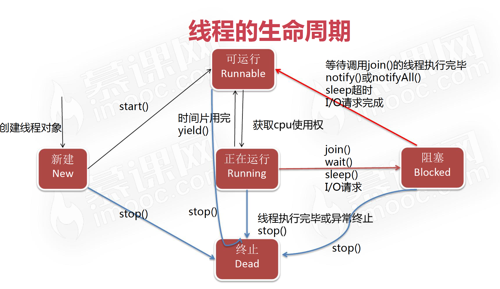

## Type
### Primitive

### Non-Primitive
#### BigDecimal
* BigDecimal(val)
* BigDecimal(String val)
* add
* subtract
* multiply
* public BigDecimal divide(BigDecimal divisor, int scale, RoundingMode roundingMode)
* doubleValue(): Converts this BigDecimal to a double.
* compareTo(BigDecimal val)

## Operator
* if the integer / integer (byte, short, char, int, long), result is integer
* i++(return and increment) vs ++i
* logical operator: short circuit; & vs &&
* priority
  - member. index[] call function()
  - positive+ negative- ++ -- bitwise complement ~ !
  - * / %
  - add+ deduct-  
  - << signed right shift>>  unsigned right shift>>>
  - < <= > >= instanceof
  - == !=
  - &
  - |
  - bitwise XOR^
  - &&
  - ||
  - ? :
  - = += -= *= /= %= &= |= ^= <<= >>= >>>=

## Control
* Labeled break and continue statements

## Modifier
### Access
* public
* private
* default
  - class and method: same package
* protected
  - method: same package or subclasses

### Non-Access
#### Class
* final: no inheritance
* abstract: no instantiation

#### Member
* final
  - variable
      - primitive: cannot be modified
      - non-primitive: cannot refer to another object but the object can be modified

      - variable as member: should be initialized when being declared or in instance initialization block or constructor
      - variable in method: should be initialized before using
  - method: can be inherited but can't be overridden; cannot be used on a constructor
* static: belong to the class rather than an object; cannot be added to a variable in a method
* abstract:
  - class: abstract class cannot have `final`
  - method
    - can only be used on methods in an abstract class or an interface.
    - not have a body.
    - must be implemented in the subclass unless the subclass is abstract.
    - cannot have `static` or `private`
* transient: attributes and methods are skipped when serializing the object
* synchronized: accessed by only one thread at a time
* volatile: the value of an attribute is not cached thread-locally, and is always read from the "main memory"

### Class

* can call a constructor in the first line of another constructor, but cannot call a constructor in a method
* Use multiple classes: try to find an accessible class in the current class, if not successful, try to find in the current package
#### Block
* execution sequence: static block -> instance initialization block -> constructor
* static block: cannot assign non-static member variable and declare static member; member declared in static block cannot be accessed from outside
* the scope of the variable declared in a method is throughout the method, so we cannot declare the same variable in a block inside the method
#### Scope
* method and block: stack

#### Inner class
 - Non-static member inner classes
    - outer$inner.class
    - cannot have static members
    - `Person.Heart heart = new Person().new Heart();` or  `Person.Heart heart = new Person().getHeart();`
    - can access members of the outer class.
    - 方法访问某个变量
       - 该方法有该名字的成员变量 -> 直接用该变量名
       - 内部类中有该名字的成员变量 -> 使用this.变量名
       - 外部类中有该名字的成员变量 -> 使用外部类的类名.this.非静态变量名 or 外部类的类名.静态变量
       ```
     public class Outer {

         private int i = 1;

         public class Inner {
             private int i = 2;

             public void print() {
                 int i = 3;
                 System.out.println(i);
                 System.out.println(this.i);
                 System.out.println(Outer.this.i);
             }
         }

         public static void main(String[] args) {
             Outer outer = new Outer();
             Inner inner = outer.new Inner();
             inner.print();
         }
     }
       ```
 - Static member inner class
    - cannot directly access non-static members of the outer class but can access them through an instance of the outer class
    - `Person.Heart heart = new Person.Heart();`
    - 方法访问某个变量
       - 该方法有该名字的成员变量 -> 直接用该变量名
       - 内部类中有该名字的成员变量 -> 使用this.变量名
       - 外部类中有该名字的static 成员变量 -> 使用外部类的类名.变量名
       - 外部类中有该名字的non-static 成员变量 -> 使用new 外部类的类名().变量名
    - when to used: when the inner class does not need to access the members of the outer class
    - outer$inner.class

 - Method inner class
    - scope: method
    - cannot have access modifier and static
    - cannot have static member but can have final and abstract member
    - 类中普通方法如需访问外部方法中的局部变量，则该变量也需定义为final（jdk1.8之后底层默认会给该变量加上final）
      ···
      public class Outer {
         private int s = 100;
         private int out_i = 1;
         public void f(final int k){
           final int s = 200;
           final int j = 10;
           class Inner{ //定义在方法内部
               int s = 300;//可以定义与外部类同名的变量
               //static int m = 20;//不可以定义静态变量
               Inner(int k){
                   inner_f(k);
               }
               int inner_i = 100;
               void inner_f(int k){
                   System.out.println(out_i);//如果内部类没有与外部类同名的变量，在内部类中可以直接访问外部类的实例变量
                   System.out.println(k);//*****可以访问外部类的局部变量(即方法内的变量)，但是变量必须是final的*****
                   //System.out.println(i);
                   System.out.println(s);//如果内部类中有与外部类同名的变量，直接用变量名访问的是内部类的变量
                   System.out.println(this.s);//用"this.变量名" 访问的也是内部类变量
                   System.out.println(Outer.this.s);//用外部"外部类类名.this.变量名" 访问的是外部类变量
               }
          }
          new Inner(k);
      }

        public static void main(String[] args) {
            //访问局部内部类必须先有外部类对象
            Outer out = new Outer();
            out.f(3);
        }
    }
      ···
    - outer$1inner.class
    - when to used: the class only used in this method

 - Anonymous inner class
    - must inherit a class or implement an interface
    - cannot have access modifier, static, abstract, or final
    - cannot have static members
    - cannot have constructor, but can have instance initialization block
    - outer$1.class

#### Inner class in interface
* non-abstract inner: `new InterfaceName.Inner();`; or import and then `new Inner();`; or create a "get" method
* abstract inner:
  - implementation method 1: create a non-abstract class implements the interface. Inside this class, create a non-abstract class to inherit the abstract inner class in the interface.
  - implementation method 2: Anonymous inner class


### Wrapper Class
#### boxing
* manual boxing
  - new Integer(1);
  - Integer.valueOf(1);

* manual unboxing
  - xxValue(): i1.intValue();

#### unboxing
* =, pass pamameter, use operator to do operations

* autoboxing: use valueOf()
```
int intVal = 1;
Integer integerVal = intVal;
```

* auto unboxing: use xxValue()
```
int intVal = integerVal;
```
#### 常量池
* .valueOf()
* -128 <= x <= 127
* except Float and Double
#### Compare
* == compares addresses
* `a.equals(b)` compares type and value. If b is primitive, auto-box it.
#### Frequently used methods
#### String
* `Integer.toString(1);`
* `Integer.parseInt("1");` to `int`
* `Integer.valueOf("1");` to `Integer`

### Method
* overload: same name, different parameter numbers or types
* override
  - in subclasses
  - same name, same parameters (sequence, number, type)
  - modifier >= that of superclass
  - return
    - if return void or primitive: return type should be same as that of superclass
    - if return non-primitive: return type can be the same of that of the overridden method or its subclass
  - cannot override constructor, final, and static methods (can declare static methods again)
  - if subclass and its superclass are in the same package, can override non-private methods except those mentioned above
  - if subclass and its superclass are not in the same package, can override public or protected methods except those mentioned above
  - overriding method can throw any unchecked exception
  - overriding method cannot throw a checked exception that is new or more general than that in the overridden method
* variable arguments: `int... args`

### String
* immutable
* == address; equals() content
* "s" is constant is in the constant pool. `String s = new String("s")` will check the constant pool first. If exist, use directly.
* `new String("s")` creates "s" in the constant pool first and then create an object on heap.
* char array or byte array
```
char[] chars = {'a','b','c','d','e'};
String s1 = new String(chars);
String s2 = new String(chars, 1, 2); // bc

byte[] b = {54, 69, 70, 71, 72}; // ASCII
String s3 = new String(b);
String s4 = new String(b, 1, 2);
String s5 = new String(b, "utf-8");
String s6 = new String(b, 1, 2, "utf-8");
```

#### Frequently Used Methods

* `.getBytes()` or `.getBytes("utf-8")`
* firstName.concat(lastName)

#### StringBuilder
* mutable, thread-unsafe
##### Methods
* StringBuilder append("s")
* StringBuilder insert(position, "s")
* String toString()
* int length()


#### StringBuffer
* mutable, thread-safe


### Object Class
* superclass of any class
* equals: addresse1 == addresse2
* toString: `getClass().getName() + '@' + Integer.toHexString(hashCode())`; when using sout, used by default
* hashCode: This is typically implemented by converting the internal address of the object into an integer, but this implementation technique is not required by the Java™ programming language.
* getClass: Returns the runtime class of this object

#### hashCode()
```
public int hashCode() {
  final int prime = 31;
  int result = 1;
  result = prime * result + age;
  result = prime * result + ((name == null) ? 0 : name.hashCode());
  return result;
}

```
#### equals()
```
public boolean equals(Object obj) {
  if (obj == null) {
    return false;
  }

  if (this == obj) {
    return true;
  }

  if (obj.getClass() == Cat.class) {
    Cat cat = (Cat) obj;
    return cat.getName().equals(name) && (cat.getAge() == age);
  }

  return false;

}
```

### Polymorphism
* decide which class' method to use based on the type of instance that calls a method
* need to have
  - inheritance
  - superclass reference refers to subclass instance
* upcast: `Animal animal = new Cat();`. cannot call a method that is not declared in superclass
* downcast: `Cat cat = (Cat)(new Animal());`. can use a method not declared in superclass but declared in subclass. Note the operation priority: `((Chinese)person).kungfu();`.
* `instanceof`: `cat instanceof Animal; //true`. can only be converted into its original type.

### Inheritance
* is-a
* only one superclass
* super
* constructor
  - When construct a subclass, must use the constructor of its superclass. Default is the superclass constructor without parameters. Error if it does not exist.
  - Use `super` to call a superclass constructor. Must be put in the first line of the constructor.

### Interface vs Abstract
#### Interface
···
[default or public] interface InterfaceName [extends SuperInterfaceName1, SuperInterfaceName2, ...] {
	[public static final] TypeName CONSTANT = ;
	[public abstract] TypeName abstractMethod([args]); // no body
	[public] default TypeName defaultMethod([args]){}; // the overriding method does not need to have `default`; In the overriding method, can use InterfaceName.super.methodName() to call the original method
	[public] static TypeName staticMethod() {}; // cannot be inherited or overridden, but the implementation class can declare again
}
···
* A class can implement multiple interfaces separated by commas. If so, can inherit only abstract methods
* If the implementation class implements multiple interfaces which have the same method, the implementation class should override the method
* If the implementation class extends a superclass and implements multiple interfaces and the superclass and interfaces have the same method and the same member variable, and if the implementation class does not override the method, by default the method in the superclass will be used when needed, but cannot tell which member variable to use


### Exception

* checked exception: must use "try-catch" or "throws"

* try
* catch: optional; catch by type; if caught, will not enter other catch blocks, so put catch blocks for smaller-scope exceptions first and put `catch(Exception)` at last; `System.exit(1);` will end the program
* finally: optional; will run no matter whether there is an exception; if there is no catch block, must have finally block; used to release resource


* throws: declare some potential exceptions, the method that calls this method will deal with the exception
* throw: throw an instance, Throwable or its subclass

* the scope of variable declared in try, catch, finally blocks is the block
* inherit Throwable or its subclass
* exception chain
  - Throwable(String message, Throwable cause)
  - Throwable(Throwable cause)
  - initCause(Throwable cause): initialize the cause of this throwable to the specified value.

* method
 - toString()
 - getMessage()
 - printStackTrace()


* common exception types
   - Exception
   - ArithmeticException
   - ArrayIndexOutOfBoundsException
   - ArrayStoreException
   - NullPointerException
   - ClassNotFoundException
   - IllegalArgumentException
   - InputMismatchException
   - ClassCastException
   - NumberFormatException
   - FileNotFoundException

### IO
#### File
* File(File parent, String child): Creates a new File instance from a parent abstract pathname and a child pathname string.
* File(String pathname): Creates a new File instance by converting the given pathname string into an abstract pathname.
* File(String parent, String child): Creates a new File instance from a parent pathname string and a child pathname string.
* File(URI uri): Creates a new File instance by converting the given file: URI into an abstract pathname.
```
File file1=new File("c:\\ll\\io\\score.txt"); // Windows: \\, linux: /
File file1=new File("c:\\ll","io\\score.txt");
```

* isDirectory()
* isFile()
* exists()
* mkdir()
* mkdirs()
* createNewFile()
#### Byte Stream
##### FileInputStream
* FileInputStream(File file): Creates a FileInputStream by opening a connection to an actual file, the file named by the File object file in the file system.
* FileInputStream(FileDescriptor fdObj): Creates a FileInputStream by using the file descriptor fdObj, which represents an existing connection to an actual file in the file system.
* FileInputStream(String name): Creates a FileInputStream by opening a connection to an actual file, the file named by the path name name in the file system.

* public int read() // return the next byte of data, or -1 if the end of the file is reached.
* public int read(byte[] b) // the total number of bytes read into the buffer, or -1 if there is no more data because the end of the file has been reached.
* public int read(byte[] b, int off, int len) // off is the byte array starting index from which we save data
* public void close()

```
public class FileInputDemo1 {

	public static void main(String[] args) {

		try {
			FileInputStream fis = new FileInputStream("ll.txt");

			int n = 0;

			while((n = fis.read()) != -1){
				System.out.print((char)n);
			}

			fis.close();
		} catch (FileNotFoundException e) {
			e.printStackTrace();
		} catch(IOException e) {
			e.printStackTrace();
		}
	}
}

public class FileInputDemo2 {

	public static void main(String[] args) {
		try {
			FileInputStream fis = new FileInputStream("ll.txt");
			byte[] b = new byte[100];
			fis.read(b, 0, 5);
			System.out.println(new String(b));
			fis.close();
		} catch (FileNotFoundException e) {
			e.printStackTrace();
		} catch (IOException e) {
			e.printStackTrace();
		}
	}

}
```
##### FileOutputStream
* FileOutputStream(File file): Creates a file output stream to write to the file represented by the specified File object.
* FileOutputStream(File file, boolean append): Creates a file output stream to write to the file represented by the specified File object.
* FileOutputStream(FileDescriptor fdObj): Creates a file output stream to write to the specified file descriptor, which represents an existing connection to an actual file in the file system.
* FileOutputStream(String name): Creates a file output stream to write to the file with the specified name.
* FileOutputStream(String name, boolean append): Creates a file output stream to write to the file with the specified name.

* public void write(int b)
* public void write(byte[] b)
* public void write(byte[] b, int off, int len) // starting from index off in the byte array, save len bytes to the file
* public void close()
```
public class FileOutputDemo {

	public static void main(String[] args) {
		FileOutputStream fos;
		FileInputStream fis;
		try {
			fos = new FileOutputStream("ll.txt",true);
			fis = new FileInputStream("ll.txt");
			fos.write(50);
			fos.write('a');
			System.out.println(fis.read());
			System.out.println((char)fis.read());

      // first opened, first closed
			fos.close();
			fis.close();

		} catch (FileNotFoundException e) {
			e.printStackTrace();
		} catch (IOException e) {
			e.printStackTrace();
		}
	}

}

public class FileOutputDemo1 {

	public static void main(String[] args) {
		// copy a file
		try {
			FileInputStream fis = new FileInputStream("happy.gif");
			FileOutputStream fos = new FileOutputStream("happycopy.gif");
			int n = 0;
			byte[] b = new byte[1024];
			while ((n = fis.read(b)) != -1) {
				fos.write(b, 0, n);
			}
			fis.close();
			fos.close();
		} catch (FileNotFoundException e) {

			e.printStackTrace();
		} catch(IOException e) {
			e.printStackTrace();
		}
	}
}
```
##### BufferedInputStream and BufferedOutputStream
```
import java.io.BufferedInputStream;
import java.io.BufferedOutputStream;
import java.io.FileInputStream;
import java.io.FileNotFoundException;
import java.io.FileOutputStream;
import java.io.IOException;

public class BufferedDemo {

	public static void main(String[] args) {
		try {
			FileOutputStream fos = new FileOutputStream("ll.txt");
			BufferedOutputStream bos = new BufferedOutputStream(fos);
			FileInputStream fis = new FileInputStream("ll.txt");
			BufferedInputStream bis = new BufferedInputStream(fis);
			long startTime = System.currentTimeMillis();
			bos.write(50);
			bos.write('a');
			bos.flush(); // The buffer is not full yet. Force to write the content inf the buffer to the file and clear the buffer

			System.out.println(bis.read());
			System.out.println((char)bis.read());
			long endTime = System.currentTimeMillis();
			System.out.println(endTime - startTime);

			fos.close();
			bos.close();
			fis.close();
			bis.close();
		} catch (FileNotFoundException e) {
			e.printStackTrace();
		} catch (IOException e) {
			e.printStackTrace();
		}
	}
}

```


#### character stream

##### InputStreamReader, OutputStreamReader, BufferedReader, BufferedWriter
```
import java.io.BufferedReader;
import java.io.BufferedWriter;
import java.io.FileInputStream;
import java.io.FileNotFoundException;
import java.io.FileOutputStream;
import java.io.IOException;
import java.io.InputStreamReader;
import java.io.OutputStreamWriter;

public class ReaderDemo {

	public static void main(String[] args) {
		try {
			FileInputStream fis = new FileInputStream("ll.txt");
			InputStreamReader isr = new InputStreamReader(fis, "GBK");
			BufferedReader br = new BufferedReader(isr);

			FileOutputStream fos = new FileOutputStream("ll1.txt");
			OutputStreamWriter osw = new OutputStreamWriter(fos, "GBK");
			BufferedWriter bw = new BufferedWriter(osw);

			int n = 0;
			char[] cbuf = new char[10];

			while((n = br.read(cbuf)) != -1){
				bw.write(cbuf, 0, n);
				bw.flush();
			}

			fis.close();
			fos.close();
			isr.close();
			osw.close();
			br.close();
			bw.close();
		} catch (FileNotFoundException e) {
			e.printStackTrace();
		}
		catch (IOException e) {
			e.printStackTrace();
		}
	}

}

```

#### Serialization
* object to bytes
* class implements Serializable
* ObjectInputStream and ObjectOutputStream
```
import java.io.FileInputStream;
import java.io.FileNotFoundException;
import java.io.FileOutputStream;
import java.io.IOException;
import java.io.ObjectInputStream;
import java.io.ObjectOutputStream;

public class GoodsTest {

	public static void main(String[] args) {

		Goods goods1 = new Goods("gd001", "电脑", 3000);
		try {
			FileOutputStream fos = new FileOutputStream("ll.txt");
			ObjectOutputStream oos = new ObjectOutputStream(fos);
			FileInputStream fis = new FileInputStream("ll.txt");
			ObjectInputStream ois = new ObjectInputStream(fis);

			oos.writeObject(goods1);
			oos.writeBoolean(true);
			oos.flush();

			try {
				Goods goods = (Goods) ois.readObject();
				System.out.println(goods);
			} catch (ClassNotFoundException e) {
				e.printStackTrace();
			}
			System.out.println(ois.readBoolean());

			fos.close();
			oos.close();
			fis.close();
			ois.close();
		} catch (FileNotFoundException e) {
			e.printStackTrace();
		} catch (IOException e) {
			e.printStackTrace();
		}

	}

}
```

### 断言

### Generic Type
* generic type as method parameter
  - <? extends Goods>; extends a class or an interface
  - <? super Goods>
* Define a generic type: `class ClassName<T, X> {}`
* generic type method
  ```
  public class ClassName {
    public <T> void printValue(T t) {
      System.out.println(t);
    }
  }

  ```
* 泛型的类型参数只能是类类型，不能是基本数据类型

### Collection
* see the post "Collection"


### Multithread
* Process: to do
* Thread
* 各线程什么时候得到CPU时间，占用多久，是不可预测的

#### Create
* create an instance of Thread or its subclass
  - Thread implements Runnable
  - Thread()
  - Thread(String name)
  - Thread(Runnable target)
  - Thread(Runnable target, String name)

  ```

  mt1.setPriority(Thread.MAX_PRIORITY);
  ```

* create an instance of a class that implements Runnable
  - only has one method: run()
  - why to use: can extend only one class; do not want to override other methods in Thread
  ```
  class PrintRunnable implements Runnable {
	int i = 1;
	@Override
	public void run() {

		while (i <= 10) {
			System.out.println(Thread.currentThread().getName() + "正在运行" + (i++));
		}

	}

  }

  public class Test {

  	public static void main(String[] args) {
  		PrintRunnable pr = new PrintRunnable();
  		Thread t1 = new Thread(pr);
  		t1.start();
  		Thread t2 = new Thread(pr);
  		t2.start();

  	}
  }
  ```
* Callable<>
    ```
      import java.util.concurrent.Callable;
      public class ThirdThread implements Callable<String> {
        @override
        public String call() throws Exception {
          String str = "the third way to create a thread";
          return str;
        }
      }

      public class ThirdThreadTest {
        public static void main(String[] args) {
          Callable<String> call = new ThirdThread();
          FutureTask<String> ft = new FutureTask<>(call);
          Thread thread = new Thread(ft);

          thread.start();

          try {
            System.out.println(ft.get()); // get the result after the thread finishes, i.e. "the third way to create a thread"
          } catch (InterruptedException | ExecutionException e) {
              e.printStackTrace();
          }
        }
      }
    ```
#### Thread methods
* public void run()
* public void start()
* public static void sleep(long m) // millisecond, used to do something periodically
* public void join() // other threads will execute after this thread finishes
* public final void join(long millis) // 等待该线程终止的最长时间为millis毫秒。如果millis为0则意味着要一直等下去。
* getName()
* public int getPriority()
* public void setPriority(int newPriority)
* wait()
* notify() // 唤醒一个等待线程
* nofifyAll() //唤醒所有等待线程
#### Lifecycle

* stop() is depreciated
#### Priority
* 1 (MIN_PRIORITY) to 10 (MAX_PRIORITY), default is 5 (NORM_PRIORITY)
* the thread with higher priority is not necessarily excuted first
```
class MyThread extends Thread {
	private String name;
	public MyThread(String name) {
		this.name=name;
	}
	public void run() {
		for (int i = 1; i <= 50; i++) {
			System.out.println("线程" + name + "正在运行" + i);
		}
	}
}
public class PriorityDemo {

	public static void main(String[] args) {
		//获取主线程的优先级
		int mainPriority = Thread.currentThread().getPriority();
		//System.out.println("主线程的优先级为：" + mainPriority);
		MyThread mt1 = new MyThread("线程1");
		MyThread mt2 = new MyThread("线程2");
		//mt1.setPriority(10);
		mt1.setPriority(Thread.MAX_PRIORITY);
		mt2.setPriority(Thread.MIN_PRIORITY);
		mt2.start();
		mt1.start();
		//System.out.println("线程1的优先级为：" + mt1.getPriority());
	}
}
```
#### synchronized
* It is not possible for two invocations of synchronized methods on the same object to interleave. When one thread is executing a synchronized method for an object, all other threads that invoke synchronized methods for the same object block (suspend execution) until the first thread is done with the object.
* Second, when a synchronized method exits, it automatically establishes a happens-before relationship with any subsequent invocation of a synchronized method for the same object. This guarantees that changes to the state of the object are visible to all threads.
```
public synchronized void saveAccount(){}
public static synchronized void saveAccount(){}
synchronized (obj){……}

public void drawAccount() {
  synchronized (this) {

    int balance = getBalance();
    balance = balance - 200;
    try {
      Thread.sleep(1000);
    } catch (InterruptedException e) {
      e.printStackTrace();
    }
    setBalance(balance);
    System.out.println("取款后的帐户余额：" + balance);
  }
}
```
#### Deadlock
* Deadlock describes a condition in which two or more threads are blocked (hung) forever because they are waiting for each other.
* notifyAll();
```
public class Queue {
	private int n;
	boolean flag = false;

	public synchronized int get() {
		if (!flag) {
			try {
				wait();
			} catch (InterruptedException e) {
				e.printStackTrace();
			}
		}
		System.out.println("消费：" + n);
		flag = false;//消费完毕，容器中没有数据
		notifyAll();
		return n;
	}

	public synchronized void set(int n) {
		if (flag) {
			try {
				wait();
			} catch (InterruptedException e) {

				e.printStackTrace();
			}
		}
		System.out.println("生产：" + n);
		this.n = n;
		flag = true;//生产完毕，容器中已经有数据
		notifyAll();
	}
}
```

#### Pool
* why
  - 反复创建线程开销大
  - 过多的线程会占用太多内存; 如果需要创建5个以上的线程，那么就可以使用线程池来管理
* constructor
  - corePoolSize: int, 线程池在完成初始化后，默认情况下，线程池中并没有任何线程，线程池会等待有任务到来时，再创建新线程去执行任务
  - maxPoolSize int 最大线程数，详解见下文
  - keepAliveTime long 保持存活时间
  - workQueue BlockingQueue 任务存储队列
    - 直接交接：SynchronousQueue, 容量为0
    - 无界队列：LinkedBlockingQueue
    - 有界的队列：ArrayBlockingQueue
  - threadFactory ThreadFactory当线程池需要新的线程的时候，会使用threadFactory来生成新的线程
    - Executors.defaultThreadFactory()
    - 创建出来的线程都在同一个线程组，拥有同样的NORM_PRIORITY优先级并且都不是守护线程。
    - 如果自己指定ThreadFactory，那么就可以改变线程名、线程组、优先级、是否是守护线程等。通常使用默认的ThreadFactory就可以了。
  - Handler RejectedExecutionHandler 由于线程池无法接受你所提交的任务的拒绝策略
* rule
  - 如果线程数小于corePoolSize，即使其他工作线程处于空闲状态，也会创建一个新线程来运行新任务。
  - 如果线程数等于（或大于）corePoolSize但少于maximumPoolSize，则将任务放入队列。
  - 如果队列已满，并且线程数小于maxPoolSize，则创建一个新线程来运行任务。只有在队列填满时才创建多于corePoolSize的线程，如果使用的是无界队列（例如LinkedBlockingQueue），那么线程数就不会超过corePoolSize。
  - 如果队列已满，并且线程数大于或等于maxPoolSize，则拒绝该任务。
  - 如果线程池当前的线程数多于corePoolSize，那么如果多余的线程空闲时间超过keepAliveTime，它们就会被终止
* how many threads
  - CPU密集型（加密、计算hash等）：最佳线程数为CPU核心数的1-2倍左右。
  - 耗时IO型（读写数据库、文件、网络读写等）：最佳线程数一般会大于CPU核心数很多倍
  - 参考Brain Goetz推荐的计算方法：线程数=CPU核心数*（1+平均等待时间/平均工作时间）
  - stress test


### Reflex
* 运行时动态访问类与对象
#### Class
* 代表"类和接口"的类
* 通过Class对象可获取对应类的构造方法/方法/成员变量
* methods
  - Class.forName()
  - classObj.newInstance()
  - classObj.getConstructor()
  - classObj.getMethod()
  - classObj.getField()
  ```
  //得到员工类的类对象
  Class employeeClass = Class.forName("com.ll.reflect.entity.Employee");
  //通过员工类默认构造方法创建Employee对象
  Employee employee = (Employee)employeeClass.newInstance();
  ```
#### Constructor
* methods
  - classObj.getConstructor(): get a public constructor object
  - constructorObj.newInstance()
  ```
  //得到员工类的类对象
  Class employeeClass = Class.forName("com.ll.reflect.entity.Employee");
  //得到Employee类包含四个参数的构造方法对象
  Constructor constructor = employeeClass.getConstructor(new Class[]{
                Integer.class,
                String.class,
                Float.class,
                String.class
              });
  //通过指定构造方法传入数据,创建对象
  Employee employee = (Employee) constructor.newInstance(new Object[]{
                        100,
                        "Liam Lian",
                        3000f,
                        "Product"});
  ```
#### Method
* methods
  - classObj.getMethod(): get a public method object
  - methodObj.invoke()
  ```
  Method method = employeeClass.getMethod("updateSalary", new Class[]{Float.class});
  //执行方法,为Liam Lian上调薪资300元
  method.invoke(employee, new Object[]{300f});
  ```
#### Field
* methods
  - classObj.getField(): get a public field object
  - fieldObj.set()
  - fieldObj.get()
  ```
  Field enameField = employeeClass.getField("ename");
  enameField.set(employee, "Liam Lian");
  String ename = (String)enameField.get(employee);
  ```
#### getDeclared
* getDeclaredConstructor(s)|Method(s)|Field(s)获取对应对象
```
import com.ll.reflect.entity.Employee;

import java.lang.reflect.Constructor;
import java.lang.reflect.Field;
import java.lang.reflect.InvocationTargetException;
import java.lang.reflect.Method;

/**
 * 获取对象所有成员变量值
 */
public class getDeclaredSample {
    public static void main(String[] args) {
        try {
            Class employeeClass = Class.forName("com.ll.reflect.entity.Employee");
            Constructor constructor = employeeClass.getConstructor(new Class[]{
                    Integer.class, String.class, Float.class, String.class
            });
            Employee employee = (Employee) constructor.newInstance(new Object[]{
                    100, "Liam Lian", 3000f, "Product"
            });
            //获取当前类所有成员变量
            Field[] fields = employeeClass.getDeclaredFields();
            for (Field field : fields){
                if (field.getModifiers() == 1) { //pubilc修饰
                    Object val = field.get(employee);
                    System.out.println(field.getName() + ":" + val);
                } else if (field.getModifiers() == 2) { //private修饰
                    String methodName = "get" + field.getName().substring(0,1).toUpperCase()
                                        + field.getName().substring(1);
                    Method getMethod = employeeClass.getMethod(methodName);
                    Object ret = getMethod.invoke(employee);
                    System.out.println(field.getName() + ":" + ret);
                }
            }
        } catch (ClassNotFoundException e) {
            e.printStackTrace();
        } catch (NoSuchMethodException e) {
            e.printStackTrace();
        } catch (InstantiationException e) {
            e.printStackTrace();
        } catch (IllegalAccessException e) {
            e.printStackTrace();
        } catch (InvocationTargetException e) {
            e.printStackTrace();
        }
    }
}

```

#### Example
```
import java.io.FileInputStream;
import java.io.UnsupportedEncodingException;
import java.net.URLDecoder;
import java.util.Properties;

public class Application {
    public static void say(){
        Properties properties = new Properties();
        String configPath = Application.class.getResource("/config.properties").getPath();
        try {
            configPath = new URLDecoder().decode(configPath, "UTF-8");
            properties.load(new FileInputStream(configPath));
            String language = properties.getProperty("language");
            I18N i18n = (I18N)Class.forName(language).newInstance();
            System.out.println(i18n.say());
        } catch (Exception e) {
            e.printStackTrace();
        }
    }

    public static void main(String[] args) {
        Application.say();
    }
}
```

### Lambda and Functional Programming
* Lambda更简洁的实现匿名内部类与函数声明与调用
* Collections.sort(names, (a,b) -> {b.compareTo(a)});
* 函数式编程是基于函数式接口并使用lambda表达的编程方式; 理念是将代码作为可重用数据代入到程序运行中; 函数式接口是有且只有一个抽象方法的接口; @FunctionalInterface//通知编译器这是函数式接口,进行抽象方法检查

#### JDK8 frequently used
* Consumer<T> 对应有一个输入参数无输出的功能代码
  ```
  import java.util.function.Consumer;

  public class ConsumerSample {
      public static void main(String[] args) {
          output(s-> System.out.println("向控制台打印:" + s));
          output(s->{
              System.out.println("向XXX网站发送数据包:" + s);
          });
      }
      public static void output(Consumer<String> consumer){
          String text = "天将降大任于是人也，必先苦其心志，劳其筋骨，饿其体肤，空乏其身，行拂乱其所为。";
          consumer.accept(text);
      }
  }
  ```
* Function<T,R> 对应有一个输入参数且需要返回数据的功能代码
  ```
  import java.util.Random;
  import java.util.function.Function;

  public class FunctionSample {
      public static void main(String[] args) {
          Function<Integer,String> randomStringFunction = l -> {
              String chars = "abcdefghijklmnopqrstuvxwyz0123456789";
              StringBuffer stringBuffer = new StringBuffer();
              Random random = new Random();
              for (int i = 0 ; i < l ; i++) {
                  int position = random.nextInt(chars.length());
                  stringBuffer.append(chars.charAt(position));
              }
              return stringBuffer.toString();
          };
          String randomString = randomStringFunction.apply(32);
          System.out.println(randomString);
      }
  }

  ```
* Predicate<T> 用于条件判断,固定返回布尔值
  ```
  import java.util.Arrays;
  import java.util.List;
  import java.util.function.Predicate;

  public class PredicateSample {
      public static void main(String[] args) {
          Predicate<Integer> predicate = n->n<4;
          boolean result = predicate.test(10);
          System.out.println(result);

          List<Integer> list = Arrays.asList(1,2,3,4,5,6,7,8,9,10);
          filter(list,n->n%2==1); //取所有奇数
          filter(list,n->n%2==0); //取所有偶数
          filter(list,n->n>5 && n%2==0); //取所有大于5的偶数
      }
      public static void filter(List<Integer> list , Predicate<Integer> predicate){
          for (Integer num:list) {
              if (predicate.test(num)) {
                  System.out.print(num + " ");
              }
          }
          System.out.println("");
      }
  }
  ```
#### Stream
```
//获取List集合中最大的偶数
Optional<Integer> op = Arrays.asList(1,2,3,4,5,6).stream()
.filter(x -> x%2 == 0)
.sorted((a,b) -> b-a)
.findFirst();
System.out.println(op.get());
```
```
import org.junit.Test;
import java.util.ArrayList;
import java.util.List;
import java.util.Random;
import java.util.stream.IntStream;
import java.util.stream.Stream;

/**
 * Stream流对象的五种创建方式
 */
public class StreamGenerator {
    //1.基于数组进行创建
    @Test
    public void generator1(){
        String[] arr = {"Lily" , "Andy" , "Jackson" , "Smith"};
        Stream<String> stream = Stream.of(arr);
        stream.forEach(s->System.out.println(s));
    }

    //2.基于集合进行创建
    @Test
    public void generator2(){
        List<String> list = new ArrayList<>();
        list.add("Lily");
        list.add("Andy");
        list.add("Jackson");
        list.add("Smith");
        Stream<String> stream = list.stream();
        stream.forEach(s->System.out.println(s));
    }

    //3.利用generate方法创建无限长度流
    @Test
    public void generator3(){
        Stream<Integer> stream = Stream.generate(() -> new Random().nextInt(100000));
        stream.limit(10).forEach(i->System.out.println(i));
    }

    //4.基于迭代器创建流
    @Test
    public void generator4(){
        Stream<Integer> stream = Stream.iterate(1, n->n+1);
        stream.limit(100).forEach(i -> System.out.println(i));
    }
    //5.基于字符序列创建流
    @Test
    public void generator5(){
        String str = "abcdefg我的";
        IntStream stream = str.chars();
        stream.forEach(c -> System.out.println((char)c));
    }
}

```

* forEach: 循环遍历
* map: map 方法用于映射每个元素到对应的结果
* filter: filter 方法用于通过设置的条件过滤出元素
* limit: limit 方法用于获取指定数量的流
* sorted: sorted 方法用于对流进行排序
* Collectors: Collectors 类实现将流转换成集合和聚合元素

```
import org.junit.Test;

import java.util.Arrays;
import java.util.List;
import java.util.stream.Collectors;

public class StreamMethod {
    //提取集合中所有偶数并求和
    @Test
    public void case1(){
        List<String> list = Arrays.asList("1", "2", "3", "4", "5" , "6");
        int sum = list.stream() //获取stream对象
            .mapToInt(s->Integer.parseInt(s)) //mapToInt将流中每一个数据转为整数
            .filter(n->n%2==0) //filter对流数据进行过滤
            .sum();//求和
        System.out.println(sum);
    }

    //所有名字首字母大写
    @Test
    public void case2(){
        List<String> list = Arrays.asList("lily","smith","jackson");
        List newList = list.stream()
                //按规则对每一个流数据进行转换
                .map(s->s.substring(0,1).toUpperCase() + s.substring(1))
                //.forEach(s-> System.out.println(s));
                //collect对流数据进行收集,生成新的List/Set
                .collect(Collectors.toList());
        System.out.println(newList);
    }

    //将所有奇数从大到小进行排序,且不许出现重复
    @Test
    public void case3(){
        List<Integer> list = Arrays.asList(1,60,38,21,51,60,51,73);
        List newList = list.stream().distinct()//去除重复的流数据
            .filter(n->n%2==1)
            .sorted((a,b)->b-a) //流数据排序
            .collect(Collectors.toList());
        System.out.println(newList);

    }

}

```

### Reg

* A: A
* x | y: x or y
* [xyz]: x or y or z
* [a-z], [A-Z], [0-9]
* [^xyz], [^0-9]: not in (x, y, z)
* `\d` any number
* `\D` 匹配\d规则之外的任意单个字符
* `\w` 匹配任意单个字母数字下划线
* `\W` 匹配\w之外的任意单个字符
* `\s`: a space
* `\n` 匹配单个换行符
* `.` 匹配任意单个字符(换行符除外)
* `\.` 特殊字符,只匹配.
* A{3} 精准N次匹配
* A{3,} 最少出现N次
* `\d{3,5}` 约定出现最少次数与最大次数
* `\d*` 可以出现零次至无限次,相当于{0,}
* `\d+` 最少出现一次,相当于{1,}
* `\d?` 最多出现一次,相当于{0,1}
* `^A.*` 头匹配
* `.*A$` 尾匹配
* `^A.*A$` 全字匹配
* (ab){3}(cd){3}分组: abababcdcdcd
* Greedy mode: default, use \d{6,8} on 111222333 -> 11122233
* Non greedy mode: use \d{6,8}? on 111222333 -> 111222
#### JavaScript
```
<!DOCTYPE html>
<html>
<head>
<meta charset="UTF-8">
<title>Insert title here</title>
</head>
<body>
	<form action="#" method="post" id="frmInfo">
		<div id="err" style="color:red">

		</div>
		<div>
			姓名:<input id="name" name="name"/>
		</div>
		<div>
			身份证:<input id="idno" name="idno"/>
		</div>
		<div>
			<input type="submit" />
		</div>
	</form>
	<script type="text/javascript">
		document.getElementById("frmInfo").onsubmit = function(){
			//在JS中定义正则表达式对象只需要在 /正则表达式/
			var regex1 = /^[\u4e00-\u9fa5]{2,8}$/;
			var regex2 = /^[1234568]\d{16}[0-9xX]$/
			var name = document.getElementById("name").value;
			var idno = document.getElementById("idno").value;
			if (regex1.test(name) == false) {//利用正则校验数据,true代表匹配,false代表不匹配
				document.getElementById("err").innerHTML = "无效姓名";
				return false;
			} else if(regex2.test(idno) == false) {
				document.getElementById("err").innerHTML = "无效身份证号";
				return false; // will not submit
			} async else {
				alert("验证通过,准备提交")
				return true; // will submit
			}
		}
	</script>
</body>
</html>
```
#### Java
```
import java.io.BufferedReader;
import java.io.FileInputStream;
import java.io.FileNotFoundException;
import java.io.InputStreamReader;
import java.util.regex.Matcher;
import java.util.regex.Pattern;

public class RegexSample {
	public static void main(String[] args) {
		StringBuilder content = new StringBuilder();
		try {
			FileInputStream fis = new FileInputStream("D:/workspace/regex/WebContent/sample.html");
			InputStreamReader isr = new InputStreamReader(fis,"UTF-8");
			BufferedReader bufferedReader = new BufferedReader(isr);
			String lineText = "";
			while((lineText = bufferedReader.readLine()) != null) {
				content.append(lineText + "\n");
			}
			bufferedReader.close();
			System.out.println(content);

		} catch (Exception e) {
			e.printStackTrace();
		}

		Pattern p = Pattern.compile("<li>([\\u4e00-\\u9fa5]{2,10})([a-zA-Z]+)</li>");
		Matcher m = p.matcher(content);
		while(m.find()) {
//			System.out.println(m.group(0));
			String chs = m.group(1);
			String eng = m.group(2);
			System.out.println(chs + "-" + eng);
		}
	}
}

```

### JDBC
#### Steps
* 加载并注册JDBC驱动
```Java
String dbDriver = "com.mysql.cj.jdbc.Driver"; //JDBC驱动类
String dbURL = "jdbc:mysql://localhost:3306/database_name" ; //连接字符串
String dbUsername = "root"; //数据库用户名
String dbPassword = "123456"; //数据库密码
//1.加载并初始化JDBC驱动
Class.forName(dbDriver);
//2.创建数据库连接
Connection connection = DriverManager.getConnection(dbURL, dbUsername, dbPassword);
```
  - useSSL true(生产) false(开发) 是否禁用ssl
  - useUnicode true 启用unicode编码传输数据
  - characterEncoding UTF-8
  - serverTimezone Asia/Shanghai 使用东8时区时间,UTC+8
  - allowPublicKeyRetrieval true 允许从客户端获取公钥加密传输
* 创建数据库连接
  ```Java
    Connection connection = DriverManager.getConnection(dbURL, dbUsername, dbPassword); //创建数据库连接
  ```
* 创建Statement对象
  ```Java
    Connection connection = DriverManager.getConnection(dbURL, dbUsername, dbPassword); //创建数据库连接
    //3. 创建Statement对象
    Statement stmt = conn.createStatement();
    //4. 执行SQL语句,得到查询结果集ResultSet
    ResultSet rs = stmt.executeQuery("SELECT * FROM emp"); //执行SQL语句
  ```
  - sql参数必须是SELECT
* PreparedStatement instead of Statement
  - prevent SQL injection
  - 执行效率更高
  ```Java
    // 利用PreparedStatement预防SQL注入风险
    // 当dname值为' or 1=1 or 1='时 , 查询不到任何结果
    // SQL: select * from employee where dname='\' or 1=1 or 1=\''
    String sql = "select * from employee where dname = ?";
    PreparedStatement pstmt = conn.prepareStatement(sql);
    pstmt.setString(1, dname); //设置SQL参数,参数从1开始
    ResultSet rs = pstmt.executeQuery();
    while (rs.next()) {
    ....
    }
  ```
  - wrong
    ```SQL
      select * from employee where ?='abc'
      select * from employee where salary = ?+100
      select ? from employee where ename = ?
    ```
* 遍历查询结果
  ```Java
    //遍历查询结果,
    while (rs.next()) {
      Integer empId = rs.getInt(1);//得到每行第1列数据,即emp_id
      String ename = rs.getString("ename") //得到每行员工姓名列
      Date hiredate = rs.getDate("ename") //入职时间,注:java.sql.Date
      System.out.println(empId + "-" + ename + "-" + hiredate)
    }
  ```
* 关闭连接,释放资源
  ```Java
  try{
    //创建Statement , 执行SQL语句 , 处理ResultSet得到结果
    rs.close();
    stmt.close();
    }catch(Exception e){
    e.printStackTrace(); //y异常处理
    }finally{
    if(conn != null) { //5. 释放数据库连接
    try{ conn.close(); }catch(Exception ex){}
    }
  }
  ```
* 改造程序预防SQL注入攻击
* insert
  ```Java
    String sql= "insert into employee(eno,ename) values(?,?)";
    PreparedStatement pstmt = conn.prepareStatement(sql);
    pstmt.setInt(1,10);
    pstmt.setString(2,"张三");
    //executeUpdate方法返回记录数
    int cnt = pstmt.executeUpdate(); //cnt=1
    System.out.println("数据新增成功");
  ```
* update
  ```Java
    String sql= "update employee set salary=salary + 1000 where dname=?";
    PreparedStatement pstmt = conn.prepareStatement(sql);
    pstmt.setString(1,"研发部");
    //executeUpdate方法返回记录数
    int cnt = pstmt.executeUpdate();
    System.out.println("研发部" + cnt + "名员工提薪1000元");
  ```
* delete
  ```Java
    String sql= "delete from employee where eno = ?";
    PreparedStatement pstmt = conn.prepareStatement(sql);
    pstmt.setInt(1, 3395);
    //executeUpdate方法返回记录数
    int cnt = pstmt.executeUpdate();
    System.out.println(cnt+"名员工数据已被删除");
  ```
* Apache Commons DBUtils
* JDBC中的事务管理
  - conn.setAutoCommit(true), default
  - conn.commit();
  - conn.rollback();
* 实现批量增加员工
* 基于实体类实现分页数据封装
* JDBC中Date日期对象的处理
  ```Java
    package com.ll.jdbc.hrapp.command;

    import com.ll.jdbc.common.DbUtils;

    import java.sql.Connection;
    import java.sql.PreparedStatement;
    import java.sql.SQLException;
    import java.text.ParseException;
    import java.text.SimpleDateFormat;
    import java.util.Scanner;

    /**
     * 新增员工数据
     */
    public class InsertCommand implements Command{
        @Override
        public void execute() {
            Scanner in = new Scanner(System.in);
            System.out.print("请输入员工编号:");
            int eno = in.nextInt();
            System.out.print("请输入员工姓名:");
            String ename = in.next();
            System.out.print("请输入员工薪资:");
            float salary = in.nextFloat();
            System.out.print("请输入隶属部门:");
            String dname = in.next();
            System.out.print("请输入入职日期：");
            String strHiredate = in.next();
            //JDBC获取日期使用java.sql.Date,其继承自java.util.Date
            //String到java.sql.Date分为两步
            //1.String转为java.util.Date
            java.util.Date udHiredate = null;
            SimpleDateFormat sdf = new SimpleDateFormat("yyyy-MM-dd");
            try {
                udHiredate = sdf.parse(strHiredate);
            } catch (ParseException e) {
                e.printStackTrace();
            }
            //2.java.util.Date转为java.sql.Date
            long time = udHiredate.getTime();//获取自1970年到现在的毫秒数
            java.sql.Date sdHiredate = new java.sql.Date(time);
            Connection conn = null;
            PreparedStatement pstmt = null;
            try {
                conn = DbUtils.getConnection();
                String sql = "insert into employee(eno,ename,salary,dname,hiredate ) values(?,?,?,?,?)";
                pstmt = conn.prepareStatement(sql);
                pstmt.setInt(1, eno);
                pstmt.setString(2, ename);
                pstmt.setFloat(3, salary);
                pstmt.setString(4,dname);
                pstmt.setDate(5,sdHiredate); //java.sql.Date
                int cnt = pstmt.executeUpdate();//所有写操作都使用executeUpdate
                System.out.println("cnt:" + cnt);
                System.out.println(ename + "员工入职手续已办理");
            } catch (SQLException e) {
                e.printStackTrace();
            } catch (ClassNotFoundException e) {
                e.printStackTrace();
            } finally {
                DbUtils.closeConnection(null,pstmt,conn);
            }
        }
    }

  ```
* JDBC数据批处理
  ```
    package com.ll.jdbc.sample;

    import com.ll.jdbc.common.DbUtils;

    import java.sql.Connection;
    import java.sql.PreparedStatement;
    import java.sql.SQLException;
    import java.util.Date;

    /**
     * JDBC批处理
     */
    public class BatchSample {
        //标准方式插入若干数据
        private static void tc1(){
            Connection conn = null;
            PreparedStatement pstmt = null;
            try {
                long startTime = new Date().getTime();
                conn = DbUtils.getConnection();
                //JDBC默认使用自动提交模式
                conn.setAutoCommit(false);//关闭自动提交
                String sql = "insert into employee(eno,ename,salary,dname) values(?,?,?,?)";
                for (int i=100000; i<200000; i++){
                    pstmt = conn.prepareStatement(sql);
                    pstmt.setInt(1, i);
                    pstmt.setString(2, "员工" + i);
                    pstmt.setFloat(3, 4000f);
                    pstmt.setString(4, "市场部");
                    pstmt.executeUpdate();
                }
                conn.commit();//提交数据
                long endTime = new Date().getTime();
                System.out.println("tc1()执行时长：" + (endTime-startTime));
            } catch (Exception e) {
                e.printStackTrace();
                try {
                    if(conn != null && !conn.isClosed()) {
                        conn.rollback();//回滚数据
                    }
                }catch (SQLException ex){
                    ex.printStackTrace();
                }
            } finally {
                DbUtils.closeConnection(null, pstmt, conn);
            }
        }


        //使用批处理插入若干数据
        private static void tc2(){
            Connection conn = null;
            PreparedStatement pstmt = null;
            try {
                long startTime = new Date().getTime();
                conn = DbUtils.getConnection();
                //JDBC默认使用自动提交模式
                conn.setAutoCommit(false);//关闭自动提交
                String sql = "insert into employee(eno,ename,salary,dname) values(?,?,?,?)";
                pstmt = conn.prepareStatement(sql);
                for (int i=200000; i<300000; i++){
                    pstmt.setInt(1, i);
                    pstmt.setString(2, "员工" + i);
                    pstmt.setFloat(3, 4000f);
                    pstmt.setString(4, "市场部");
                    pstmt.addBatch();//将参数加入批处理任务
    //                pstmt.executeUpdate();
                }
                pstmt.executeBatch();//执行批处理任务
                conn.commit();//提交数据
                long endTime = new Date().getTime();
                System.out.println("tc2()执行时长：" + (endTime-startTime));
            } catch (Exception e) {
                e.printStackTrace();
                try {
                    if(conn != null && !conn.isClosed()) {
                        conn.rollback();//回滚数据
                    }
                }catch (SQLException ex){
                    ex.printStackTrace();
                }
            } finally {
                DbUtils.closeConnection(null, pstmt, conn);
            }
        }


        public static void main(String[] args) {
            tc1();
            tc2();
        }
    }

  ```
* 连接池
  - 连接池负责创建管理连接,程序只负责取用与归还
  - maxActive should be > user count; initialSize is better to equal to maxActive
  - Druid
    - druid-cofig.properties
  - C3P0
    - c3p0-config.xml


### Linux
Linux发行版选择建议
u
桌面系统:Ubuntu
u
服务器操作系统:
CentOS
（免费）
、
Red Hat
Linux
（收费）
u
特定需求: Debian(稳定性)、
Fedora(新特性)、
麒麟Linux(国产)

CentOS 7 :
主流版本,稳定成熟,大多数服务器的首选版本
Centos 7.7

VMware Workstation虚拟机

SSH是专为远程登录和其他网络服务提供的安全性协议

Linux命令格式
命令 [参数选项] [文件或路径]
cd
切换目录
pwd
查看当前目录
l
s、
l
l
显示目录内容
mkdir
创建目录
cp
复制文件与目录
mv
移动或重命名文件
rm
删除文件或目录
find
查找目录或文件

vim文本编辑器
vim
[选项]
[文件]
u
普通模式:默认模式,文本只读,不可编辑
u
编辑模式:编辑文本模式,普通模式按i键进入,Esc键退出
u
命令模式:执行保存、
搜索、
退出等操作
delete或x
删除单个字符
dd
删除整行
/str
全文查找str字符串,n下一个,N前一个
:
%
s/old/new/g
替换文件内所有old字符串为new
u
撤销最近一次操作
:wq或者:wq!
退出并保存,只读文件要额外加!
:
q!
强制退出放弃保存

常用文本工具
echo
屏幕打印与文本输出
cat
合并文件或查看文件内容
tail
显示文件内容尾部
grep
文本过滤工具

文件输入与输出
u
文件输入：
<
(重写)
或者
<<
(追加)
u
文件输出：> (重写) 或者 >> (追加)

gzip
tar
tar
zcvf
tomcat.tar.gz
/usr/local/tomcat

tar
zxvf
tomcat.tar.gz
-C
/usr/local/tomcat

z
通过gzip压缩或解压
c
创建新的tar.gz文件
v
显示执行过程
f
指定压缩文件名称
x
解压缩tar.gz文件
-C
指定解压缩目录


### Maven
* project manamgement tool
* plug-in to export jar: maven-assembly-plugin
#### Commands
* mvn archetype:generate 创建Maven工程结构
* mvn compile 编译源代码
* mvn test 执行测试用例
* mvn clean 清除产生的项目
* mvn package 项目打包
* mvn install 安装至本地仓库
#### package
to do


### IDEA
* ctrl + shift + T: create test class
