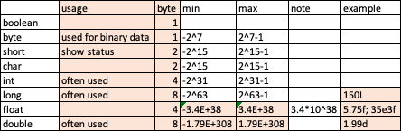
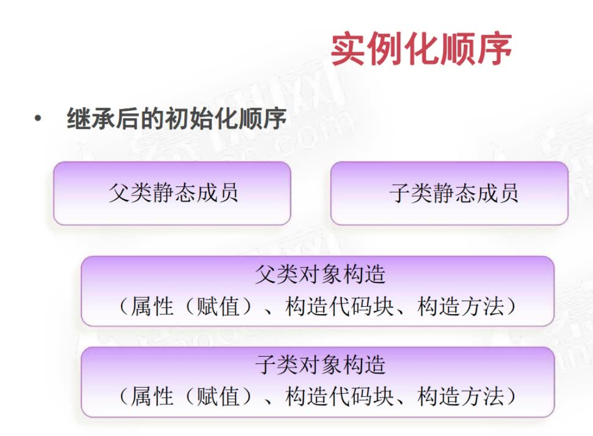
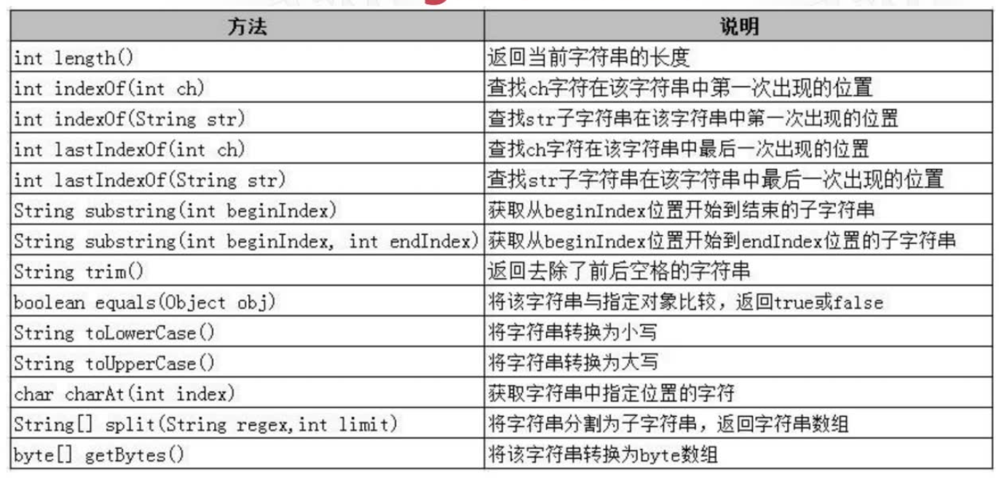
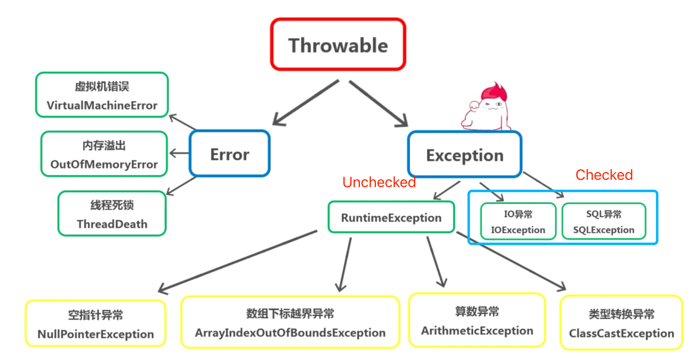
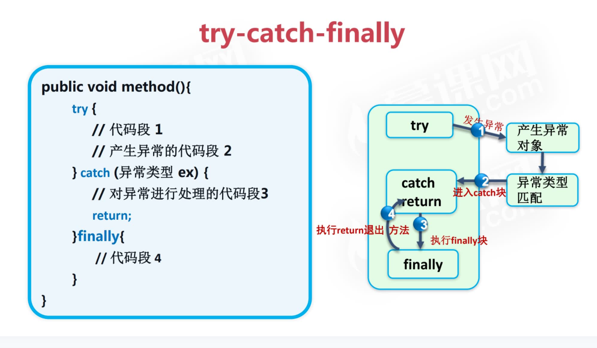
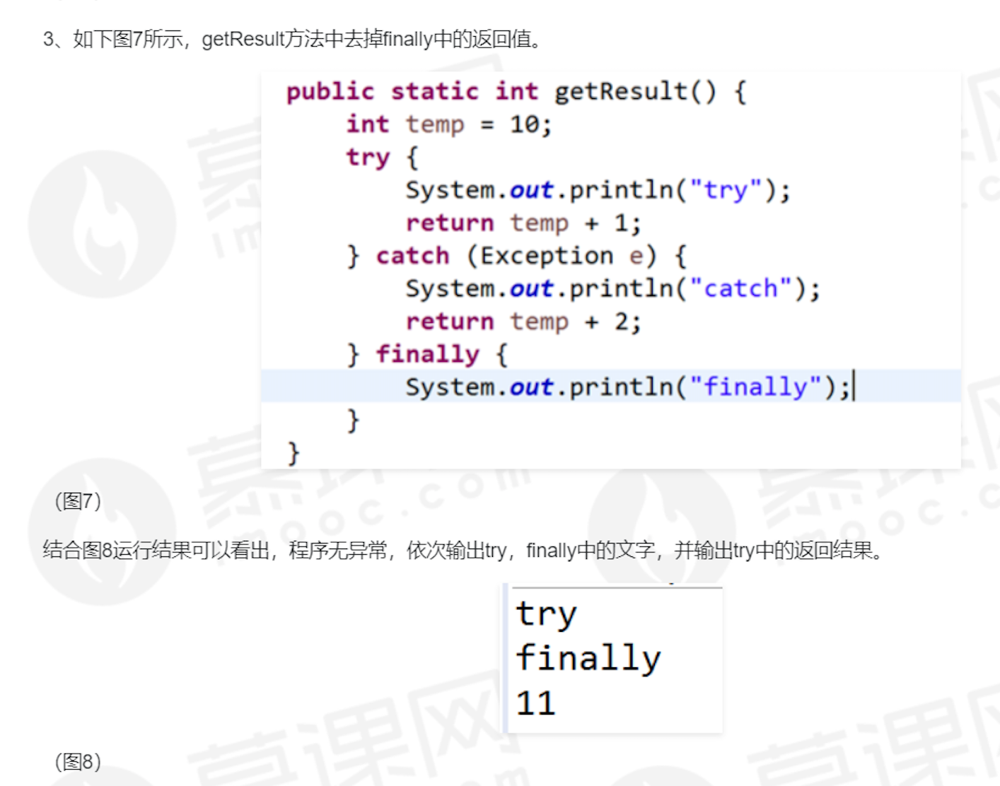

## Type
### Primitive

### Non-Primitive
#### BigDecimal
to do

## Operator
* if the integer / integer (byte, short, char, int, long), result is integer
* i++(return and increment) vs ++i
* logical operator: short circuit; & vs &&
* priority
  - member. index[] call function()
  - positive+ negative- ++ -- bitwise complement ~ !
  - * / %
  - add+ deduct-  
  - << signed right shift>>  unsigned right shift>>>
  - < <= > >= instanceof
  - == !=
  - &
  - |
  - bitwise XOR^
  - &&
  - ||
  - ? :
  - = += -= *= /= %= &= |= ^= <<= >>= >>>=

## Control
* Labeled break and continue statements

## Modifier
### Access
* public
* private
* default
  - class and method: same package
* protected
  - method: same package or subclasses

### Non-Access
#### Class
* final: no inheritance
* abstract: no instantiation

#### Member
* final
  - variable
      - primitive: cannot be modified
      - non-primitive: cannot refer to another object but the object can be modified

      - variable as member: should be initialized when being declared or in instance initialization block or constructor
      - variable in method: should be initialized before using
  - method: can be inherited but can't be overridden; cannot be used on a constructor
* static: belong to the class rather than an object; cannot be added to a variable in a method
* abstract:
  - class: abstract class cannot have `final`
  - method
    - can only be used on methods in an abstract class or an interface.
    - not have a body.
    - must be implemented in the subclass unless the subclass is abstract.
    - cannot have `static` or `private`
* transient: attributes and methods are skipped when serializing the object
* synchronized: accessed by only one thread at a time
* volatile: the value of an attribute is not cached thread-locally, and is always read from the "main memory"

### Class

* can call a constructor in the first line of another constructor, but cannot call a constructor in a method
* Use multiple classes: try to find an accessible class in the current class, if not successful, try to find in the current package
#### Block
* execution sequence: static block -> instance initialization block -> constructor
* static block: cannot assign non-static member variable and declare static member; member declared in static block cannot be accessed from outside
* the scope of the variable declared in a method is throughout the method, so we cannot declare the same variable in a block inside the method
#### Scope
* method and block: stack

#### Inner class
 - Non-static member inner classes
    - outer$inner.class
    - cannot have static members
    - `Person.Heart heart = new Person().new Heart();` or  `Person.Heart heart = new Person().getHeart();`
    - can access members of the outer class.
    - 方法访问某个变量
       - 该方法有该名字的成员变量 -> 直接用该变量名
       - 内部类中有该名字的成员变量 -> 使用this.变量名
       - 外部类中有该名字的成员变量 -> 使用外部类的类名.this.非静态变量名 or 外部类的类名.静态变量
       ```
     public class Outer {

         private int i = 1;

         public class Inner {
             private int i = 2;

             public void print() {
                 int i = 3;
                 System.out.println(i);
                 System.out.println(this.i);
                 System.out.println(Outer.this.i);
             }
         }

         public static void main(String[] args) {
             Outer outer = new Outer();
             Inner inner = outer.new Inner();
             inner.print();
         }
     }
       ```
 - Static member inner class
    - cannot directly access non-static members of the outer class but can access them through an instance of the outer class
    - `Person.Heart heart = new Person.Heart();`
    - 方法访问某个变量
       - 该方法有该名字的成员变量 -> 直接用该变量名
       - 内部类中有该名字的成员变量 -> 使用this.变量名
       - 外部类中有该名字的static 成员变量 -> 使用外部类的类名.变量名
       - 外部类中有该名字的non-static 成员变量 -> 使用new 外部类的类名().变量名
    - when to used: when the inner class does not need to access the members of the outer class
    - outer$inner.class

 - Method inner class
    - scope: method
    - cannot have access modifier and static
    - cannot have static member but can have final and abstract member
    - 类中普通方法如需访问外部方法中的局部变量，则该变量也需定义为final（jdk1.8之后底层默认会给该变量加上final）
      ···
      public class Outer {
         private int s = 100;
         private int out_i = 1;
         public void f(final int k){
           final int s = 200;
           final int j = 10;
           class Inner{ //定义在方法内部
               int s = 300;//可以定义与外部类同名的变量
               //static int m = 20;//不可以定义静态变量
               Inner(int k){
                   inner_f(k);
               }
               int inner_i = 100;
               void inner_f(int k){
                   System.out.println(out_i);//如果内部类没有与外部类同名的变量，在内部类中可以直接访问外部类的实例变量
                   System.out.println(k);//*****可以访问外部类的局部变量(即方法内的变量)，但是变量必须是final的*****
                   //System.out.println(i);
                   System.out.println(s);//如果内部类中有与外部类同名的变量，直接用变量名访问的是内部类的变量
                   System.out.println(this.s);//用"this.变量名" 访问的也是内部类变量
                   System.out.println(Outer.this.s);//用外部"外部类类名.this.变量名" 访问的是外部类变量
               }
          }
          new Inner(k);
      }

        public static void main(String[] args) {
            //访问局部内部类必须先有外部类对象
            Outer out = new Outer();
            out.f(3);
        }
    }
      ···
    - outer$1inner.class
    - when to used: the class only used in this method

 - Anonymous inner class
    - must inherit a class or implement an interface
    - cannot have access modifier, static, abstract, or final
    - cannot have static members
    - cannot have constructor, but can have instance initialization block
    - outer$1.class

#### Inner class in interface
* non-abstract inner: `new InterfaceName.Inner();`; or import and then `new Inner();`; or create a "get" method
* abstract inner:
  - implementation method 1: create a non-abstract class implements the interface. Inside this class, create a non-abstract class to inherit the abstract inner class in the interface.
  - implementation method 2: Anonymous inner class


### Wrapper Class
#### boxing
* manual boxing
  - new Integer(1);
  - Integer.valueOf(1);

* manual unboxing
  - xxValue(): i1.intValue();

#### unboxing
* =, pass pamameter, use operator to do operations

* autoboxing: use valueOf()
```
int intVal = 1;
Integer integerVal = intVal;
```

* auto unboxing: use xxValue()
```
int intVal = integerVal;
```
#### 常量池
* .valueOf()
* -128 <= x <= 127
* except Float and Double
#### Compare
* == compares addresses
* `a.equals(b)` compares type and value. If b is primitive, auto-box it.
#### Frequently used methods
#### String
* `Integer.toString(1);`
* `Integer.parseInt("1");` to `int`
* `Integer.valueOf("1");` to `Integer`

### Method
* overload: same name, different parameter numbers or types
* override
  - in subclasses
  - same name, same parameters (sequence, number, type)
  - modifier >= that of superclass
  - return
    - if return void or primitive: return type should be same as that of superclass
    - if return non-primitive: return type can be the same of that of the overridden method or its subclass
  - cannot override constructor, final, and static methods (can declare static methods again)
  - if subclass and its superclass are in the same package, can override non-private methods except those mentioned above
  - if subclass and its superclass are not in the same package, can override public or protected methods except those mentioned above
  - overriding method can throw any unchecked exception
  - overriding method cannot throw a checked exception that is new or more general than that in the overridden method
* variable arguments: `int... args`

### String
* immutable
* == address; equals() content
* "s" is constant is in the constant pool. `String s = new String("s")` will check the constant pool first. If exist, use directly.
* `new String("s")` creates "s" in the constant pool first and then create an object on heap.
* char array or byte array
```
char[] chars = {'a','b','c','d','e'};
String s1 = new String(chars);
String s2 = new String(chars, 1, 2); // bc

byte[] b = {54, 69, 70, 71, 72}; // ASCII
String s3 = new String(b);
String s4 = new String(b, 1, 2);
String s5 = new String(b, "utf-8");
String s6 = new String(b, 1, 2, "utf-8");
```

#### Frequently Used Methods

* `.getBytes()` or `.getBytes("utf-8")`
* firstName.concat(lastName)

#### StringBuilder
* mutable, thread-unsafe
##### Methods
* StringBuilder append("s")
* StringBuilder insert(position, "s")
* String toString()
* int length()


#### StringBuffer
* mutable, thread-safe


### Object Class
* superclass of any class
* equals: addresse1 == addresse2
* toString: `getClass().getName() + '@' + Integer.toHexString(hashCode())`; when using sout, used by default
* hashCode: This is typically implemented by converting the internal address of the object into an integer, but this implementation technique is not required by the Java™ programming language.
* getClass: Returns the runtime class of this object

### Polymorphism
* decide which class' method to use based on the type of instance that calls a method
* need to have
  - inheritance
  - superclass reference refers to subclass instance
* upcast: `Animal animal = new Cat();`. cannot call a method that is not declared in superclass
* downcast: `Cat cat = (Cat)(new Animal());`. can use a method not declared in superclass but declared in subclass. Note the operation priority: `((Chinese)person).kungfu();`.
* `instanceof`: `cat instanceof Animal; //true`. can only be converted into its original type.

### Inheritance
* is-a
* only one superclass
* super
* constructor
  - When construct a subclass, must use the constructor of its superclass. Default is the superclass constructor without parameters. Error if it does not exist.
  - Use `super` to call a superclass constructor. Must be put in the first line of the constructor.

### Interface vs Abstract
#### Interface
···
[default or public] interface InterfaceName [extends SuperInterfaceName1, SuperInterfaceName2, ...] {
	[public static final] TypeName CONSTANT = ;
	[public abstract] TypeName abstractMethod([args]); // no body
	[public] default TypeName defaultMethod([args]){}; // the overriding method does not need to have `default`; In the overriding method, can use InterfaceName.super.methodName() to call the original method
	[public] static TypeName staticMethod() {}; // cannot be inherited or overridden, but the implementation class can declare again
}
···
* A class can implement multiple interfaces separated by commas. If so, can inherit only abstract methods
* If the implementation class implements multiple interfaces which have the same method, the implementation class should override the method
* If the implementation class extends a superclass and implements multiple interfaces and the superclass and interfaces have the same method and the same member variable, and if the implementation class does not override the method, by default the method in the superclass will be used when needed, but cannot tell which member variable to use


### Exception

* checked exception: must use "try-catch" or "throws"

* try
* catch: optional; catch by type; if caught, will not enter other catch blocks, so put catch blocks for smaller-scope exceptions first and put `catch(Exception)` at last; `System.exit(1);` will end the program
* finally: optional; will run no matter whether there is an exception; if there is no catch block, must have finally block; used to release resource


* throws: declare some potential exceptions, the method that calls this method will deal with the exception
* throw: throw an instance, Throwable or its subclass

* the scope of variable declared in try, catch, finally blocks is the block
* inherit Throwable or its subclass
* exception chain
  - Throwable(String message, Throwable cause)
  - Throwable(Throwable cause)
  - initCause(Throwable cause): initialize the cause of this throwable to the specified value.

* method
 - toString()
 - getMessage()
 - printStackTrace()


* common exception types
   - Exception
   - ArithmeticException
   - ArrayIndexOutOfBoundsException
   - ArrayStoreException
   - NullPointerException
   - ClassNotFoundException
   - IllegalArgumentException
   - InputMismatchException
   - ClassCastException
   - NumberFormatException
   - FileNotFoundException

### IO

### 断言

### Generic Type

### Collection
* see the post "Collection"

### Multithread


### Linux
