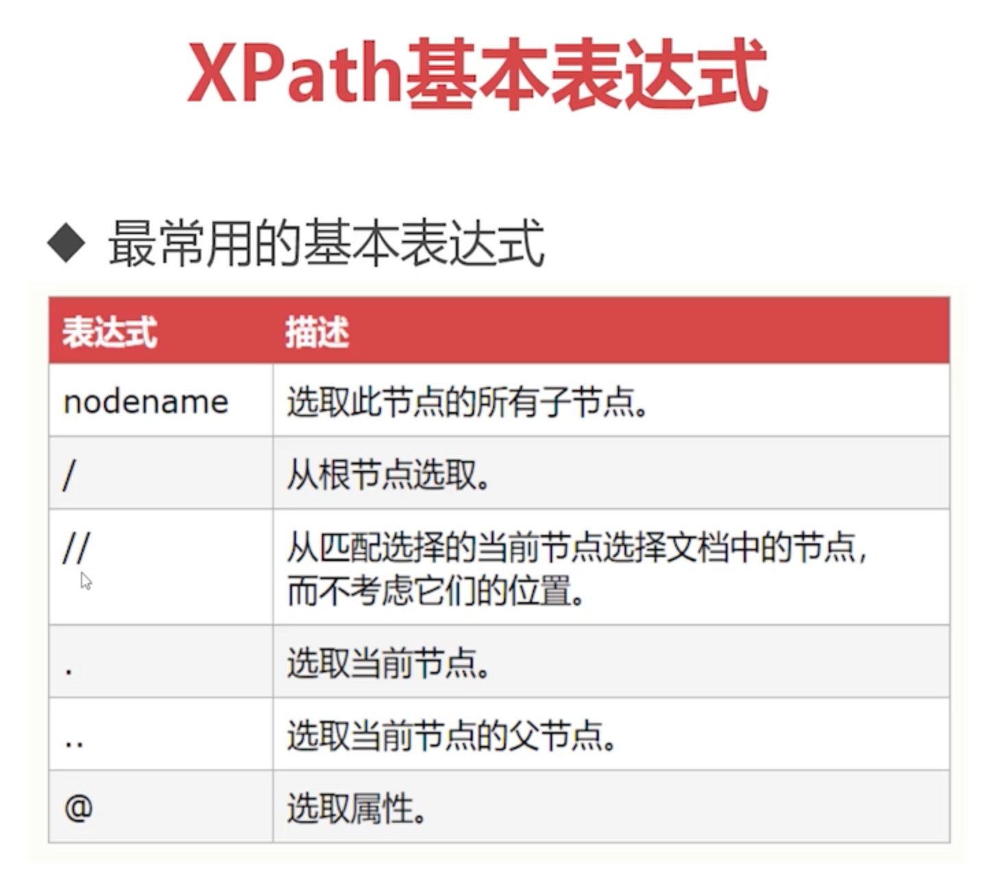
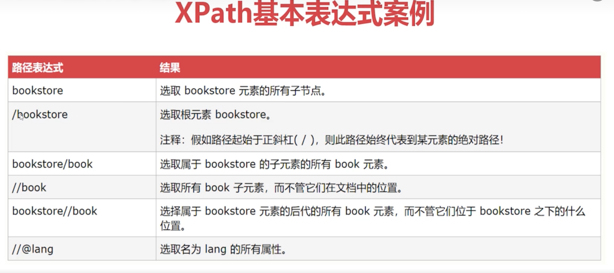
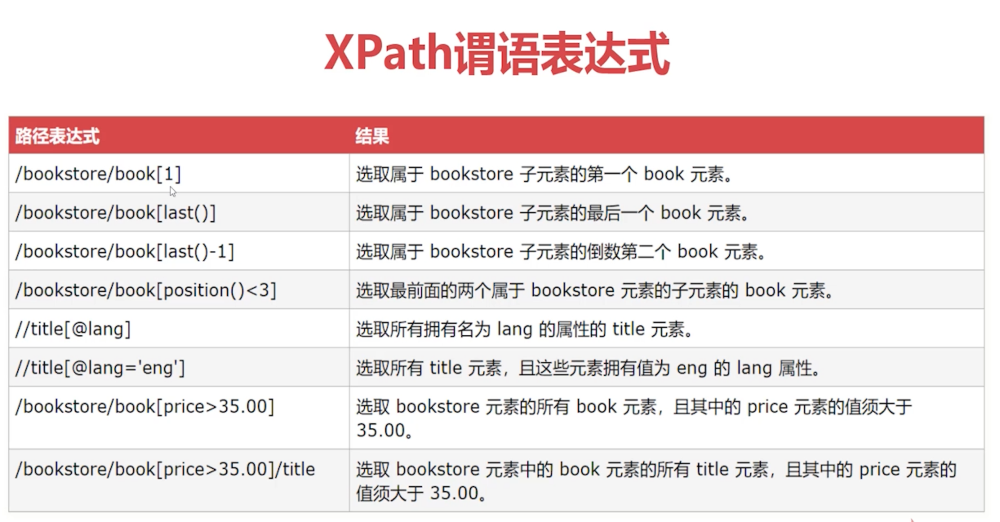

## XML
* Extensible Markup Language, has tags, to save and transfer data or config
### markup
* lower case, "-"
* no duplicate names in different layers
* &lt, &gt, &amp, &apos, &quot
### cdata
* element content that parser to interpret as character data, not markup
* `<![CDATA[ content here ]]>`
### Semantic constraint
#### dtd
* <!ELEMENT>: to define what elements and how many are allowed
  - <!ELEMENT hr (employee) >: one "employee" node under the "hr" node
  - <!ELEMENT hr (employee+) >: at least one "employee" node under the "hr" node
  - <!ELEMENT hr (employee*) >: can have 0 to n "employee" nodes under the "hr" node
  - <!ELEMENT hr (employee?) >: at most one "employee" node under the "hr" node
  - <!ELEMENT employee (name, age, salary, department)>: must have four nodes with this order
  - <!ELEMENT name (#PCDATA)>: #PCDATA is text
  - <!ATTLIST employee no CDATA "">: the type of the attribute "no" in "employee" is CDATA and the default value is ""
* `<!DOCTYPE hr SYSTEM "hr.dtd">` in XML to import the dtd file
#### XML schema
```
<?xml version="1.0" encoding="UTF-8"?>
<schema xmlns="http://www.w3.org/2001/XMLSchema">
	<element name="hr">
		<!-- complexType标签含义是复杂节点，包含子节点时必须使用这个标签 -->
		<complexType>
			<sequence>
				<element name="employee" minOccurs="1" maxOccurs="9999">
					<complexType>
						<sequence>
							<element name="name" type="string"></element>
							<element name="age">
								<simpleType>
									<restriction base="integer">
										<minInclusive value="18"></minInclusive>
										<maxInclusive value="60"></maxInclusive>
									</restriction>
								</simpleType>
							</element>
							<element name="salary" type="integer"></element>
							<element name="department">
								<complexType>
									<sequence>
										<element name="dname" type="string"></element>
										<element name="address" type="string"></element>
									</sequence>
								</complexType>
							</element>
						</sequence>
						<attribute name="no" type="string" use="required"></attribute>
					</complexType>
				</element>
			</sequence>
		</complexType>
	</element>
</schema>

```
### DOM
* document object model
* Dom4j
```

import java.util.List;

import org.dom4j.Attribute;
import org.dom4j.Document;
import org.dom4j.DocumentException;
import org.dom4j.Element;
import org.dom4j.io.SAXReader;

public class HrReader {
	public void readXml(){
		String file = "d:/workspace/xml/src/hr.xml";

		SAXReader reader = new SAXReader();
		try {
			Document document = reader.read(file);
			Element root = document.getRootElement();
			List<Element> employees =  root.elements("employee");
			for (Element employee : employees){
				Element name = employee.element("name");
				String empName = name.getText();
				System.out.println(empName);
				System.out.println(employee.elementText("age"));
				System.out.println(employee.elementText("salary"));
				Element department = employee.element("department");
				System.out.println(department.element("dname").getText());
				System.out.println(department.element("address").getText());
				Attribute att = employee.attribute("no");
				System.out.println(att.getText());
			}
		} catch (DocumentException e) {
			e.printStackTrace();
		}
	}
	public static void main(String[] args) {
		HrReader reader = new HrReader();
		reader.readXml();
	}

}

```

```
import java.io.FileOutputStream;
import java.io.OutputStreamWriter;
import java.io.Writer;

import org.dom4j.Document;
import org.dom4j.DocumentException;
import org.dom4j.Element;
import org.dom4j.io.SAXReader;

public class HrWriter {
	public void writeXml(){
		String file = "d:/workspace/xml/src/hr.xml";
		SAXReader reader = new SAXReader();
		try {
			Document document = reader.read(file);
			Element root = document.getRootElement();
			Element employee = root.addElement("employee");
			employee.addAttribute("no", "3311");
			Element name = employee.addElement("name");
			name.setText("Liam");
			employee.addElement("age").setText("37");
			employee.addElement("salary").setText("3600");
			Element department = employee.addElement("department");
			department.addElement("dname").setText("IT");
			department.addElement("address").setText("N2J 3C5");
			Writer writer = new OutputStreamWriter(new FileOutputStream(file) , "UTF-8");
			document.write(writer);
			writer.close();
		} catch (Exception e) {
			e.printStackTrace();
		}
	}
	public static void main(String[] args) {
		HrWriter hrWriter = new HrWriter();
		hrWriter.writeXml();
	}
}
```
### XPath
* to search data in XML



* Jaxen
  - a Xpath library that supports DOM, XOM, Dom4j, and JDOM
  - Dom4j depends on Jaxen
```
import java.util.List;
import org.dom4j.Document;
import org.dom4j.DocumentException;
import org.dom4j.Element;
import org.dom4j.Node;
import org.dom4j.io.SAXReader;

public class XPathTestor {
	public void xpath(String xpathExp){
		String file = "E:/lianxi/xml/hr.xml";
		SAXReader reader = new SAXReader();
		try {
			Document document = reader.read(file);

			List<Node> nodes = document.selectNodes(xpathExp);
			for(Node node : nodes){
				Element emp = (Element)node;
				System.out.println(emp.attributeValue("no"));
				System.out.println(emp.elementText("name"));
				System.out.println(emp.elementText("age"));
				System.out.println(emp.elementText("salary"));
				System.out.println("==============================");
			}


		} catch (DocumentException e) {
			// TODO Auto-generated catch block
			e.printStackTrace();
		}
	}

	public static void main(String[] args) {
		XPathTestor testor = new XPathTestor();
//		testor.xpath("/hr/employee");
//		testor.xpath("//employee");
//		testor.xpath("//employee[salary<4000]");
//		testor.xpath("//employee[name='������']");
//		testor.xpath("//employee[@no=3304]");
//		testor.xpath("//employee[1]");
//		testor.xpath("//employee[last()]");
		//testor.xpath("//employee[position()<3]");
		testor.xpath("//employee[3] | //employee[8]");

	}
}

```

## Tomcat
* Tomcat: web application server software, a container to run Servlet
* configuration
  - port
  - ContextPath
  - 应用自动重载


## Servlet
* Server Applet, to create dynamic web content
* process: request -> Tomcat -> search in web.xml to find the relevant Servlet -> Servlet runs -> response
* steps
  - extends HttpServlet
  - override service(HttpServletRequest request , HttpServletResponse response)
    ```
    PrintWriter out =  response.getWriter();
    out.println("<a href='http://www.baidu.com'>Baidu</a>");
    ```
  - configure web.xml or use annotation
    - XML
      - <load-on-startup>0~9999</load-on-startup>, 0 means this Servlet has the highest priority
      - default home page
      - status code and page
      - Servlet 通配符映射及初始化参数
      ```
      <?xml version="1.0" encoding="UTF-8"?>
      <web-app xmlns:xsi="http://www.w3.org/2001/XMLSchema-instance" xmlns="http://xmlns.jcp.org/xml/ns/javaee" xsi:schemaLocation="http://xmlns.jcp.org/xml/ns/javaee http://xmlns.jcp.org/xml/ns/javaee/web-app_3_1.xsd" id="WebApp_ID" version="3.1">
        <display-name>servlet_advanced</display-name>
        <welcome-file-list>
          <welcome-file>index.html</welcome-file>
          <welcome-file>index.htm</welcome-file>
          <welcome-file>index.jsp</welcome-file>
          <welcome-file>default.html</welcome-file>
          <welcome-file>default.htm</welcome-file>
          <welcome-file>default.jsp</welcome-file>
        </welcome-file-list>
        <servlet>
        	<servlet-name>patternServlet</servlet-name>
        	<servlet-class>com.imooc.servlet.pattern.PatternServlet</servlet-class>
        </servlet>
        <servlet-mapping>
        	<servlet-name>patternServlet</servlet-name>
        	<url-pattern>/pattern/*</url-pattern>
        </servlet-mapping>
        <context-param>
        	<param-name>copyright</param-name>
        	<param-value>© 2018 imooc.com</param-value>
        </context-param>
        <context-param>
        	<param-name>title</param-name>
        	<param-value>Liam Lian</param-value>
        </context-param>
        <!-- 指定错误页面 -->
        <error-page>
        	<error-code>404</error-code>
        	<location>/error/404.html</location>
        </error-page>
        <error-page>
        	<error-code>500</error-code>
        	<location>/error/500.jsp</location>
        </error-page>
      </web-app>
      ```
    - `@WebServlet`
      ```
      @WebServlet("/anno/*")
      public class AnnotationServlet extends HttpServlet{

        @Override
        protected void service(HttpServletRequest req, HttpServletResponse resp) throws ServletException, IOException {
          resp.getWriter().println("I'm annotation servlet!");
        }

      }
      ```

  - http://ip:port/context-path/url-mapping: context-path is project name by default
* methods
  - request.getParameter() // get one parameter
  - request.getParameterValues() // get multiple parameter values
  - request.setAttribute(属性名，属性值)
  - Object attr = request.getAttribute(属性名)
  - request.getRequestURL()
  - request.getServletContext()
  ```
  ServletContext context = request.getServletContext();
  String copyright = context.getInitParameter("copyright");
  context.setAttribute("copyright", copyright);
  ```
  - request.getSession()
  - request.getHeader("User-Agent");

  - service() // can deal with all requests
  - doGet() // deal with get requests
  - doPost // deal with post requests
    ```
    public void doPost(HttpServletRequest request , HttpServletResponse response) throws IOException{
      String name = request.getParameter("name");
      response.getWriter().println("<h1 style='color:red'>" + name + "</h1>");
    }
    ```


* life cycle
  - load: web.xml
  - constructor
  - init()
  - provide service: service(), etc
  - destroy()
* note: content in WEB-INF can be accessed only by the server, secure

### Forward and Redirect
* request.getRequestDispatcher().forward(): `request.getRequestDispatcher("/direct/index").forward(request, response);`
  - one request
  - url that appears will not change
* response.sendRedirect(): `response.sendRedirect("/servlet_advanced/direct/index");`
  - two requests
#### Cookie
* sent with request to Tomcat
* default
```
import java.io.IOException;
import javax.servlet.ServletException;
import javax.servlet.annotation.WebServlet;
import javax.servlet.http.Cookie;
import javax.servlet.http.HttpServlet;
import javax.servlet.http.HttpServletRequest;
import javax.servlet.http.HttpServletResponse;

@WebServlet("/cookies/index")
public class ImoocIndexServlet extends HttpServlet {
	private static final long serialVersionUID = 1L;

    public ImoocIndexServlet() {
        super();
    }

	protected void doGet(HttpServletRequest request, HttpServletResponse response) throws ServletException, IOException {
		Cookie[] cs = request.getCookies();
		if (cs == null) {
			response.getWriter().println("user not login");
			return;
		}
		String user = null;
		for (Cookie c : cs) {
			System.out.println(c.getName() + ":" + c.getValue());
			if (c.getName().equals("user")) {
				user = c.getValue();
				break;
			}
		}

		if (user == null) {
			response.getWriter().println("user not login");
		} else {
			response.getWriter().println("user:" + user);
		}
	}

}

import java.io.IOException;
import javax.servlet.ServletException;
import javax.servlet.annotation.WebServlet;
import javax.servlet.http.Cookie;
import javax.servlet.http.HttpServlet;
import javax.servlet.http.HttpServletRequest;
import javax.servlet.http.HttpServletResponse;

@WebServlet("/cookies/login")
public class ImoocLoginServlet extends HttpServlet {
	private static final long serialVersionUID = 1L;

    public ImoocLoginServlet() {
        super();
    }

	protected void doGet(HttpServletRequest request, HttpServletResponse response) throws ServletException, IOException {
		Cookie cookie = new Cookie("user" , "admin");
		cookie.setMaxAge(60 * 60 * 24 * 7);
		response.addCookie(cookie);
		response.getWriter().println("login success");
	}
}
```
#### Session
* data related to browser window, saved in Tomcat server memory
* 通过Cookie的SessionId值提取用户数据
* methods
  - request.getSession()
  - getAttribute()
  - setAttribute()
  - removeAttribute()
  - setMaxInactiveInterval: 设置Session超时时间
#### ServletContext
* one global object
#### Scope
* HttpServletRequest
* HttpSession
* ServletContext: after the application starts and before it closes
#### Char set
* get: before Tomcat 8, server.xml增加URIEncoding="UTF-8"
* post: `request.setCharacterEncoding("UTF-8");`
* response: `response.setContentType("text/html;charset=utf-8");`

### Filter
* 对URL进行统一的拦截处理, 过滤器对象在Web应用启动时被创建且全局唯一, 唯一的过滤器对象在并发环境中采用“多线程”提供服务
过
* implements javax.servlet.Filter
* doFilter()
* web.xml
 ```
  <filter>
    <filter-name>MyFirstFilter</filter-name>
    <filter-class>com.imooc.filter.MyFirstFilter</filter-class>
  </filter>
  <filter-mapping>
    <filter-name>MyFirstFilter</filter-name>
    <url-pattern>/*</url-pattern>
  </filter-mapping>
 ```
 ```
 @WebFilter (filterName="MyAnnoationFilter",urlPatterns="/*")
  public class MyAnnotationFilter implements Filter {
  }
 ```
  - `<init-param>`
    ```
    import java.io.IOException;
    import javax.servlet.Filter;
    import javax.servlet.FilterChain;
    import javax.servlet.FilterConfig;
    import javax.servlet.ServletException;
    import javax.servlet.ServletRequest;
    import javax.servlet.ServletResponse;
    import javax.servlet.annotation.WebFilter;
    import javax.servlet.annotation.WebInitParam;
    import javax.servlet.http.HttpServletRequest;
    import javax.servlet.http.HttpServletResponse;

    @WebFilter(filterName="CharacterEncodingFilter",urlPatterns="/*",
    	initParams= {
    			@WebInitParam(name="encoding" , value="GBK"),
    			@WebInitParam(name="p1" , value="v1"),
    			@WebInitParam(name="p2" , value="v2")
    	})
    public class CharacterEncodingFilter implements Filter {
    	private String encoding;
    	@Override
    	public void init(FilterConfig filterConfig) throws ServletException {
    		encoding = filterConfig.getInitParameter("encoding");
    		System.out.println("encoding:"+encoding);
    	}

    	@Override
    	public void doFilter(ServletRequest request, ServletResponse response, FilterChain chain)
    			throws IOException, ServletException {
    		HttpServletRequest req = (HttpServletRequest)request;
    		req.setCharacterEncoding(encoding);
    		HttpServletResponse res = (HttpServletResponse)response;
    		res.setContentType("text/html;charset=" + encoding);
    		chain.doFilter(request, response);
    	}

    	@Override
    	public void destroy() {
    	}

    }
    ```
    ```
    <filter>
      <filter-name>CharacterEncodingFilter</filter-name>
      <filter-class>com.imooc.filter.CharacterEncodingFilter</filter-class>
      <init-param>
        <param-name>encoding</param-name>
        <param-value>GBK</param-value>
      </init-param>
      <init-param>
        <param-name>p1</param-name>
        <param-value>v1</param-value>
      </init-param>
      <init-param>
        <param-name>p2</param-name>
        <param-value>v2</param-value>
      </init-param>
    </filter>
    ```
#### Lifecycle
* Filter.init()
* Filter.doFilter()
* Filter.destroy()

#### ServletRequest
* ServletRequest是所有请求的顶层接口，代表任何"请求"
* HttpServletRequest是Http协议请求的抽象接口，是J2EE标准
* RequestFacade是HttpServletRequest接口的实现类，由Tomcat创建

#### / 映射的问题
* / 指映射 Web应用根路径，且只对Servlet生效
* 默认首页index.jsp会让 / 失效
* / 与 /* 含义不同，前者指向根路径，后者代表所有

#### chain
* 过滤器的执行顺序以<filter-mapping>为准
* 调用chain.doFilter()将请求向后传递

## JSP
* Java server page, separate Java code and HTML, in nature is Servlet, .jsp
* .jsp -> Servlet source code ->(compiled) byte code
#### JSP code block
* <% java code %>: `<% System.out.println("Hello"); %>`
#### JSP declaration block
* <%! java code %>: `<%! public int add(int a,int b){return a+b;} %>`
#### output
* <%= java code %>: `<%= "<b>" + name + "</b>" %>`
#### JSP commands
* `<%@ page import="java.util.*" %>`
  - <%@ page %> 定义当前JSP页面全局设置: `<%@page import="java.util.*,java.text.*" contentType="text/html;charset=utf-8" isErrorPage="true"%>`
  - <%@ include %> 将其他JSP页面与当前JSP页面合并: `<%@include file="include/header.jsp" %>`
  - <%@ taglib %> 引入JSP标签库
#### comments
* <%-- comments --%>
* // 、/*..*/ 用于注释<%%>java代码
* `<!-- html -->` HTML注释
### JSP objects
* request: HttpServletRequest
* response: HttpServletResponse
* session: HttpSession
* application: ServletContext
* out: PrintWriter
* page: this (this page)
* pageContext: PageContext
* config: ServletConfig
* exception: Throwable
```
<%@ page language="java" contentType="text/html; charset=UTF-8"
    pageEncoding="UTF-8" %>
<!DOCTYPE html>
<html>
<head>
<meta charset="UTF-8">
<title>Insert title here</title>
</head>
<body>
	<%
		String url = request.getRequestURL().toString(); // HttpServletRequest
		response.getWriter().println(url);//HttpServletResponse
	%>
	<% out.println("<br>ABCCC");
		session.setAttribute("user", "Liam");
		out.println((String)session.getAttribute("user"));
	%>
	<%
		String cp = application.getInitParameter("copyright") ; //ServletContext
		out.println("<hr/>");
		out.println(cp);
		pageContext.getRequest();
		pageContext.getResponse();
		pageContext.getSession();
		pageContext.getServletContext();
	%>
</body>
</html>
```
#### example
```
<%@page import="java.util.*,java.text.*" contentType="text/html;charset=utf-8" %>
<%!
	boolean isPrime(int num){
		boolean flag = true;
		for(int j = 2 ; j < num ; j++){
			if(num % j == 0){
				flag = false;
				break;
			}
		}
		return flag;
	}
%>
<%
	List<Integer> primes = new ArrayList();
	for(int i = 2 ; i<=1000 ; i++){
		boolean flag = isPrime(i);

		if(flag == true){
			primes.add(i);
		}
	}
%>
<%
	for(int p : primes){
%>
	<h1 style="color:red;"><%=p %>是质数</h1>
<%
	}
%>

```
### EL
* Expression Language, to simplify JSP
* ${expression}
#### Scope
* pageScope: `{pageScope.student.name}`
* requestScope
* sessionScope
* applicationScope

* if scope is omitted, EL will try to find the value from the smallest scope to the largest scope
* ${param.参数名}

### JSTL
* JSP Standard Tag Library, to simplify JSP
* put jar files in `/WEB-INF/lib`
  - taglibs-standard-spec-1.2.5.jar
  - taglibs-standard-impl-1.2.5.jar
  - taglibs-standard-jstlel-1.2.5.jar: to support EL, optional
  - taglibs-standard-compat-1.2.5.jar: to be compatible with version 1.0, optional
* libraries
  - core
    - <%@ taglib prefix="c" uri="http://java.sun.com/jsp/jstl/core" %>

    - <c:if>
    - <c:choose>, <c:when>, <c:otherwise>
    - <c:forEach>
      ```
      <c:forEach var="p" items="${persons}" varStatus = "idx">
      No. ${idx.index + 1} <br/>
      name：${p.name} sex: ${p.sex} age:${p.age}
      </c:forEach>
      ```

      ```
      <%@ page language="java" contentType="text/html; charset=UTF-8"
          pageEncoding="UTF-8"%>
      <!-- 在Java或者JSP文件中输入 Alt + / 可出现智能提示 -->
      <%@ taglib  uri = "http://java.sun.com/jsp/jstl/core" prefix = "c" %>
      <!DOCTYPE html>
      <html>
      <head>
      <meta charset="UTF-8">
      <title>Insert title here</title>
      </head>
      <body>
      	<h1>${requestScope.score}</h1>
      	<c:if test = "${score >= 60 }">
      		<h1 style = "color:green">恭喜，你已通过测试</h1>
      	</c:if>
      	<c:if test = "${score < 60 }">
      		<h1 style = "color:red">对不起，再接再厉</h1>
      	</c:if>

      	<!-- choose when otherwise -->
      	${grade }
      	<c:choose>
      		<c:when test="${grade == 'A'}">
      			<h2>你很优秀</h2>
      		</c:when>
      		<c:when test="${grade == 'B' }">
      			<h2>不错呦</h2>
      		</c:when>
      		<c:when test="${grade == 'C' }">
      			<h2>水平一般，需要提高</h2>
      		</c:when>
      		<c:when test = "${grade == 'D'}">
      			<h2>需要努力啦，不要气馁</h2>
      		</c:when>
      		<c:otherwise>
      			<h2>一切随缘吧</h2>
      		</c:otherwise>
      	</c:choose>

      	<!-- forEach标签用于遍历集合
      		List companys = (List)request.getAttribute("companys")
      		for(Company c : companys){
      			out.print("...")
      		}
      		idx = index
      		idx.index属性代表循环的索引值（0开始）
      	-->
      	<c:forEach varStatus="idx" items = "${requestScope.companys }" var = "c">
      		<h2>${idx.index + 1}-${c.cname }-${c.url }</h2>
      	</c:forEach>

      </body>
      </html>
      ```
  - fmt
    - <fmt:formatDate value = "" pattern = "" />
    - <fmt:formatNumber value = "" pattern = ""/>
    ```
    <%@ page language="java" contentType="text/html; charset=UTF-8"
        pageEncoding="UTF-8"%>
    <%@ taglib uri="http://java.sun.com/jsp/jstl/fmt" prefix="fmt" %>
    <%@ taglib uri="http://java.sun.com/jsp/jstl/core" prefix="c" %>
    <!DOCTYPE html>
    <html>
    <head>
    <meta charset="UTF-8">
    <title>Insert title here</title>
    </head>
    <body>
    	<%
    		request.setAttribute("amt", 1987654.326);
    		request.setAttribute("now", new java.util.Date());
    		request.setAttribute("html", "<a href='index.html'>index</a>");
    		request.setAttribute("nothing", null);
    	%>
    	<h2>${now }</h2>
    	<!--
    		formatDate pattern
    		yyyy - 四位年
    		MM - 两位月
    		dd - 两位日
    		HH - 24小时制
    		hh - 12小时制
    		mm - 分钟
    		ss - 秒数
    		SSS - 毫秒
    	 -->
    	<h2>
    		<fmt:formatDate value="${requestScope.now }" pattern="yyyy年MM月dd日 HH时mm分ss秒 SSS毫秒" />
    	</h2>

    	<h2>${amt }</h2>
    	<h2>¥<fmt:formatNumber value = "${amt }" pattern="0,00.00"></fmt:formatNumber>元</h2>
    	<h2>null默认值：<c:out value="${nothing }" default="无"></c:out> </h2>
    	<h2><c:out value="${ html}" escapeXml="true"></c:out></h2>
    </body>
    </html>
    ```
  - sql
  - xml
  - functions

### Listener
* ServletContext - 对全局ServletContext及其属性进行监听
* HttpSession - 对用户会话及其属性操作进行监听
* ServletRequest - 对请求及属性操作进行监听


## publish
* export WAR
* put WAR in `{TOMCAT_HOME}/webapps`
* start: run bin/startup.bat
* `{TOMCAT_HOME}/conf/server.xml`
```
<Connector port="8080" protocol="HTTP/1.1"
           connectionTimeout="20000"
           redirectPort="8443" />
<Context path="/"> <!-- so that we don't need to have the project name in the url -->
```
