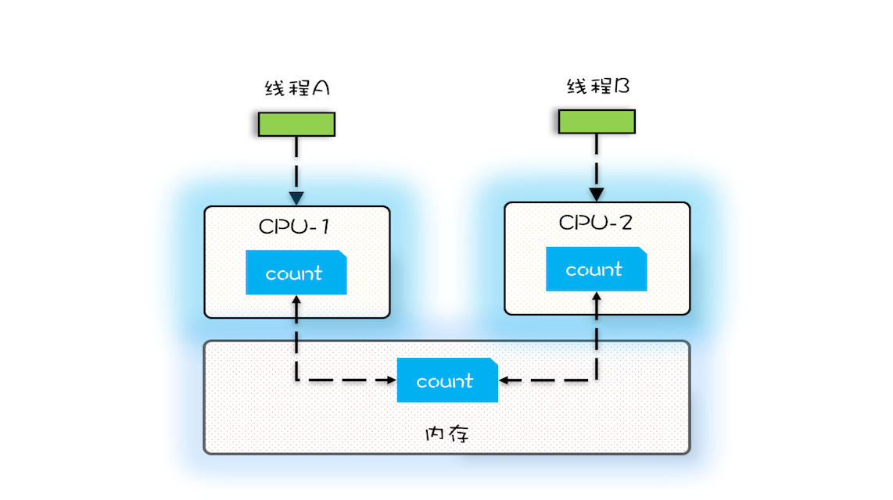

# Thread
* every thread has its own method-call stack. Calculate parameters first, push parameters to method-call stack, and then execute method body


# Frequently-Used Methods
## Runnable
* void run()
## Thread implements Runnable
* constructors
  - Thread()
  - Thread(Runnable target)
  - Thread(Runnable target, String name)
  - Thread(String name)
* void start()  
* void run()
  - https://www.geeksforgeeks.org/difference-between-thread-start-and-thread-run-in-java/#:~:text=Multiple%20invocation%3A%20In%20Java's%20multi,just%20a%20normal%20method%20calling.
* void join(), void join(milliseconds)
* static void sleep(long millis)
* static void yield()
  - A hint to the scheduler that the current thread is willing to yield its current use of a processor.
* void interrupt()
  - `threadToBeInterrupted.interrupt()`
  - t.interrupt() will set interrupt status be to true.
  - after being interrupted, usually the thread will throw InterruptedException. Need to determine how to handle that. Throwing InterruptedException will set interrupt status to be false, so we may need to add `t.interrupt();` in catch block to reset it to be true.
### Communication
* wait(), notify(), notifyAll() need to be inside `synchronized`
* wait() will release lock
* notify() will notify randomly
* Sometimes need to use notifyAll() instead of notify(), otherwise the thread needs to be notified may not be notify
## Callable
```
  import java.util.concurrent.Callable;
  public class ThirdThread implements Callable<String> {
    @override
    public String call() throws Exception {
      String str = "the third way to create a thread";
      return str;
    }
  }

  public class ThirdThreadTest {
    public static void main(String[] args) {
      Callable<String> call = new ThirdThread();
      FutureTask<String> ft = new FutureTask<>(call);
      Thread thread = new Thread(ft);

      thread.start();

      try {
        System.out.println(ft.get()); // get the result after the thread finishes, i.e. "the third way to create a thread"
      } catch (InterruptedException | ExecutionException e) {
          e.printStackTrace();
      }
    }
  }
```

# Life Cycle
* New
* start() -> Runnable
* Running
  - uses CPU
  - will turn into Runnable if time share is used up or yield()
  - will turn into Blocked if calls `child.join()` or `child.join(milliseconds)`, wait(), `t.sleep(milliseconds)`, sends I/O request
* Blocked
* Terminated: after run() finishes or throws an error


# ThreadLocal
* When to use
  - each thread needs an object
  ```
  class ThreadSafeFormatter {
    // the initial value will be set at the first time get() is called  
    public static ThreadLocal<SimpleDateFormat> dateFormatter
      = ThreadLocal.withInitial(() -> new SimpleDateFormat("HH:mm:ss"));

  }
  ```
  - each thread wants to use global variable without the hassle of passing paramters
  ```
  class UserContextHolder {

      public static ThreadLocal<User> holder = new ThreadLocal<>();

  }

  class Service1 {

    public void process(String name) {
        User user = new User("Liam");
        UserContextHolder.holder.set(user);
        new Service2().process();
    }
  }

  class Service2 {

      public void process() {
          User user = UserContextHolder.holder.get();
          ThreadSafeFormatter.dateFormatThreadLocal.get();
          System.out.println("Service2 has gotten: " + user.name);
          new Service3().process();
      }
  }

  class Service3 {

      public void process() {
          User user = UserContextHolder.holder.get();
          System.out.println("Service3 has gotten: " + user.name);
          UserContextHolder.holder.remove();
      }
  }
  ```
* prevent OOM
  - after finishing using ThreadLocal, call `void remove()`

# Safety
* need to consider when we will have
  - will change the global variable
  - or there is "escaping":
  ```
  final int x;
    // Wrong contructor
    public FinalFieldExample() {
      x = 3;
      y = 4;
      // "escaping". if the thread reads x through global.obj, it may get 0
      global.obj = this;
  ```
* reason: race condition: result depends on timing of execution of threads
* visibility: happens-before
  - order within same thread
  - writing volatile (read in and write to memory rather than CPU cache)
  - A happens-before B and B happens-before C, then A happens-before C
  - For the same lock, locking happends-before unlocking. To make addOne() visible to get():
    ```
    class SafeCalc {
      long value = 0L;
      synchronized long get() { return value; }
      synchronized void addOne() { value += 1; }}
    ```
  - a thread changes variable within critical area
  - child thread can see operation results of parent thread before the child thread is started by start()
  - parent thread calls join(), after child thread finishes, parent thread can see operation results of child thread
# Lock
```
private final Object
  lock = new Object();
```
* `synchronized` will writing thread id into lock object head
* lock should be unchangable and should not be reused (e.g. Integer, String, Boolean will be reused). Ratio of resources to lock should be N : 1.

## Dead Lock
* when: occupy and wait, cannot deprive, wait loop
* solution
  - release resources being occupied if the thread cannot get other resources needed
  - avoid wait loop. For example, when acquiring resources, start from the resource with smaller id
## Live Lock
* when: "give way" example
* solution: random

# Performance
* No lock or do not lock for too long

# JUC
## ThreadPool
```
ThreadPoolExecutor(
  int corePoolSize,
  int maximumPoolSize,
  long keepAliveTime,
  TimeUnit unit,
  BlockingQueue<Runnable> workQueue,
  ThreadFactory threadFactory,
  RejectedExecutionHandler handler)
```
some handers:
  - CallerRunsPolicy
  - AbortPolicy: default, throws RejectedExecutionException
  - DiscardPolicy
  - DiscardOldestPolicy
  - can custom handler
allowCoreThreadTimeOut(boolean value)
unbounded LinkedBlockingQueue may cause OOM, should use bounded:
`BlockingQueue workQueue = new LinkedBlockingQueue<>(2);`

* need to catch exception thrown by execute()
* How many threads
  - CPU-intensive: CPU cores + 1
  - I/O-intensive: CPU cores * [ 1 +（I/O time / CPU time）], need stress test. Initial value could be 2 * cores + 1 (https://github.com/brettwooldridge/HikariCP/wiki/About-Pool-Sizing)
* give the thread a meaningful name

## CompletionService
* adding finished task to a blocking queue
```
ExecutorCompletionService(Executor executor) // using unbounded LinkedBlockingQueue
ExecutorCompletionService(Executor executor, BlockingQueue> completionQueue)

Future<V> submit(Callable<V> task);
Future<V> submit(Runnable task, V result);
Future<V> take() throws InterruptedException;
Future<V> poll();
Future<V> poll(long timeout, TimeUnit unit) throws InterruptedException;
```
## Atomic
* when: if only one shared variable
```

public class Test {
  AtomicLong count =
    new AtomicLong(0);
  void add10K() {
    int idx = 0;
    while(idx++ < 10000) {
      count.getAndIncrement();
    }
  }
}
```
* primitive
```
getAndIncrement()
getAndDecrement()
incrementAndGet()
decrementAndGet()

getAndAdd(delta)

addAndGet(delta)
compareAndSet(expect, update)

// new value can be calcuated by func
getAndUpdate(func)
updateAndGet(func)
getAndAccumulate(x,func)
accumulateAndGet(x,func)
```
* ABA issue
* AtomicReference, AtomicStampedReference, AtomicMarkableReference
  - `AtomicStampedReference<T>(value, stamp)`
* AtomicIntegerArray, AtomicLongArray, AtomicReferenceArray
* AtomicIntegerFieldUpdater, AtomicLongFieldUpdater, AtomicReferenceFieldUpdater
* DoubleAccumulator, DoubleAdder, LongAccumulator, LongAdder
