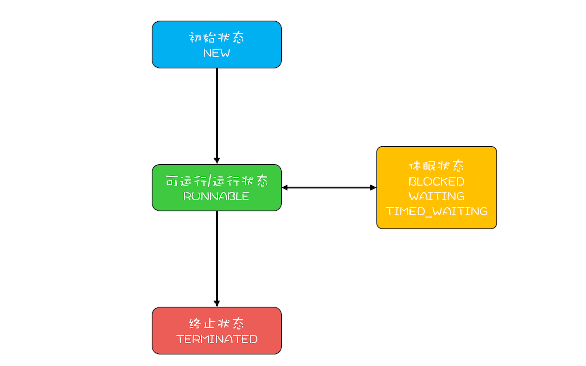

## Summary
* Thread, Runnable, Callable
* priority
* pool
  - why need
  - workQueue BlockingQueue 任务存储队列
    - 直接交接：SynchronousQueue, 容量为0
    - 无界队列：LinkedBlockingQueue
    - 有界的队列：ArrayBlockingQueue
  - rule
    - 如果线程数小于corePoolSize，即使其他工作线程处于空闲状态，也会创建一个新线程来运行新任务。
    - 如果线程数等于（或大于）corePoolSize但少于maximumPoolSize，则将任务放入队列。
    - 如果队列已满，并且线程数小于maxPoolSize，则创建一个新线程来运行任务。只有在队列填满时才创建多于corePoolSize的线程，如果使用的是无界队列（例如LinkedBlockingQueue），那么线程数就不会超过corePoolSize。
    - 如果队列已满，并且线程数大于或等于maxPoolSize，则拒绝该任务。
    - 如果线程池当前的线程数多于corePoolSize，那么如果多余的线程空闲时间超过keepAliveTime，它们就会被终止
  - how many threads
    - CPU密集型（加密、计算hash等）：最佳线程数为CPU核心数的1-2倍左右。
    - 耗时IO型（读写数据库、文件、网络读写等）：最佳线程数一般会大于CPU核心数很多倍
    - 参考Brain Goetz推荐的计算方法：线程数 = CPU核心数 *（1 + 平均等待时间 / 平均工作时间）
    - stress test
  - join() 失效  

* Safety: have changable shared variable?
* Lock: private, unchangable, cannot be reused
* Visibility
  - volatile
  - happens-before: 前一个线程在临界区修改的共享变量，对后续进入临界区的线程可见
* Synchronization
  - blocked: 线程等待synchronized的隐式锁

  - interrupt
    - 在触发 InterruptedException 异常的同时，JVM 会同时把线程的中断标志位清除，可能需要在catch中加入t.interrupt();
  - wait
    - will release lock
  - notifyAll
    - why?
    - when can use notify
* Active
  - dead lock
    - when?
    - how?
      - try to get all -> release and wait -> be notified
      - number resources
  - live lock
    - how: after a random length of interval, release
  - starvation
    - adequate resource
    - hold the lock for a shorter period
    - fair: first come first serve
* Performance
  - avoid lock
  - reduce locking time
    - smaller-scope lock
    - no lock when read, lock when write


## Fundamental
* 各线程什么时候得到CPU时间，占用多久，是不可预测的
### CPU Cache

Because of cache, count may not be 20000:
```java

public class Test {
  private long count = 0;
  private void add10K() {
    int idx = 0;
    while (idx++ < 10000) {
      count += 1;
    }
  }
  public static long calc() {
    final Test test = new Test();
    // create two threads and add
    Thread th1 = new Thread(()->{
      test.add10K();
    });
    Thread th2 = new Thread(()->{
      test.add10K();
    });
    // start
    th1.start();
    th2.start();
    // wait for two threads to finish
    th1.join();
    th2.join();
    return count;
  }
}  
```

### Atomicity
* count += 1:
  - get count from memory to CPU register
  - update count to count + 1 in CPU register
  - save to memory or (if use cache) CPU cache
  

### Calling Method
* every thread has its own method-call stack
* calculate parameters first, push parameters to method-call stack, and then execute method body

### Monitor
#### Component
* shared variable(s)
* methods to manipulate the shared variable
* waiting queue at the entrance
* conditional variable and its waiting queue

#### Rule
* 线程T1进入条件变量的等待队列后，允许其他线程进入管程，否则其他线程不能进入；条件具备时，T1被通知，从等待队列出来，到入口等待队列

#### Java
* synchronized使用管程，在进入同步块之前，会自动加锁，而在代码块执行完会自动释放锁


### Lifecycle

* runnable:
  - Java runnable对应操作系统的runnable和running
  - t.start()
  - .interrupt()
    - 当线程 A 处于 WAITING、TIMED_WAITING 状态时，A变成runnable状态并抛出InterruptedException
    - 当线程 A 处于 RUNNABLE 状态时，并且阻塞在 java.nio.channels.InterruptibleChannel 上时，如果其他线程调用线程 A 的 interrupt() 方法，线程 A 会触发 java.nio.channels.ClosedByInterruptException 这个异常；而阻塞在 java.nio.channels.Selector 上时，如果其他线程调用线程 A 的 interrupt() 方法，线程 A 的 java.nio.channels.Selector 会立即返回。
    - 在触发 InterruptedException 异常的同时，JVM 会同时把线程的中断标志位清除。
      正确：
    ```java

    try {
      Thread.sleep(100);
    }catch(InterruptedException e){
      // 重新设置中断标志位
      th.interrupt();
    }
    ```
      错误：
    ```java

    Thread th = Thread.currentThread();
    while(true) {
      if(th.isInterrupted()) {
        break;
      }
      // 省略业务代码无数
      try {
        Thread.sleep(100);
      }catch (InterruptedException e){
        e.printStackTrace();
      }
    }
    ```  
* 线程调用阻塞式 API（例如以阻塞方式读文件） 时：操作系统的线程转换到休眠状态；JVM 的Java 线程的状态不会发生变化
* blocked: 线程等待synchronized的隐式锁
* waiting
  - 获得 synchronized 隐式锁的线程调用Object.wait()
  - 调用t.join()
  - 调用 LockSupport.park() 方法
* TIMED_WAITING
  - 调用Thread.sleep(long millis)
  - 获得 synchronized 隐式锁的线程，调用Object.wait(long timeout)；
  - 调用Thread.join(long millis)；
  - 调用LockSupport.parkNanos(Object blocker, long deadline)；
  - 调用LockSupport.parkUntil(long deadline)
* terminated：
  - 执行完run(）
  - run()抛出异常


## Multi-Thread Programming
### Division
### Safety
* 存在会变化的共享数据，需要考虑安全性
* Data race
  - two or more threads in a single process access the same memory location concurrently
  - at least one of the accesses is for writing
  - the threads are not using any exclusive locks to control their accesses to that memory
* Race condition
  - the correctness of a computation depends on the relative timing or interleaving of multiple threads by the runtime; in other words, when getting the right answer relies on lucky timing.
  - having "if", may have race condition

#### How
* avoid global variable; local variable is thread-safe
* make global variable final if possible
  - Java 1.5以后，只要我们提供正确构造函数没有“逸出”，就不会出问题了
  ```java

    // 以下代码来源于【参考1】
    final int x;
    // Wrong contructor
    public FinalFieldExample() {
      x = 3;
      y = 4;
      // 此处就是this逸出，线程通过 global.obj 读取 x 是有可能读到 0 的
      global.obj = this;
    }    
  ```
* lock
* Atomic
* beware visibility  


##### Lock
* allow only one thread to execute critical area code during a period
* synchronized：本质是在锁对象的头中写入当前线程id
```
class X {
  // 修饰非静态方法 锁定当前实例
  synchronized void foo() {
    // 临界区
  }
  // 修饰静态方法 锁定当前类的 Class 对象
  synchronized static void bar() {
    // 临界区
  }
  // 修饰代码块 锁定obj
  Object obj = new Object()；
  void baz() {
    synchronized(obj) {
      // 临界区
    }
  }
}  
```

* 锁，应是私有的、不可变的、不可重用的
```java

// 普通对象锁
private final Object
  lock = new Object();
// 静态对象锁
private static final Object
  lock = new Object();
```

##### Visibility
* Visible: after a thread changes a variable, another thread can see the result immediately
* If one thread sets shared variable a = 3, how to make other threads to see a == 3 is true?
  - volatile: read in and write to memory rather than CPU cache
  - Happens-Before: 前一个操作的结果对后续操作可见
    - 在一个线程中，前面的操作 Happens-Before 于后续的操作
    - 对一个 volatile 变量的写操作， Happens-Before 于后续对这个 volatile 变量的读操作。
    - 如果 A Happens-Before B，且 B Happens-Before C，那么 A Happens-Before C。
    - 管程中，一个锁的解锁 Happens-Before 于后续对这个锁的加锁。前一个线程在临界区修改的共享变量（该操作在解锁之前），对后续进入临界区（该操作在加锁之后）的线程是可见的
    - 线程 start() 规则：主线程 A 启动子线程 B 后，子线程 B 能够看到主线程在启动子线程 B 前的操作
    - 线程 join() 规则：指主线程 A 等待子线程 B 完成（主线程 A 通过调用子线程 B 的 join() 方法实现），当子线程 B 完成后（主线程 A 中 join() 方法返回），主线程能够看到子线程对共享变量的操作

    - 案例：受保护资源和锁之间的合理关系是 N:1 的关系。不可以多锁保护一个资源，因为多把锁之间没有可见性保证。

        ```

        class Account {
          // 锁：保护账户余额
          private final Object balLock
            = new Object();
          // 账户余额  
          private Integer balance;
          // 锁：保护账户密码
          private final Object pwLock
            = new Object();
          // 账户密码
          private String password;

          // 取款
          void withdraw(Integer amt) {
            synchronized(balLock) {
              if (this.balance > amt){
                this.balance -= amt;
              }
            }
          }
          // 查看余额
          Integer getBalance() {
            synchronized(balLock) {
              return balance;
            }
          }

          // 更改密码
          void updatePassword(String pw){
            synchronized(pwLock) {
              this.password = pw;
            }
          }
          // 查看密码
          String getPassword() {
            synchronized(pwLock) {
              return password;
            }
          }
        }
        ```


    - 案例：执行 addOne() 方法后，value 的值对 get() 方法是可见的吗？这个可见性是没法保证的。解决方法：
          ```

          class SafeCalc {
            long value = 0L;
            synchronized long get() {
              return value;
            }
            synchronized void addOne() {
              value += 1;
            }
          }
          ```

##### Synchronization
* wait()、notify()、notifyAll() 都要在 synchronized{}内部被调用，否则会抛出java.lang.IllegalMonitorStateException。
* notify vs notifyAll
  - both notify threads in the waiting queue
  - notify: notify a random thread, so some threads may never be notified. Example: 假设有资源 A、B、C、D，线程 1 申请到了 AB，线程 2 申请到了 CD，此时线程 3 申请 AB，会进入等待队列（AB 分配给线程 1，线程 3 要求的条件不满足），线程 4 申请 CD 也会进入等待队列。我们再假设之后线程 1 归还了资源 AB，如果使用 notify() 来通知等待队列中的线程，有可能被通知的是线程 4，但线程 4 申请的是 CD，所以此时线程 4 还是会继续等待，而真正该唤醒的线程 3 就再也没有机会被唤醒了。
  - 何时可以用notify：同时满足
    - 1. 所有等待线程拥有相同的等待条件；
    - 2. 所有等待线程被唤醒后，执行相同的操作；
    - 3. 只需要唤醒一个线程。
* wait vs sleep
  - both make threads to sleep in OS
  - sleep是Thread的方法，而wait是Object类的方法
  - wait()无参数需要唤醒，线程状态WAITING；wait(1000L);到时间自己醒过来或者到时间之前被其他线程唤醒，状态和sleep都是TIME_WAITING
  - wait will release lock; sleep will not, so if there is synchronized scope, other threads cannot access
  - wait should be in synchronized scope; sleep doesn't have to

## Active
### Dead Lock
* 一组互相竞争资源的线程因互相等待，导致“永久”阻塞。
* have dead lock when all are met:
  - exclusive: both resource X and resource Y can be occupied by only one thread
  - occupy and wait: thread 1 is occupying resource X and waiting for Y
  - cannot deprive: other threads cannot take resources of X away
  - wait loop: X is waiting for Y and Y is waiting for X

#### Prevent
* exclusive: cannot prevent
* occupy and wait
  - 1. get lock
  - 2. try to get all resources altogether; if cannot get all, wait and release lock
  - 3. if conditions were met, be notified (尽量用notifyAll())
  ```java

    class Allocator {
      private List<Object> als = new ArrayList<>();
      // 一次性申请所有资源
      synchronized void apply(Object from, Object to) {
        while (als.contains(from) || als.contains(to)){
          try {
            wait();
          } catch(Exception e) {
          }
        }
        als.add(from);
        als.add(to);
      }
      // 归还资源
      synchronized void free(Object from, Object to) {
        als.remove(from);
        als.remove(to);
        notifyAll();
      }
    }

    class Account {
      // actr应该为单例
      private Allocator actr;
      private int balance;
      // 转账
      void transfer(Account target, int amt){
        // 一次性申请转出账户和转入账户，直到成功
        actr.apply(this, target);
        try {
          if (this.balance > amt) {
            this.balance -= amt;
            target.balance += amt;
          }

          // mock database manipulation time
          try {
            Thread.sleep(new Random.nextInt(2000));
          } catch (InterruptedException e) {
            e.printStackTrace();
          }
        } finally {
          actr.free(this, target);
        }
      }
    }
  ```
* cannot deprive: release resources being occupied if the thread cannot get other resources needed
* wait loop: number the resources. when acquiring resources, start from the resource with smaller id
  ```java

  class Account {
    private int id;
    private int balance;
    // 转账
    void transfer(Account target, int amt){
      Account left = this        ①
      Account right = target;    ②
      if (this.id > target.id) { ③
        left = target;           ④
        right = this;            ⑤
      }                          ⑥
      // 锁定序号小的账户
      synchronized(left){
        // 锁定序号大的账户
        synchronized(right){
          if (this.balance > amt){
            this.balance -= amt;
            target.balance += amt;
          }
        }
      }
    }
  }
  ```

### 活锁
* 虽然没有发生阻塞，但仍然执行不下去
  - 路人甲从左手边出门，路人乙从右手边进门，两人为了不相撞，互相谦让，路人甲让路走右手边，路人乙也让路走左手边，结果是两人又相撞了。
* 解决“活锁”: 谦让时，尝试等待一个随机的时间就可以了。例如上面的那个例子，路人甲走左手边发现前面有人，并不是立刻换到右手边，而是等待一个随机的时间后，再换到右手边；同样，路人乙也不是立刻切换路线，也是等待一个随机的时间再切换。由于路人甲和路人乙等待的时间是随机的，所以同时相撞后再次相撞的概率就很低了。
### 饥饿
* 线程因无法访问所需资源而无法执行下去的情况
* 解决“饥饿”：一是保证资源充足，二是公平地分配资源，三就是避免持有锁的线程长时间执行。这三个方案中，方案一和方案三的适用场景比较有限，因为很多场景下，资源的稀缺性是没办法解决的，持有锁的线程执行的时间也很难缩短。倒是方案二的适用场景相对来说更多一些。那如何公平地分配资源呢？在并发编程里，主要是使用公平锁。所谓公平锁，是一种先来后到的方案，线程的等待是有顺序的，排在等待队列前面的线程会优先获得资源。

## Performance
### How to Measure
* 吞吐量：指的是单位时间内能处理的请求数量。吞吐量越高，说明性能越好。
* 延迟：指的是从发出请求到收到响应的时间。延迟越小，说明性能越好。
* 并发量：指的是能同时处理的请求数量，一般来说随着并发量的增加、延迟也会增加。所以延迟这个指标，一般都会是基于并发量来说的。例如并发量是 1000 的时候，延迟是 50 毫秒。

### How to Improve
* Avoid lock
  - Thread Local Storage
  - Copy-on-write
  - 乐观锁
  - 并发包的原子类
  - Disruptor：一个无锁的内存队列
* 减少持有锁的时间
  - 细粒度锁：用不同的锁对受保护资源进行精细化管理，能够提升性能。可能会造成死锁。
  - 读写锁，也就是读是无锁的，只有写的时候才会互斥

## JUC
### Lock
```java

// 支持中断的API
void lockInterruptibly() throws InterruptedException;
// 支持超时的API
boolean tryLock(long time, TimeUnit unit) throws InterruptedException;
// 支持非阻塞获取锁的API
boolean tryLock();
```
```java

class X {
  private final Lock rtl = new ReentrantLock();
  int value;
  public void addOne() {
    // 获取锁
    rtl.lock();  
    try {
      value+=1;
    } finally {
      // 保证锁能释放
      rtl.unlock();
    }
  }
}


//无参构造函数：默认非公平锁
public ReentrantLock() {
    sync = new NonfairSync();
}
//根据公平策略参数创建锁
public ReentrantLock(boolean fair){
    sync = fair ? new FairSync()
                : new NonfairSync();
}
```
### Condition
### CountDownLatch
* 解决一个线程等待多个线程的场景，类比旅游团团长要等待所有的游客到齐才能去下一个景点
```java

// 创建2个线程的线程池
Executor executor =
  Executors.newFixedThreadPool(2);
while (存在未对账订单) {
  // 计数器初始化为2
  CountDownLatch latch =
    new CountDownLatch(2);
  // 查询未对账订单
  executor.execute(()-> {
    pos = getPOrders();
    latch.countDown();
  });
  // 查询派送单
  executor.execute(()-> {
    dos = getDOrders();
    latch.countDown();
  });

  // 等待两个查询操作结束
  latch.await();

  // 执行对账操作
  diff = check(pos, dos);
  // 差异写入差异库
  save(diff);
}
```
### CyclicBarrier
* 一组线程之间互相等待
* 计数器能自动重置
```java

// 订单队列
Vector<P> pos;
// 派送单队列
Vector<D> dos;
// 执行回调的线程池
Executor executor =
  Executors.newFixedThreadPool(1);
final CyclicBarrier barrier =
  new CyclicBarrier(2, ()->{
    executor.execute(()->check());
  }); // when counter is 0, call the callback

void check(){
  P p = pos.remove(0);
  D d = dos.remove(0);
  // 执行对账操作
  diff = check(p, d);
  // 差异写入差异库
  save(diff);
}

void checkAll(){
  // 循环查询订单库
  Thread T1 = new Thread(()->{
    while(存在未对账订单){
      // 查询订单库
      pos.add(getPOrders());
      // 等待
      barrier.await(); // counter deducts
    }
  });
  T1.start();  
  // 循环查询运单库
  Thread T2 = new Thread(()->{
    while(存在未对账订单){
      // 查询运单库
      dos.add(getDOrders());
      // 等待
      barrier.await(); // counter deducts
    }
  });
  T2.start();
}
```  
* CyclicBarrier 的回调函数我们使用了一个固定大小的线程池，你觉得是否有必要呢？
