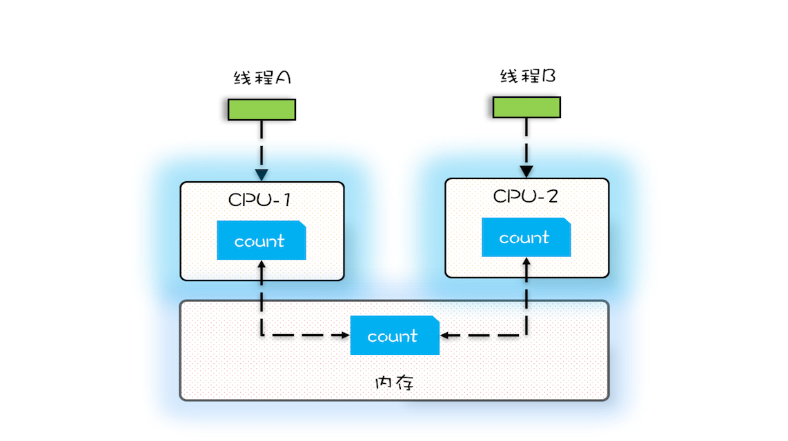
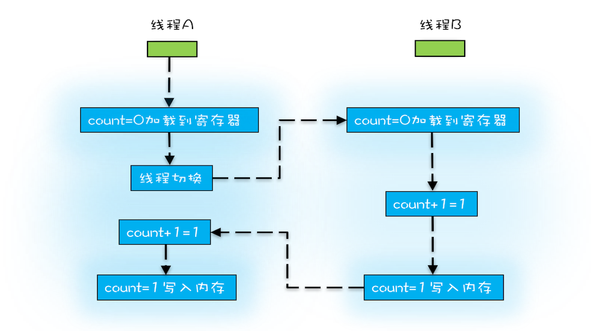

## Multi-Thread Programming Core
* Division
* Notification after finishing
* Exclusion: allow only one thread to access a shared variable during a period
  - how: use lock or make it read-only

## Why Bug?
* visible: after a thread changes a variable, another thread can see the result immediately
  - 有一个共享变量 abc，在一个线程里设置了 abc 的值 abc=3，你思考一下，有哪些办法可以让其他线程能够看到abc==3？
  - CPU cache

  ```java

  public class Test {
    private long count = 0;
    private void add10K() {
      int idx = 0;
      while(idx++ < 10000) {
        count += 1;
      }
    }
    public static long calc() {
      final Test test = new Test();
      // 创建两个线程，执行add()操作
      Thread th1 = new Thread(()->{
        test.add10K();
      });
      Thread th2 = new Thread(()->{
        test.add10K();
      });
      // 启动两个线程
      th1.start();
      th2.start();
      // 等待两个线程执行结束
      th1.join();
      th2.join();
      return count;
    }
  }  
  ```
* Atomic
  - count += 1:
    - get count from memory to CPU register
    - update count to count + 1 in CPU register
    - save to memory or (if use cache) CPU cache
    
* Compiler optimization changes the code sequence

* 按需禁用缓存以及编译优化
  - volatile: read in and write to memory rather than CPU cache
  - synchronized
  - final
    - Java 1.5以后，只要我们提供正确构造函数没有“逸出”，就不会出问题了
    ```java

    // 以下代码来源于【参考1】
    final int x;
    // 错误的构造函数
    public FinalFieldExample() {
      x = 3;
      y = 4;
      // 此处就是this逸出，线程通过 global.obj 读取 x 是有可能读到 0 的
      global.obj = this;
    }    
    ```
  - Happens-Before: 前一个操作的结果对后续操作可见
    - 在一个线程中，按照程序顺序，前面的操作 Happens-Before 于后续的操作
    - 对一个 volatile 变量的写操作， Happens-Before 于后续对这个 volatile 变量的读操作。
    - 如果 A Happens-Before B，且 B Happens-Before C，那么 A Happens-Before C。
    - 管程（Java: synchronized，在进入同步块之前，会自动加锁，而在代码块执行完会自动释放锁）中，一个锁的解锁 Happens-Before 于后续对这个锁的加锁
    - 线程 start() 规则：主线程 A 启动子线程 B 后，子线程 B 能够看到主线程在启动子线程 B 前的操作
    - 线程 join() 规则：指主线程 A 等待子线程 B 完成（主线程 A 通过调用子线程 B 的 join() 方法实现），当子线程 B 完成后（主线程 A 中 join() 方法返回），主线程能够看到子线程对共享变量的操作

## Lock
* 同一时刻只有一个线程执行临界区的代码
```

class X {
  // 修饰非静态方法 锁定当前实例
  synchronized void foo() {
    // 临界区
  }
  // 修饰静态方法 锁定当前类的 Class 对象
  synchronized static void bar() {
    // 临界区
  }
  // 修饰代码块 锁定obj
  Object obj = new Object()；
  void baz() {
    synchronized(obj) {
      // 临界区
    }
  }
}  
```
* 前一个线程在临界区修改的共享变量（该操作在解锁之前），对后续进入临界区（该操作在加锁之后）的线程是可见的
* 受保护资源和锁之间的合理关系是 N:1 的关系。不可以多锁保护一个资源，会没有可见性保证。

```

class Account {
  // 锁：保护账户余额
  private final Object balLock
    = new Object();
  // 账户余额  
  private Integer balance;
  // 锁：保护账户密码
  private final Object pwLock
    = new Object();
  // 账户密码
  private String password;

  // 取款
  void withdraw(Integer amt) {
    synchronized(balLock) {
      if (this.balance > amt){
        this.balance -= amt;
      }
    }
  }
  // 查看余额
  Integer getBalance() {
    synchronized(balLock) {
      return balance;
    }
  }

  // 更改密码
  void updatePassword(String pw){
    synchronized(pwLock) {
      this.password = pw;
    }
  }
  // 查看密码
  String getPassword() {
    synchronized(pwLock) {
      return password;
    }
  }
}
```

* 也可以用一把互斥锁来保护多个资源，例如我们可以用 this 这一把锁来管理账户类里所有的资源：账户余额和用户密码，示例程序中所有的方法都增加同步关键字 synchronized 就可以了。
* 细粒度锁：用不同的锁对受保护资源进行精细化管理，能够提升性能。
* 不能用可变对象做锁

## Local variable is thread-safe
## OOP
* shared variable encapsulation
```Java

public class Counter {
  private long value;
  synchronized long get(){
    return value;
  }
  synchronized long addOne(){
    return ++value;
  }
}

```
* unchanged shared variable: final
* constraints among shared variables
  - having "if", may have race condition
