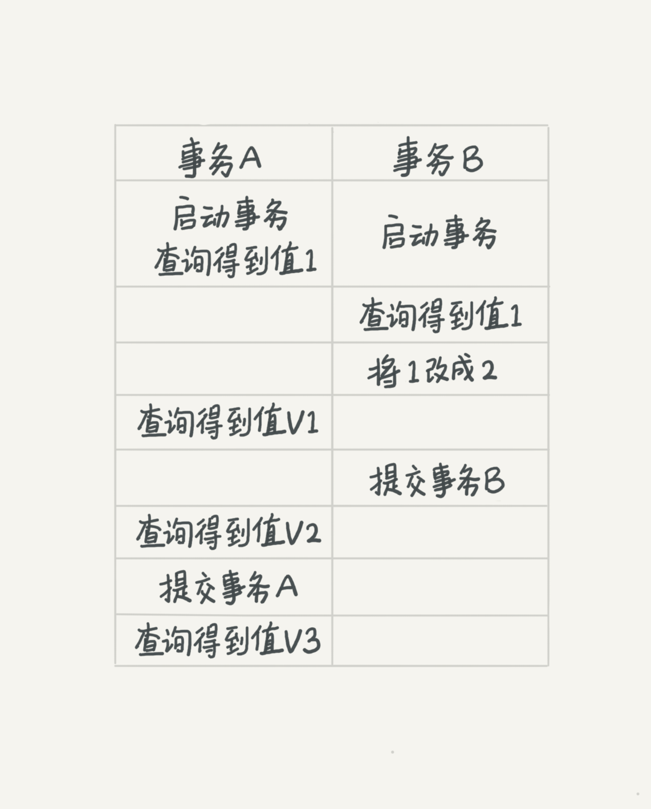

## Overview
* server layer + storage engine layer
    - server layer
        - connector: connects client to server
        - analyzer: lexical and syntax analysis
        - optimizer: which index to use, which table to be joined first
        - executor: execute; update binlog in disk
    - storage engine: read and store, update redo log
        - engines

## Comments
```SQL
#
/**/
```
## Operator
* <>, !=
* like
  - %: >= 0
  - _: 1
* regexp: `ename regexp "[a-zA-Z]{4}"`
* not, and, or

## DDL
### Database
```
drop database (if exists) database_name;
create database database_name;
show databases;
```

### Table
```SQL
drop table (if exists) database.table_name;

CREATE TABLE database.table_name (                                   
column1 datatype [constraint] [comment],                             
column2 datatype [constraint] [comment],                             
column3 datatype [constraint] [comment],                             
INDEX [ index_name ] ( column_name )                                 
foreign key (deptno) references t_dept(deptno)                       
....) [comment];                                                     
                                                                                                                                          
CREATE TABLE database.new_table_name                                 
AS                                                                   
(SELECT column1, column2,...                                         
FROM existing_table_name                                             
WHERE ....);                                                         
                                                                     
Show tables;  
    
describe table_name;                                                 
                                                                     
ALTER TABLE table_name                                               
ADD column1 datatype [constraint] [COMMENT] ,                        
ADD column2 datatype [constraint] [COMMENT] ;                        
                                                                     
ALTER TABLE table_name                                               
MODIFY column1 datatype [constraint] [COMMENT] ,                     
MODIFY column2 datatype [constraint] [COMMENT] ;                     
                                                                     
ALTER TABLE table_name                                               
CHANGE column1 new_column_name1 datatype [constraint] [COMMENT] ,    
CHANGE column2 new_column_name2 datatype [constraint] [COMMENT] ;    
                                                                     
ALTER TABLE table_name                                               
DROP column1 ,                                                       
DROP column2 ;                                                       
                                                                     
ALTER TABLE table_name RENAME new_table_name ;                       
```            

#### constraints
* PRIMARY KEY
* NOT NULL
* UNIQUE
* FOREIGN KEY           

### Insert
```SQL                                                                                     
/*IGNORE: only insert records that do not exist*/                                          
INSERT [ IGNORE ] INTO table_name [(column1 ,column2, ...)] VALUES (value1, value2, ...);  
                                                                                           
INSERT INTO table_name （column_name）(                                                      
SELECT column_name                                                                         
FROM table_name                                                                            
WHERE 条件);                                                                                 
                                                                                                                                                                                      
/*MySQL dialect*/                                                                          
INSERT INTO table_name SET column1=value1, column2=value2, ...... ;      

/* key: UNIQUE index or PRIMARY KEY */
INSERT INTO demo.goodsmaster                                          
SELECT *                                                              
FROM demo.goodsmaster1 as a                                           
ON DUPLICATE KEY UPDATE barcode = a.barcode, goodsname=a.goodsname;                      
```        

### Delete
```mysql                                                                                         
/* ignore: if foreign key exists so some records cannot be deleted, will ignore these records  */
DELETE [ IGNORE ] FROM table_name [ LEFT | RIGHT ] JOIN table_name2 ON conditions                
WHERE conditions                                                                                 
[ ORDER BY ... ]                                                                                 
[ LIMIT ... ] ;                                                                                  
                                                                                                 
/*delete all*/                                                                                   
DELETE FROM demo.goodsmaster; // undo log                                                        
Truncate table table_name; // no in undo log                                                     
```          

### Update
```                                                     
                                                        
UPDATE table_name   
[left | right] join table_name2
on conditions                                    
SET column_name = value                                               
WHERE 条件                                                
[ ORDER BY ... ]                                         
[ LIMIT param ] ; /*can only have one param*/           
```    

### Read
```                                    
                                       
SELECT * | [DISTINCT] column_name                 
FROM table_name                        
WHERE conditions                       
GROUP BY column_name                   
HAVING conditions                      
ORDER BY column_name                   
LIMIT [offset,] row_count                 
``` 
#### Join
* inner join
* left join, right join
    - If there is no match, the columns of the row from the right/left table will contain NULL
* Full (outer) Join
```                                                                                                  
SELECT * FROM t1                                                                                     
LEFT JOIN t2 ON t1.id = t2.id                                                                        
UNION ALL                                                                                            
SELECT * FROM t1                                                                                     
RIGHT JOIN t2 ON t1.id = t2.id                                                                       
WHERE t1.id IS NULL                                                                                  
```                                                                                                  
* cross join
* self join

#### Group by
* The number of dimension column you selected can not larger than that of followed by clause group by
* GROUP_CONCAT函数可以把分组查询中的某个字段拼接成一个字符串 // TODO
#### Limit
* `limit 1, 2`: 1 means starting from 1 (included, first row is 0); 2 means returning 2 records
#### aggregation function
* AVG: ignore null, 只能用于数字类型
* COUNT
    - COUNT(*) to count the number of rows in a table
    - COUNT(column) ignores NULL values
* MAX: ignore null
* MIN: ignore null
* SUM: ignore null, 只能用于数字类型
* for each group
* can put `Distinct` inside (), such as `count(DISTINCT prod_price)`
#### Window functions
// TODO
```
window_function_name(expression) OVER (                                                                                      
[PARTITION BY <expression>[{,<expression>...}]]                                                                           
[ORDER BY <expression> [ASC|DESC], [{,<expression>...}]] // how the rows are ordered within a partition                   
[frame_unit {<frame_start>|<frame_between>}]                                                                              
)                                                                                                                            
                   
``` 
* frame_unit: row | range
* frame_start
  - UNBOUNDED PRECEDING: frame starts at the first row of the partition.
  - N PRECEDING: a physical N of rows before the first current row.
  - CURRENT ROW
* frame_between: `BETWEEN frame_boundary_1 AND frame_boundary_2`
  - frame_start
  - UNBOUNDED FOLLOWING
  - N FOLLOWING
* default: `RANGE BETWEEN UNBOUNDED PRECEDING AND CURRENT ROW`
* functions
  - Aggregate: Count, Sum, Avg, Min, Max
  - Offset:
    - first_value(column_name)
    - last_value(column_name)
    - lead(<expression>[,offset[, default_value]]): running diff, e.g. y-o-y; If offset is zero, then the LAG() function evaluates the expression for the current row. If you don’t specify the offset, then the LAG() function uses one by default.
    - lag(<expression>[,offset[, default_value]]): running diff, e.g. y-o-y

  - Rank
    - row_number: Assigns a sequential integer to every row within its partition; application: Removing duplicate rows
    - rank
    - dense_rank   

### Case when
```sql                                                                                   
CASE WHEN [compare_value] THEN result                                                    
[WHEN [compare_value] THEN result ...]                                                   
[ELSE result] END (AS new_column)                                                        
```                                                                                      
* CASE WHEN case be used in any statement

### union
* union removes duplicates
* union all
* only one order by statement can be used, which is after the final select statement


### Column Alias
* It is not permissible to refer to a column alias in a WHERE clause, because the column value might not yet be determined when the WHERE clause is executed. 

### Table Alias
* derived table must have an alias  

### function
#### Number
* abs
* round
* floor
* ceil
* power(2,3)
* log(7,3)
* ln(10)
* sqrt(9)
* pi()
* sin
* cos
* tan
* cot
* radians(30): 角度转换弧度
* DEGREES(1): 弧度转换角度   
#### Time
##### system time
* now(): yyyy-MM-dd hh:mm:ss
* curdate(): yyyy-MM-dd
* curtime(): hh:mm:ss        
##### DATE_FORMAT
* DATE_FORMAT(日期, 表达式)      
  %Y 年份                       
  %m 月份                       
  %d 日期                       
  %w 星期(数字)                   
  %W 星期(名称)                   
  %j 本年第几天                    
  %U 本年第几周                    
  %h 小时(12)                   
  %H 小时(24)                   
  %i 分钟                       
  %s 秒                        
  %r 时间(12)                   
  %T 时间(24)               
##### DATE_ADD() and DATEDIFF
* DATE_ADD( 日期 , INTERVAL 15 DAY )
* DATEDIFF ( 日期 , 日期 )
#### String
LOWER                                                                                                                      
UPPER                                                                                                                      
LENGTH                                                                                                                     
SELECT CONCAT("SQL ", "Tutorial ", "is ", "fun!") AS ConcatenatedString                                                    
SELECT INSTR("W3Schools.com", "3") AS MatchPosition: 2                                                                     
SELECT INSERT("W3Schools.com", 1, 9, "Example"): Example.com                                                               
REPLACE("你好先生","先生","女士")                                                                                                  
SELECT SUBSTR("SQL Tutorial", 5, 3) AS ExtractString: Tut                                                                  
SELECT SUBSTRING("SQL Tutorial", 5, 3) AS ExtractString: Tut                                                               
SELECT LPAD("SQL Tutorial", 20, "ABC"): ABCABCABSQL Tutorial; Left-pad the string with "ABC", to a total length of 20.     
RPAD("Hello",10,"*")                                                                                                       
TRIM(" 你好先生 ")
#### Condition
IFNULL(expresssion, value)                                                                                                 
IF(expression, value1, value2)    

### CTE
```sql
WITH RECURSIVE cte_name AS (                                                   
    initial_query  -- anchor member                                            
    UNION ALL                                                                  
    recursive_query -- recursive member that references to the CTE name        
)                                                                              
SELECT * FROM cte_name;                                                        

```
                                                                   
to do: https://www.mysqltutorial.org/mysql-recursive-cte/

### subquery
* can be in "select", "from", "where"
* in "from" will have high efficiency, avoid being in "select" or "where". 查询语句执行的时候要多次的依赖于子查询的结果，这类子查询被                 
  称作相关子查询
* 多行子查询只能出现在WHERE子句和FROM子句中

### Execution Order
From > join > Where > group by > having > select > distinct > order by > limit                                           

## Constraint
### PK vs FK
* PK
  - unique
  - not null
  - one but can be multiple columns
  - can use AUTO_INCREMENT
  - Manual assignment: choose the largest ID, add 1 to make the new ID for the new record
    - why: multiple servers, auto_increment will cause duplicates; don't use business field as PK because the business field may be reused or have duplicates
* FK
  - primary key in another table
  - can be null
  - can have more than one FK
  - 如果形成外键闭环，我们将无法删除任何一张表的记录

## View
* read-only, no storage
// TODO

## Log
### General
* connection start and end time, all instructions to server   
### Slow
* my.ini, restart after modifying my.ini 
### Error
### binary log in the server layer    
* Has statement-based logging: Events contain SQL statements that produce data changes (inserts, updates, deletes)
* append    
* for back up
### Relay Bin Log
* on slave server, read bin log from master server and write into  
### Undo log
* record what data look like before change, allowing rollback and allowing other transactions to read what data look like before it is changed by this transaction
* When there are no read-views earlier than this undo log record, it will be deleted.
  
### Redo Log in InnoDB
* used to recover modification of unfinished transaction
* Write-ahead logging
  - write to redo log, update memory, then disk
  - when the redo log is full, move to disk to clean some space    

InnoDB prepares redo log. Executor updates binlog. InnoDB commits redo log. 

### Lock
* 行锁是在需要的时候才加上的，等到事务结束时才释放。如果你的事务中需要锁多个行，要把最可能造成锁冲突、最可能影响并发度的锁尽量往后放。
* Dead lock
  - 发起死锁检测（默认innodb_deadlock_detect=ON），发现死锁后，InnoDB自动回滚死锁链条中的某一个事务，让其他事务得以继续执行。如果并发能够控制住，比如同一行同时最多只有 10 个线程在更新，那么死锁检测的成本很低
  - 你可以考虑通过将一行改成逻辑上的多行来减少锁冲突。还是以影院账户为例，可以考虑放在多条记录上，比如 10 个记录，影院的账户总额等于这 10 个记录的值的总和。
    这样每次要给影院账户加金额的时候，随机选其中一条记录来加。这样每次冲突概率变成原来的 1/10，可以减少锁等待个数，也就减少了死锁检测的 CPU 消耗。
### Isolation Levels
* read uncommitted: no read-view.
* read committed: a read-view is created when a SQL query of transaction B executes
* repeatable read: a read-view is created when the transaction B executes "select" so the undo log has data, so data seen in this transaction are the same as what they were when this transaction started.
* serializable: read and write will add lock. After a transaction finishes, another transaction can execute.
  
  Source: https://time.geekbang.org/column/article/68963

## index
```
CREATE INDEX 索引名 ON table_name( column_name ) ；
ALTER TABLE table_name称 ADD INDEX [ index_name ]( column_name ) ;
SHOW INDEX FROM table_name ;
DROP INDEX index_name ON table_name ;
```
* different storage engines may have different index implementation.
* Clustered index: defines the physical order in which table records are stored in a database; one clustered index per table; by default is PK
* Secondary index
* Multiple-column index
  - leftmost prefix rule
  - if filter a field by a range, the field after this field in the multiple-column index will not be filtered by using the multiple-column index any longer.
    For example, index is (branchnumber, cashiernumber, itemnumber), `branchnumber > 10 AND cashiernumber = 1 AND itemnumber = 100`: will use index to filter branchnuber,
    but when filtering cashiernumber, it will not use the index (branchnumber, cashiernumber)
* If there are multiple indexes, MySQL will choose the best
* Don't create an index on a big field


### InnoDB index model
* B+ tree
  
* primary key index (called clustered index in InnoDB): leaves store records
* non primary key index (called secondary index in InnoDB): leaves store primary key values. If search based on non primary key index, will search the B+ tree of the non primary key index first, find the primary key value, and then search the B+ tree of the primary key index.
* index maintenance
  - inserting may cause some records to be moved
  - if a data page is full, inserting will create a new data page


## Paradigm
* First: atomic: cannot be separated further
* Second: every record has a unique identifier; every field depends on the full PK rather than part of PK
* Third: cannot have field that depends on non-PK
* Business-first: may not obey paradigm 3

## ER
* One entity -> a table
* M-N -> a table
