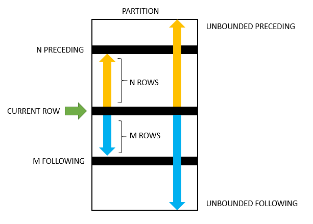

## Overview
* server layer + storage engine layer
  - server layer
    - connector: connects client to server; wait_timeout can decide how long it will wait before disconnecting if the client has not sent a query.
    - cache: After MySQL 8.0, not have this.
    - analyzer: lexical and syntax analysis
    - optimizer: which index to use, which table to be joined first
    - executor: execute; update binlog in disk
    the server layer has functions, stored procedures, trigger, view, etc

  - storage engine: store, update log
    - engines: InnoDb, MyISAM, Memory, etc


## comments
```SQL
#
/**/
```

## data types
## Number
* TINYINT: 1 byte
* SMALLINT: 2 bytes
* MEDIUMINT: 3 bytes
* INT: 4 bytes
* BIGINT: 8 bytes
* FLOAT: 4 bytes
* DOUBLE: 8 bytes
* DECIMAL(x,y)

## String
* char: 255
* varchar: variable length; 理论65535，不允许非空字段时最大65533，允许非空字段65532
* text: variable length; 65535
* MEDIUMTEXT: variable length; 1千6百万字符
* LONGTEXT: variable length; 42亿字符
## Date and Time
* Date
* Time
* Year
* Datetime
* Timestamp: converted from the current time zone to UTC for storage, and converted back from UTC to the current time zone for retrieval


## Queries


### Database
```
drop database (if exists) database_name;
create database database_name;
show databases;
```

### Table
```SQL
CREATE TABLE database.table_name (
column1 datatype [constraint] [comment],
column2 datatype [constraint] [comment],
column3 datatype [constraint] [comment],
INDEX [ 索引名称 ] ( 字段 )
foreign key (deptno) references t_dept(deptno)
....) [comment];
drop table (if exists) database.table_name;
CREATE TABLE database.new_table_name
AS
(SELECT column1, column2,...
FROM existing_table_name
WHERE ....);

Show tables;
describe table_name;

ALTER TABLE 表名称
ADD 列1 数据类型 [ 约束 ] [COMMENT 注释] ,
ADD 列2 数据类型 [ 约束 ] [COMMENT 注释] ;

ALTER TABLE 表名称
MODIFY 列1 数据类型 [ 约束 ] [COMMENT 注释] ,
MODIFY 列2 数据类型 [ 约束 ] [COMMENT 注释] ;

ALTER TABLE 表名称
CHANGE 列1 新列名1 数据类型 [ 约束 ] [COMMENT 注释] ,
CHANGE 列2 新列名2 数据类型 [ 约束 ] [COMMENT 注释] ;

ALTER TABLE 表名称
DROP 列1 ,
DROP 列2 ;

ALTER TABLE 表名 RENAME 新表名 ;
```
#### constraints
* PRIMARY KEY
* NOT NULL
* UNIQUE
* FOREIGN KEY


### Operator
* =
* <>, !=
* is null, is not null
* between and
* in
* EXISTS
  - EXISTS关键字是把原来在子查询之外的条件判断，写到了子查询的里面
  ```SQL
  /*
  查询工资等级3和4级的员工信息
  */
  select empno, ename, sal, comm
  from t_emp
  where exists
  (select * from t_salgrade where grade in (3, 4) and sal between losal and hisal);
  ```
* like
  - %: zero or more
  - _: single
* regexp
  - `ename regexp "[a-zA-Z]{4}`

* NOT
* AND
* OR
* XOR
* &
* |
* ~: bitwise not
* ^: bitwise XOR
* <<
* >>

#### Priority
* () > NOT >And > Or

### Insert
```SQL
/*
IGNORE只插入数据库不存在
*/
INSERT [ IGNORE ] INTO 表名 [(字段名 [,字段名] ...)] VALUES (值的列表);


INSERT INTO 表名 （字段名）(
SELECT 字段名或值
FROM 表名
WHERE 条件);

INSERT INTO demo.goodsmaster
(itemnumber, barcode, goodsname, specification, unit, price)
VALUES
(4,'0003','尺子','三角型','把',5);

/*MySQL dialect*/
INSERT INTO 表名 SET 字段1=值1, 字段2=值2, …… ;
```

* can skip inserting some columns if null allowed or have default values
* ON DUPLICATE: 假设我们要把门店 B 的商品数据，插入到门店 A 的商品表中去，如果有重复的商品编号，就用门店 B 的条码，替换门店 A 的条码，用门店 B 的商品名称，替换门店 A 的商品名称；如果没有重复的编号，就直接把门店 B 的商品数据插入到门店 A 的商品表中。

```

mysql> SELECT *
    -> FROM demo.goodsmaster;
+------------+---------+-----------+---------------+------+------------+
| itemnumber | barcode | goodsname | specification | unit | salesprice |
+------------+---------+-----------+---------------+------+------------+
|          1 | 0001    | 书        | 16开          | 本   |      89.00 |
|          2 | 0002    | 笔        | 10支装        | 包   |       5.00 |
|          3 | 0003    | 橡皮      | NULL          | 个   |       3.00 |
+------------+---------+-----------+---------------+------+------------+
3 rows in set (0.00 sec)


mysql> SELECT *
    -> FROM demo.goodsmaster1;
+------------+---------+-----------+---------------+------+------------+
| itemnumber | barcode | goodsname | specification | unit | salesprice |
+------------+---------+-----------+---------------+------+------------+
|          1 | 0001    | 教科书    | NULL          | NULL |      89.00 |
|          4 | 0004    | 馒头      |               |      |       1.50 |
+------------+---------+-----------+---------------+------+------------+
2 rows in set (0.00 sec)


INSERT INTO demo.goodsmaster
SELECT *
FROM demo.goodsmaster1 as a
ON DUPLICATE KEY UPDATE barcode = a.barcode,goodsname=a.goodsname;
-- 运行结果如下
mysql> SELECT *
    -> FROM demo.goodsmaster;
+------------+---------+-----------+---------------+------+------------+
| itemnumber | barcode | goodsname | specification | unit | salesprice |
+------------+---------+-----------+---------------+------+------------+
|          1 | 0001    | 教科书    | 16开          | 本   |      89.00 |
|          2 | 0002    | 笔        | 10支装        | 包   |       5.00 |
|          3 | 0003    | 橡皮      | NULL          | 个   |       3.00 |
|          4 | 0004    | 馒头      |               |      |       1.50 |
+------------+---------+-----------+---------------+------+------------+
4 rows in set (0.00 sec)
```

### Delete
```

DELETE [ IGNORE ] FROM 表名 [ LEFT | RIGHT ] JOIN 表2 ON 条件
WHERE 条件
[ ORDER BY …… ]
[ LIMIT …… ] ;

// 删除全部数据
DELETE FROM demo.goodsmaster; // undo log
Truncate table table_name; // no in undo log
```
* ignore: if foreign key exists so some records cannot be deleted, will ignore these records
* sequence: from -> where -> order by -> limit -> delete

### Update
```

UPDATE 表名
SET 字段名=值
WHERE 条件
[ ORDER BY …… ]
[ LIMIT param ] ; /*can only have one param*/
```
* sequence: from -> where -> order by -> limit -> set
* Don't update primary key
* 因为WHERE子句中的子查询效率非常低，所以我们可以利用表连接的方式来改造UPDATE语句
```SQL
UPDATE 表1 [ LEFT | RIGHT ] JOIN 表2 ON 条件
SET 字段1 = 值1 , 字段2 = 值2 , …… ;

UPDATE 表1 , 表2
SET 字段1 = 值1 , 字段2 = 值2 , ……
WHERE 连接条件 ;
```

### Read
```

SELECT *|字段列表
FROM 数据源
WHERE 条件
GROUP BY 字段
HAVING 条件
ORDER BY 字段
LIMIT 起始点，行数
```

```
SELECT
    [ALL | DISTINCT | DISTINCTROW ]
    [HIGH_PRIORITY]
    [STRAIGHT_JOIN]
    [SQL_SMALL_RESULT] [SQL_BIG_RESULT] [SQL_BUFFER_RESULT]
    [SQL_NO_CACHE] [SQL_CALC_FOUND_ROWS]
    select_expr [, select_expr] ...
    [into_option]
    [FROM table_references
      [PARTITION partition_list]]
    [WHERE where_condition]
    [GROUP BY {col_name | expr | position}, ... [WITH ROLLUP]]
    [HAVING where_condition]
    [WINDOW window_name AS (window_spec)
        [, window_name AS (window_spec)] ...]
    [ORDER BY {col_name | expr | position}
      [ASC | DESC], ... [WITH ROLLUP]]
    [LIMIT {[offset,] row_count | row_count OFFSET offset}]
    [into_option]
    [FOR {UPDATE | SHARE}
        [OF tbl_name [, tbl_name] ...]
        [NOWAIT | SKIP LOCKED]
      | LOCK IN SHARE MODE]
    [into_option]

into_option: {
    INTO OUTFILE 'file_name'
        [CHARACTER SET charset_name]
        export_options
  | INTO DUMPFILE 'file_name'
  | INTO var_name [, var_name] ...
}

```

* Windows
  - window functions also operate on a subset of rows but they do not reduce the number of rows returned by the query
···
window_function_name(expression) OVER (
   [PARTITION BY <expression>[{,<expression>...}]]
   [ORDER BY <expression> [ASC|DESC], [{,<expression>...}]] // how the rows are ordered within a partition
   [frame_unit {<frame_start>|<frame_between>}]
)

// running total
SUM(total_price) OVER(ORDER BY Sales_Date rows between UNBOUNDED PRECEDING and current row) AS Running_Total
···
  - A frame is defined with respect to the current row, which allows a frame to move within a partition depending on the position of the current row within its partition.
  - The frame unit specifies the type of relationship between the current row and frame rows. It can be ROWS or RANGE. The offsets of the current row and frame rows are the row numbers if the frame unit is ROWS and row values the frame unit is RANGE.


  - The frame_start defines the frame boundary and contains one of the following:
    - UNBOUNDED PRECEDING: frame starts at the first row of the partition.
    - N PRECEDING: a physical N of rows before the first current row. N can be a literal number or an expression that evaluates to a number.
    - CURRENT ROW: the row of the current calculation

  - The frame_between defines the frame boundary and is as follows:
    ```
    BETWEEN frame_boundary_1 AND frame_boundary_2   
    ```
    The frame_boundary_1 and frame_boundary_2 can each contain one of the following:
      - frame_start: as mentioned previously.
      - UNBOUNDED FOLLOWING: the frame ends at the final row in the partition.
      - N FOLLOWING: a physical N of rows after the current row.
  - If you don’t specify the frame_definition in the OVER clause, then MySQL uses the following frame by default:
    ```
    RANGE BETWEEN UNBOUNDED PRECEDING AND CURRENT ROW
    ```
  
  - Aggregate: Count, Sum, Avg, Min, Max
  - Offset:
    - first_value(column_name)
    - last_value(column_name)
    - lead(<expression>[,offset[, default_value]]): running diff, e.g. y-o-y; If offset is zero, then the LAG() function evaluates the expression for the current row. If you don’t specify the offset, then the LAG() function uses one by default.
    - lag(<expression>[,offset[, default_value]]): running diff, e.g. y-o-y

  - Rank
    - row_number: Assigns a sequential integer to every row within its partition; application: Removing duplicate rows
    - rank
    - dense_rank

* distinct
  - If you have null value in the column, select distinct will only show one null value
  - Select multiple columns: MySQL uses the combination of values in these columns to determine the uniqueness of the row in the result set
* Use of an unqualified * with other items in the select list may produce a parse error. To avoid this problem, use a qualified tbl_name.* reference:
```
SELECT AVG(score), t1.* FROM t1 ...
```
* You need not specify a tbl_name or db_name.tbl_name prefix for a column reference unless the reference would be ambiguous.

* The INTO clause, if present, can appear in any position indicated by the syntax description, but within a given statement can appear only once, not in multiple positions.

* column alias:
 - it is good practice to be in the habit of using AS explicitly when specifying column aliases.
 - can be used in GROUP BY, ORDER BY, or HAVING clauses
 - If the column alias contains spaces, you need to place it inside quotes
 - The execute order after select can use the alias name, otherwise no. It is not permissible to refer to a column alias in a WHERE clause, because the column value might not yet be determined when the WHERE clause is executed.
```
SELECT CONCAT('Jane',' ','Doe') AS 'Full name';
```

* from: table, derived table
```
tbl_name [[AS] alias] [index_hint]
```
 - devrived table must have an alias
 - If you name more than one table, you are performing a join.
 - The use of index hints provides the optimizer with information about how to choose indexes during query processing. For a description of the syntax for specifying these hints, see Section 8.9.4, “Index Hints”.You can use SET max_seeks_for_key=value as an alternative way to force MySQL to prefer key scans instead of table scans. See Section 5.1.8, “Server System Variables”.

* where
  - old: 筛选掉记录最多的条件写在最左侧

* GROUP BY
  - permits a WITH ROLLUP modifier. See Section 12.20.2, “GROUP BY Modifiers”.
    ```
    SELECT
        productLine,
        orderYear,
        SUM(orderValue) totalOrderValue
    FROM
        sales
    GROUP BY
        productline,
        orderYear
    WITH ROLLUP;
    ```
    
    https://www.mysqltutorial.org/mysql-rollup/
  - The number of dimension column you selected can not larger than that of followed by clause group by
  - GROUP_CONCAT函数可以把分组查询中的某个字段拼接成一个字符串


* order by
  - asc, desc
  - If ORDER BY occurs within a parenthesized query expression and also is applied in the outer query, the results are undefined and may change in a future version of MySQL.
  - When you use ORDER BY or GROUP BY to sort a column in a SELECT, the server sorts values using only the initial number of bytes indicated by the max_sort_length system variable.

* limit:
 - start index is 0
 - `limit 1, 2`: 1 means starting from 1 (included, first row is 0); 2 means 2 records
 - With one argument, the value specifies the number of rows to return from the beginning of the result set
 - For prepared statements, you can use placeholders.
 ```
 SET @skip=1; SET @numrows=5;
 PREPARE STMT FROM 'SELECT * FROM tbl LIMIT ?, ?';
 EXECUTE STMT USING @skip, @numrows;
 ```
 - If LIMIT occurs within a parenthesized query expression and also is applied in the outer query, the results are undefined and may change in a future version of MySQL


* HAVING
   - The query result includes only groups satisfying the HAVING conditions. (If no GROUP BY is present, all rows implicitly form a single aggregate group.)
   - The WHERE clause specifies conditions on columns in the select list, but cannot refer to aggregate functions.
   - SQL standard: HAVING must reference only columns in the GROUP BY clause or columns used in aggregate functions. Extension: permits HAVING to refer to columns in the SELECT list and columns in outer subqueries. If a HAVING column name is used both in GROUP BY and as an aliased column in the select column list, preference is given to the column in the GROUP BY column

 * aggregation function
  - AVG: ignore null, 只能用于数字类型，非数字数据统计结果为0
  - COUNT
    - COUNT(*) to count the number of rows in a table
    - COUNT(column) ignores NULL values
  - MAX: ignore null
  - MIN: ignore null
  - SUM: ignore null, 只能用于数字类型，字符类型的统计结果为0，日期类型统计结果是毫秒数相加。
  - for each group
  - can put `Distinct` inside (), such as `count(DISTINCT prod_price)`

 * For update: ...
 * DISTINCT
 * STRAIGHT_JOIN forces the optimizer to join the tables in the order in which they are listed in the FROM clause.
 * STRAIGHT_JOIN does not apply to any table that the optimizer treats as a const or system table.
 * SQL_BIG_RESULT or SQL_SMALL_RESULT can be used with GROUP BY or DISTINCT to tell the optimizer that the result set has many rows or is small, respectively. For SQL_BIG_RESULT, MySQL directly uses disk-based temporary tables if they are created, and prefers sorting to using a temporary table with a key on the GROUP BY elements. For SQL_SMALL_RESULT, MySQL uses in-memory temporary tables to store the resulting table instead of using sorting. This should not normally be needed.
 * SQL_BUFFER_RESULT forces the result to be put into a temporary table. This helps MySQL free the table locks early and helps in cases where it takes a long time to send the result set to the client. This modifier can be used only for top-level SELECT statements, not for subqueries or following UNION.
 * Named Windows: https://dev.mysql.com/doc/refman/8.0/en/window-functions-named-windows.html
 * Partition: https://dev.mysql.com/doc/refman/8.0/en/partitioning-selection.html

### Join
* inner join
* left join, right join
  - If there is no match, the columns of the row from the right/left table will contain NULL
* Full (outer) Join
```
SELECT * FROM t1
LEFT JOIN t2 ON t1.id = t2.id
UNION ALL
SELECT * FROM t1
RIGHT JOIN t2 ON t1.id = t2.id
WHERE t1.id IS NULL
```
* cross join
* self join

### Case when
···
CASE WHEN [compare_value] THEN result
[WHEN [compare_value] THEN result ...]
[ELSE result] END (AS new_column)
···
* CASE WHEN case be used in any statement

### union
* union removes duplicates
* union all
* only one order by statement can be used, which is after the final select statement

### function
#### Number
* abs
* round
* floor
* ceil
* power(2,3)
* log(7,3)
* ln(10)
* sqrt(9)
* pi()
* sin
* cos
* tan
* cot
* radians(30): 角度转换弧度
* DEGREES(1): 弧度转换角度
#### Time
##### system time
* now(): yyyy-MM-dd hh:mm:ss
* curdate(): yyyy-MM-dd
* curtime(): hh:mm:ss
##### DATE_FORMAT
* DATE_FORMAT(日期, 表达式)
%Y 年份
%m 月份
%d 日期
%w 星期(数字)
%W 星期(名称)
%j 本年第几天
%U 本年第几周
%h 小时(12)
%H 小时(24)
%i 分钟
%s 秒
%r 时间(12)
%T 时间(24)
##### DATE_ADD() and
* DATE_ADD( 日期 , INTERVAL 15 DAY )
* DATEDIFF ( 日期 , 日期 )
#### String
LOWER
UPPER
LENGTH
SELECT CONCAT("SQL ", "Tutorial ", "is ", "fun!") AS ConcatenatedString
SELECT INSTR("W3Schools.com", "3") AS MatchPosition: 2
SELECT INSERT("W3Schools.com", 1, 9, "Example"): Example.com
REPLACE("你好先生","先生","女士")
SELECT SUBSTR("SQL Tutorial", 5, 3) AS ExtractString: Tut
SELECT SUBSTRING("SQL Tutorial", 5, 3) AS ExtractString: Tut
SELECT LPAD("SQL Tutorial", 20, "ABC"): ABCABCABSQL Tutorial; Left-pad the string with "ABC", to a total length of 20.
RPAD("Hello",10,"*")
TRIM(" 你好先生 ")
#### Condition
IFNULL( 表达式 , 值 )
IF( 表达式 , 值1 , 值2 )

### common table expression or CTE
```
WITH salesrep AS (
    SELECT
        employeeNumber,
        CONCAT(firstName, ' ', lastName) AS salesrepName
    FROM
        employees
    WHERE
        jobTitle = 'Sales Rep'
),
customer_salesrep AS (
    SELECT
        customerName, salesrepName
    FROM
        customers
            INNER JOIN
        salesrep ON employeeNumber = salesrepEmployeeNumber
)
SELECT
    *
FROM
    customer_salesrep
ORDER BY customerName;


WITH RECURSIVE cte_name AS (
    initial_query  -- anchor member
    UNION ALL
    recursive_query -- recursive member that references to the CTE name
)
SELECT * FROM cte_name;
```
to do: https://www.mysqltutorial.org/mysql-recursive-cte/

### subquery
* can be in "select", "from", "where"
* in "from" will have high efficiency, avoid being in "select" or "where". 查询语句执行的时候要多次的依赖于子查询的结果，这类子查询被
称作相关子查询
* 多行子查询只能出现在WHERE子句和FROM子句中

### Execution Order
From > join > Where > group by > having > select > distinct > order by > limit

### Prepared statement
```
SELECT *
FROM products
WHERE productCode = ?;
```
* When MySQL executes this query with different productcode values, it does not have to fully parse the query. As a result, this helps MySQL execute the query faster, especially when MySQL executes the same query multiple times.
* Since the prepared statement uses placeholders (?), this helps avoid many variants of SQL injection hence make your application more secure.

```
PREPARE stmt1 FROM
	'SELECT
   	    productCode,
            productName
	FROM products
        WHERE productCode = ?';


SET @pc = 'S10_1678';

EXECUTE stmt1 USING @pc;

DEALLOCATE PREPARE stmt1;
```

## Constraint
### PK vs FK
* PK
  - unique
  - not null
  - one but can be multiple columns
  - can use AUTO_INCREMENT
* FK
  - primary key in another table
  - can be null
  - can have more than one FK
  - 如果形成外键闭环，我们将无法删除任何一张表的记录

## View
* read-only, no storage


## Log
### Redo Log in InnoDB
* Write-ahead logging
  - write to redo log, update memory, then disk
  - when the redo log is full, move to disk to clean some space
* Crash-safe: innodb_flush_log_at_trx_commit = 1
### binlog in the server layer
* can be used by all engines
* Has statement-based logging: Events contain SQL statements that produce data changes (inserts, updates, deletes)
* append
* sync_binlog = 1 to make sure binlog is not lost

InnoDB prepares redo log. Executor updates binlog. InnoDB commits redo log.
### Undo log
* When there are no read-views earlier than this undo log record, it will be deleted.

Source: https://time.geekbang.org/column/article/68963
* Long transaction will cause too many undo log records to stay

* To avoid long transaction, set autocommit=1
* To find long transaction (e.g. 60s):

```MySql

select * from information_schema.innodb_trx where TIME_TO_SEC(timediff(now(),trx_started))>60
```
* Analyze general log to avoid long transaction issues
* SET_MAX_EXECUTION_TIME


### How to restore
* Find the most recent full backup. Then based on binlog records later than the most recent full backup, restore data.
* back up every day or every week? More frequent, more storage, less RTO(Recovery Time Objective).

## Transaction
* high isolation will lead to low efficiency
* SQL
```SQL
START TRANSACTION ;
SQL语句
[ COMMIT | ROLLBACK ] ;
```
* ACID

### Isolation Levels
* `SET SESSION TRANSACTION ISOLATION LEVEL READ UNCOMMITTED`
* read uncommitted: no read-view.
* read committed: a read-view is created when a SQL query executes
* repeatable read: a read-view is created when the transaction executes "select" so the undo log has data, so data seen in this transaction are the same as what they were when this transaction started.
* serializable: read and write will add lock. After a transaction finishes, another transaction can execute.

Source: https://time.geekbang.org/column/article/68963

## 导出与备份
* 数据导出: 数据
  - SQL文档
    - `mysqldump -uroot -p [ no-data ] 逻辑库 > 路径`
    - 如果业务数据非常多，建议只导出表结构，然后用SELECT INTO OUTFILE把数据导出成文本文档
  - 文本文档
* 数据备份: 数据文件、日志文件、索引文件等等
* 全量备份, 增量备份
* 导入
```
USE demo ;
SOURCE backup.sql ;
```

## index
```
CREATE INDEX 索引名 ON 表名( 字段 ) ；
ALTER TABLE 表名称 ADD INDEX [ 索引名 ]( 字段 ) ;
SHOW INDEX FROM 表名 ;
DROP INDEX 索引名称 ON 表名 ;
```
* different storage engines may have different index implementation.
* 不要在大字段上创建索引


### InnoDB index model
* B+ tree

* primary key index (called clustered index in InnoDB): leaves store records
* non primary key index (called secondary index in InnoDB): leaves store primary key values. If search based on non primary key index, will search the B+ tree of the non primary key index first, find the primary key value, and then search the B+ tree of the primary key index.
* index maintenance
  - inserting may cause some records to be moved
  - if a data page is full, inserting will create a new data page
* Usually using auto increment as the primary key leads to better performance and less storage. However, for the k-v situation, may use a business column as the primary key
