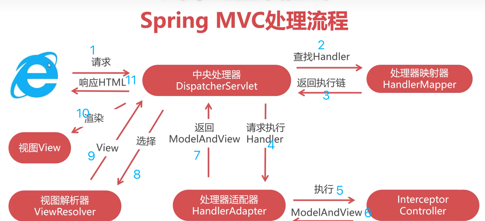

## What
* Model
* View
* Controller

## Environment
* Maven依赖spring-webmvc
* web.xml配置DispatcherServlet
  ```XML
  <?xml version="1.0" encoding="UTF-8"?>
  <web-app xmlns="http://xmlns.jcp.org/xml/ns/javaee"
           xmlns:xsi="http://www.w3.org/2001/XMLSchema-instance"
           xsi:schemaLocation="http://xmlns.jcp.org/xml/ns/javaee http://xmlns.jcp.org/xml/ns/javaee/web-app_3_1.xsd"
           version="3.1">
      <!--DispatchServlet-->
      <servlet>
          <servlet-name>springmvc</servlet-name>
          <!--
              DispatcherServlet是Spring MVC最核心的对象
              DispatcherServlet用于拦截Http请求,
              并根据请求的URL调用与之对应的Controller方法,来完成Http请求的处理
          -->
          <servlet-class>org.springframework.web.servlet.DispatcherServlet</servlet-class>
          <!--applicationContext.xml-->
          <init-param>
              <param-name>contextConfigLocation</param-name>
              <param-value>classpath:applicationContext.xml</param-value>
          </init-param>
          <!--
              在Web应用启动时自动创建Spring IOC容器,
              并初始化DispatcherServlet
          -->
          <load-on-startup>0</load-on-startup>
      </servlet>
      <servlet-mapping>
          <servlet-name>springmvc</servlet-name>
          <!--"/" 代表拦截所有请求-->
          <url-pattern>/</url-pattern>
      </servlet-mapping>

      <filter>
          <filter-name>characterFilter</filter-name>
          <filter-class>org.springframework.web.filter.CharacterEncodingFilter</filter-class>
          <init-param>
              <param-name>encoding</param-name>
              <param-value>UTF-8</param-value>
          </init-param>
      </filter>
      <filter-mapping>
          <filter-name>characterFilter</filter-name>
          <url-pattern>/*</url-pattern>
      </filter-mapping>
      <filter>
          <filter-name>formContentFilter</filter-name>
          <filter-class>org.springframework.web.filter.FormContentFilter</filter-class>
      </filter>
      <filter-mapping>
          <filter-name>formContentFilter</filter-name>
          <url-pattern>/*</url-pattern>
      </filter-mapping>
  </web-app>
  ```
* 配置applicationContext的mvc标记
  ```XML
  <?xml version="1.0" encoding="UTF-8"?>
  <beans xmlns="http://www.springframework.org/schema/beans"
         xmlns:mvc="http://www.springframework.org/schema/mvc"
         xmlns:context="http://www.springframework.org/schema/context"
         xmlns:xsi="http://www.w3.org/2001/XMLSchema-instance" xmlns:mv="http://www.springframework.org/schema/mvc"
         xsi:schemaLocation="http://www.springframework.org/schema/beans
              http://www.springframework.org/schema/beans/spring-beans.xsd
              http://www.springframework.org/schema/context
              http://www.springframework.org/schema/context/spring-context.xsd
              http://www.springframework.org/schema/mvc
              http://www.springframework.org/schema/mvc/spring-mvc.xsd">
      <!--
      context:component-scan 标签作用
      在Spring IOC初始化过程中,自动创建并管理com.ll.springmvc及子包中
      拥有以下注解的对象.
      @Repository
      @Service
      @Controller
      @Component
      -->
      <context:component-scan base-package="com.ll.springmvc"></context:component-scan>
      <!--启用Spring MVC的注解开发模式-->
      <mvc:annotation-driven conversion-service="conversionService">
          <mvc:message-converters>
              <bean class="org.springframework.http.converter.StringHttpMessageConverter">
                  <property name="supportedMediaTypes">
                      <list>
                          <!-- response.setContentType("text/html;charset=utf-8") -->
                          <value>text/plain;charset=utf-8</value>
                          <value>text/html;charset=utf-8</value>
                          <value>application/json;charset=utf-8</value>
                      </list>
                  </property>
              </bean>
          </mvc:message-converters>
      </mvc:annotation-driven>
      <!-- 将图片/JS/CSS等静态资源排除在外,可提高执行效率 -->
      <mvc:default-servlet-handler/>

      <bean id="conversionService" class="org.springframework.format.support.FormattingConversionServiceFactoryBean">
          <property name="converters">
              <set>
                  <bean class="com.ll.springmvc.converter.MyDateConverter"/>
              </set>
          </property>
      </bean>

      <bean id="ViewResolver" class="org.springframework.web.servlet.view.freemarker.FreeMarkerViewResolver">
          <property name="contentType" value="text/html;charset=utf-8"/>
          <property name="suffix" value=".ftl"/>
      </bean>

      <bean id="freemarkerConfig" class="org.springframework.web.servlet.view.freemarker.FreeMarkerConfigurer">
          <property name="templateLoaderPath" value="/WEB-INF/ftl"/>
          <property name="freemarkerSettings">
              <props>
                  <prop key="defaultEncoding">UTF-8</prop>
              </props>
          </property>
      </bean>
  </beans>
  ```
* 开发Controller控制器

## URL Mapping
* `@RequestMapping`
* `@GetMapping`
* `@PostMapping`

## 接收请求参数
* 使用Controller方法参数接收
```
<form action="/m1" method="post">
  <input name="username"/>
  <input name="password"/>
</form>
--------------------------------------------------------------
@PostMapping("/m1")
@ResponseBody
public String post(String username , Long password){
  return username + ":" + password;
}
```
* 使用Java Bean接收数据
```
<form action="/m1" method="post">
  <input name="username"/>
  <input name="password"/>
</form>
-----------------------------------------------------------------
@PostMapping("/m1")
@ResponseBody
public String post(User user){
  return user.getUsername() + ":" + user.getPassword();
}
```
  - make sure parameter name consistent with “name” in html


* 利用@RequestParam为参数设置默认值
* 使用Map对象接收请求参数及注意事项: if there are multiple parameters with the same name, will only save the first
* 复杂内容表单
```
用户名:<input name="username">
密码: <input name="password">
-------------------------------------------
姓名:<input name="idcard.name">
身份证:<input name="idcard.idno">
过期时间:<input name="idcard.expire">

public class User{
  private String username;
  private String password;
  private IDcard idcard = new IDCard();
  //getter and setter ...
}

public class IDcard{
  private String name;
  private String idno;
  private Date expire;
  //getter and setter ...
}
```
* 日期类型转换
  - `@DateTimeFormat(pattern = "yyyy-MM-dd")` on the controller param and the entity field
  - Converter class and applicationContext.xml
    ```Java
    package com.ll.springmvc.converter;

    import org.springframework.core.convert.converter.Converter;

    import java.text.ParseException;
    import java.text.SimpleDateFormat;
    import java.util.Date;

    public class MyDateConverter implements Converter<String, Date> {
        public Date convert(String s) {
            SimpleDateFormat sdf = new SimpleDateFormat("yyyy-MM-dd");
            try {
                Date d = sdf.parse(s);
                return d;
            } catch (ParseException e) {
                return null;
            }
        }
    }

    ```
    ```XML
    <bean id="conversionService" class="org.springframework.format.support.FormattingConversionServiceFactoryBean">
        <property name="converters">
            <set>
                <bean class="com.ll.springmvc.converter.MyDateConverter"/>
            </set>
        </property>
    </bean>
    ```

## UTF-8
* Get请求乱码: server.xml增加URIEncoding属性
* Post请求乱码: web.xml配置CharacterEncodingFilter
* Response响应乱码 - Spring配置StringHttpMessageConverter

## Response
* `@ResponseBody`
  - 方法被@ResponseBody描述，SpringMVC响应String字符串本身
  - 方法不存在@ResponseBody，则SpringMVC处理String指代的视图
* ModelAndView: 默认的View是JSP
  ```
  @GetMapping("/find_user")
  public ModelAndView findUser(Integer userId){
    //创建对象
    ModelAndView mav = new ModelAndView("/index.jsp");
    //调用业务方法产生数据
    User u = userService.findById(userId)
    //将数据(Model)存放到ModelAndView对象中
    mav.addObject("user" , u);
    return mav;
  }
  ```
  ```
  <div>
    <h1>员工信息</h1>
    <h2>用户名:${user.username}</h2>
    <h3>姓名:${user.name}</h2>
  </div>
  ```
  - mav.addObject()方法设置的属性默认存放在当前请求中
  - 默认ModelAndView使用请求转发(forward)至页面; 重定向使用new ModelAndView("redirect:/index.jsp")

## Freemarker
* add dependency
* configure beans "ViewResolver" and "freemarkerConfig". Please applicationContext.xml above

## Inceptor
* similer to Filter but different implementations. Inceptor is implemented based on Spring AOP.
### Steps
* dependency
* implements HandlerInceptor
  - preHandle
  - postHandle
  - afterCompletion: after response data generated
* applicationContext.xml
### Example: 用户流量拦截器

```Java
package com.ll.restful.interceptor;

import org.slf4j.Logger;
import org.slf4j.LoggerFactory;
import org.springframework.web.servlet.HandlerInterceptor;

import javax.servlet.http.HttpServletRequest;
import javax.servlet.http.HttpServletResponse;

public class AccessHistoryInterceptor implements HandlerInterceptor {
    private Logger logger = LoggerFactory.getLogger(AccessHistoryInterceptor.class);

    public boolean preHandle(HttpServletRequest request, HttpServletResponse response, Object handler) throws Exception {
        StringBuilder log = new StringBuilder();
        log.append(request.getRemoteAddr());
        log.append("|");
        log.append(request.getRequestURL());
        log.append("|");
        log.append(request.getHeader("user-agent"));
        logger.info(log.toString());
        return true; //不filter掉
    }
}

```
* add dependency for logback
* logback.xml
  ```XML
  <?xml version="1.0" encoding="UTF-8"?>
  <configuration>
      <appender name="console" class="ch.qos.logback.core.ConsoleAppender">
          <encoder>
              <pattern>[%thread] %d %level %logger{10} - %msg%n</pattern>
          </encoder>
      </appender>
      <!-- RollingFileAppender creates a log file per day -->
      <appender name="accessHistoryLog" class="ch.qos.logback.core.rolling.RollingFileAppender">
          <rollingPolicy class="ch.qos.logback.core.rolling.TimeBasedRollingPolicy">
              <!-- where to save the log files -->
              <fileNamePattern>d:/logs/history.%d.log</fileNamePattern>
          </rollingPolicy>
          <encoder>
              <pattern>[%thread] %d %level %logger{10} - %msg%n</pattern>
          </encoder>
      </appender>
      <root level="debug">
          <appender-ref ref="console"/>
      </root>
      <!--additivity="false" means that it will only be saved to the log file rather than printed in console-->
      <logger name="com.ll.restful.interceptor.AccessHistoryInterceptor"
              level="INFO" additivity="false">
          <appender-ref ref="accessHistoryLog"/>
      </logger>
  </configuration>
  ```
* applicationContext.xml
  ```XML
  <mvc:interceptors>
      <mvc:interceptor>
          <mvc:mapping path="/**"/>
          <mvc:exclude-mapping path="/resources/**"/>
          <bean class="com.imooc.restful.interceptor.AccessHistoryInterceptor"/>
      </mvc:interceptor>
  </mvc:interceptors>
  ```

## Process
* handler is a controller or an inceptor

