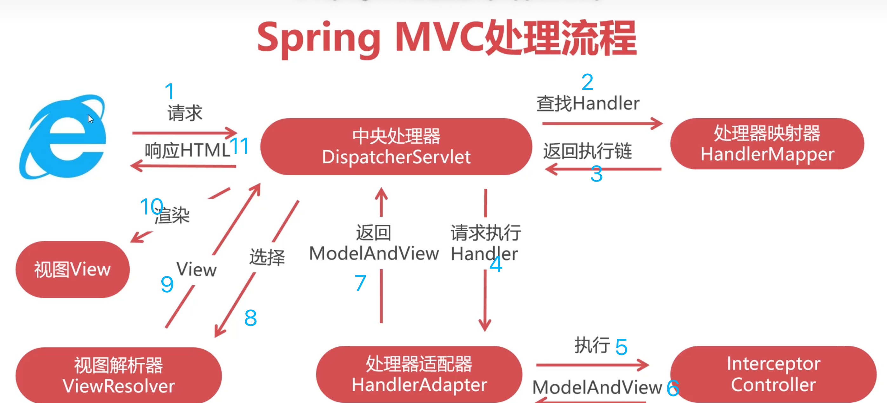

# IoC and DI
* inversion of control. developer control -> framework control
* dependency injection: how to implement IoC
* Spring IoC container
* bean: objects managed by Spring IoC container
## Bean lifecycle
* IoC container prepares to init
* objects call constructors
* inject fields into objects
* object calls init-method, `@PreDestroy`
* IoC container finishes initiation
* run business codes
* IoC container prepare to be destroy, `@PostConstruct`
* object calls destroy-method
* IoC container is destroyed
## Annotation
### Configuration Class
* `@Bean`: on method, returned object is bean, bean id is method name
* `@Configuration`: configuration class
* `@Scope`
  - singleton: default; constructed when IoC container starts, unless postpone construction by "lazy-init" until using
  ```
  @Bean
  @Scope(value = ConfigurableBeanFactory.SCOPE_SINGLETON)
  public Person personSingleton() {
      return new Person();
  }
  ```
  - prototype: constructed when getBean() or injected; not managed by IoC container, will not trigger destroy-method, will destory by GC;
  - request
  - session
  - application
  - websocket
* `@Primary`: inject this object among objects of the same type, on `@Bean` or `@Component`
* `@ComponentScan(basePackages="")`

### Injection
* `@Resource`: by name first, then by class
* `@Autowired`: by class
* `@Inject`: by class, not support “required”
* `@Named`: by name

* `@Value(${metaDate}`
* `@ConfigurationProperties(prefix = "school")`: https://www.baeldung.com/configuration-properties-in-spring-boot

### MVC
* `@Component`: on class
* `@RestController`
* `@Service`
* `@Repository`
* `@Mapper`: MyBatis annotation, using it can get rid of `@MapperScan(basePackages = "")`

#### Controller
* `@RequestMapping`: on class
* `@GetMapping`, etc
* `@PathVariable`
```java
@GetMapping("/api/employees/{id}/{name}")
@ResponseBody
public String getEmployeesByIdAndName(@PathVariable String id, @PathVariable String name) {
    return "ID: " + id + ", name: " + name;
}
```
```java
// can also handle the optional path variables
@GetMapping("/api/employeeswithmapvariable/{id}/{name}")
@ResponseBody
public String getEmployeesByIdAndNameWithMapVariable(@PathVariable Map<String, String> pathVarsMap) {
    String id = pathVarsMap.get("id");
    String name = pathVarsMap.get("name");
    if (id != null && name != null) {
        return "ID: " + id + ", name: " + name;
    } else {
        return "Missing Parameters";
    }
}
```
```java
@GetMapping(value = { "/api/employeeswithrequiredfalse", "/api/employeeswithrequiredfalse/{id}" })
@ResponseBody
public String getEmployeesByIdWithRequiredFalse(@PathVariable(required = false) String id) {
    if (id != null) {
        return "ID: " + id;
    } else {
        return "ID missing";
    }
}
```
```java
@GetMapping(value = { "/api/employeeswithoptional", "/api/employeeswithoptional/{id}" })
@ResponseBody
public String getEmployeesByIdWithOptional(@PathVariable Optional<String> id) {
    if (id.isPresent()) {
        return "ID: " + id.get();
    } else {
        return "ID missing";
    }
}
```
* `@RequestBody`
```java
@PostMapping("/request")
public ResponseEntity postController(
  @RequestBody LoginForm loginForm) {

    exampleService.fakeAuthenticate(loginForm);
    return ResponseEntity.ok(HttpStatus.OK);
}
```
```java
public class LoginForm {
    private String username;
    private String password;
    // ...
}
```
```
curl -i \
-H "Accept: application/json" \
-H "Content-Type:application/json" \
-X POST --data
  '{"username": "johnny", "password": "password"}' "https://localhost:8080/.../request"
```
* `@RequestParam`
```java
@PostMapping("/api/foos")
@ResponseBody
public String addFoo(@RequestParam(name = "id") String fooId, @RequestParam String name) {
    return "ID: " + fooId + " Name: " + name;
}
```
```
http://localhost:8080/api/foos?id=1&name=somename
```
```java
@GetMapping("/api/foos")
@ResponseBody
public String getFoos(@RequestParam(required = false) String id) {
    return "ID: " + id;
}
```
```Java
@GetMapping("/api/foos")
@ResponseBody
public String getFoos(@RequestParam Optional<String> id){
    return "ID: " + id.orElseGet(() -> "not provided");
}
```
```java
@GetMapping("/api/foos")
@ResponseBody
public String getFoos(@RequestParam(defaultValue = "test") String id) {
    return "ID: " + id;
}
```
```java
@PostMapping("/api/foos")
@ResponseBody
public String updateFoos(@RequestParam Map<String,String> params) {
    return "Parameters are " + params.entrySet();
}
```
```java
@GetMapping("/api/foos")
@ResponseBody
public String getFoos(@RequestParam List<String> id) {
    return "IDs are " + id;
}
```
```
http://localhost:8080/spring-mvc-basics/api/foos?id=1,2,3
----
IDs are [1,2,3]
```
```
http://localhost:8080/spring-mvc-basics/api/foos?id=1&id=2
----
IDs are [1,2]
```

### Cache
* `@EnableCaching`: on configuration class
* `@Cacheable`
* `@CacheEvict`
```java
@Cacheable(value = "::user", key="{#userId}", cacheManager = "cacheManager1Hour")
  @Override
  public User getUser(Integer userId) {
    User user = userMapper.selectByPrimaryKey(userId);
    try {
      Thread.sleep(5000);
    } catch (InterruptedException e) {
      e.printStackTrace();
    }
    return user;
  }

  @CacheEvict(value = "::user", key = "#userId")
  @Override
  public void deleteUserFromCache(Integer userId) {
    // Intentionally blank
  }
```
* `@CachePut`: `@Cacheable` will skip running the method, whereas `@CachePut` will actually run the method and then put its results in the cache
```java
@CachePut(value="addresses", condition="#customer.name=='Tom'")
public String getAddress(Customer customer) {...}
```
```java
@CachePut(value="addresses", unless="#result.length()<64")
public String getAddress(Customer customer) {...}
```
* `@CacheConfig`: on the class level to avoid declaring many times
```
@CacheConfig(cacheNames={"addresses"})
public class CustomerDataService {

@Cacheable
public String getAddress(Customer customer) {...}
```
Reference: https://www.baeldung.com/spring-cache-tutorial

### Schedule
* `@Scheduled(fixedDelay=5000)`: https://www.baeldung.com/spring-scheduled-tasks


# Configuration
* XML
* class
* annotation

# AOP
* aspect: a class that cuts across many classes, `@Aspect`
* join point: a point during the execution of a program
  - `JoinPoint`
  - `ProceedingJoinPoint`: besides functionality of `JoinPoint`, can control whether the target method is executed or not
* advice: action
  - before
  - after returning
  - after throwing
  - after: after normal or exceptional return
  - around
* pointcut: a predicate that matches join points to run advice
  - `*`
  - `..`: package wildcard
  - `(..)`: parameter wildcard
  ```
  execution(public * com.ll..*.*(..)) // all methods of all classes in package com.ll
  execution(* com.ll..*Service.*(..)) // only to services
  execution(String com.ll..*Service.*(..)) // only to methods returning String
  execution(* com.ll..*Service.create*(..)) // method name
  execution(* com.ll..*Service.*(String,*)) // parameter
  ```
* target object: object being advised by aspects
## Implementation
* if target class is interface, use JDK dynamic proxy, otherwise use CGLIB

# Declarative transactions
* uses TransactionManager
* is AOP around advice in nature
## Propagation
* PROPAGATION_REQUIRED: default. If current transaction exist, join, otherwise create a new transaction for itself
```java
@Transactional(propagation = Propagation.REQUIRED)
public void testMain(){
    methodA(a1);
    testB();    
}
@Transactional(propagation = Propagation.REQUIRED)
public void testB(){
    methodB(b1);  
    throw Exception;     
    methodB(b2);  
}
// testMain and testB are rollback
```
```java
public void testMain(){
    methodA(a1);  
    testB();    
}
@Transactional(propagation = Propagation.REQUIRED)
public void testB(){
    methodB(b1);  
    throw Exception;    
    methodB(b2);  
}
// testB creates a new transaction and will roll back. testMain does not have a transaction.
// a1 is saved into DB. b1 and b2 are not saved into DB.
```
* PROPAGATION_SUPPORTS: If current transaction exist, join, otherwise execute without transaction
```java
public void testMain(){
    methodA(a1);  
    testB();    
}
@Transactional(propagation = Propagation.SUPPORTS)
public void testB(){
    methodB(b1);
    throw Exception;     
    methodB(b2);
}
// a1 and b1 are saved to DB. b2 is not.
// if testB is required, no data is saved.
```
* PROPAGATION_MANDATORY: If current transaction exist, join, otherwise throw an exception
```java
public void testMain(){
    methodA(a1);  
    testB();    
}
@Transactional(propagation = Propagation.MANDATORY)
public void testB(){
    methodB(b1);  
    throw Exception;
    methodB(b2);  
}
// a1 is saved to DB. b1 and b2 are not.
```
* PROPAGATION_REQUIRES_NEW: Create a new transaction. If current transaction exist, suspend the current transaction.
```java
@Transactional(propagation = Propagation.REQUIRED)
public void testMain(){
    methodA(a1);  
    testB();    
    throw Exception;    
}
@Transactional(propagation = Propagation.REQUIRES_NEW)
public void testB(){
    methodB(b1);  
    methodB(b2);  
}
// a1 is not saved. b1 and b2 are saved.
// if testB is required, no data is saved.
```
* PROPAGATION_NOT_SUPPORTED: Execute without transaction. If current transaction exist, suspend the current transaction.
```java
@Transactional(propagation = Propagation.REQUIRED)
public void testMain(){
    methodA(a1);  
    testB();    
}
@Transactional(propagation = Propagation.NOT_SUPPORTED)
public void testB(){
    methodB(b1);  
    throw Exception;     
    methodB(b2);  
}
// a1 and b2 are not saved. b1 is saved. testB throws an exception, which causes testMain to roll back.
```
* PROPAGATION_NEVER: Execute non-transactionally, throw an exception if a transaction exists.
```java
@Transactional(propagation = Propagation.REQUIRED)
public void testMain(){
    A(a1);  //调用A入参a1
    testB();    //调用testB
}
@Transactional(propagation = Propagation.NEVER)
public void testB(){
    B(b1);  //调用B入参b1
    B(b2);  //调用B入参b2
}
// no data is saved, because testB throws an exception due to "NEVER"
```
* PROPAGATION_NESTED: If current transaction exists, nest a transaction, otherwise create a new transaction for itself. If parent transaction rolls back, the child transaction also rolls back.
```java
@Transactional(propagation = Propagation.REQUIRED)
public void testMain(){
    methodA(a1);  
    testB();    
    throw Exception;     
}
@Transactional(propagation = Propagation.NESTED)
public void testB(){
    methodB(b1);  
    methodB(b2);  
}

// no data is not saved.
```
```java
@Transactional(propagation = Propagation.REQUIRED)
public void testMain(){
    A(a1);  //调用A入参a1
    try{
        testB();    //调用testB
    }catch（Exception e){

    }
    A(a2);
}
@Transactional(propagation = Propagation.NESTED)
public void testB(){
    B(b1);  //调用B入参b1
    throw Exception;     //发生异常抛出
    B(b2);  //调用B入参b2
}
// a1 and a2 are saved. b1 and b2 are not. testMain catches, so only testB rolls back.
// if testB is REQUIRED, no data is saved even if testMain catches.
```


# Spring MVC HandlerInterceptor
* https://blog.csdn.net/fly910905/article/details/86537648
* servlet filter -> interceptor -> controller advice -> aspect -> controller
```java
package com.ll.demo.restful.interceptor;

import org.slf4j.Logger;
import org.slf4j.LoggerFactory;
import org.springframework.web.servlet.HandlerInterceptor;

import javax.servlet.http.HttpServletRequest;
import javax.servlet.http.HttpServletResponse;

public class AccessHistoryInterceptor implements HandlerInterceptor {
    private Logger logger = LoggerFactory.getLogger(AccessHistoryInterceptor.class);

    public boolean preHandle(HttpServletRequest request, HttpServletResponse response, Object handler) throws Exception {
        StringBuilder log = new StringBuilder();
        log.append(request.getRemoteAddr());
        log.append("|");
        log.append(request.getRequestURL());
        log.append("|");
        log.append(request.getHeader("user-agent"));
        logger.info(log.toString());
        return true; // request can pass
    }
}
```
* handler is either an inceptor or a controller
* prehandle() – called before the execution of the actual handler
* postHandle() – called after the handler is executed
* afterCompletion() – called after the complete request is finished and the view is generated
* process


# Spring Cloud
TODO
