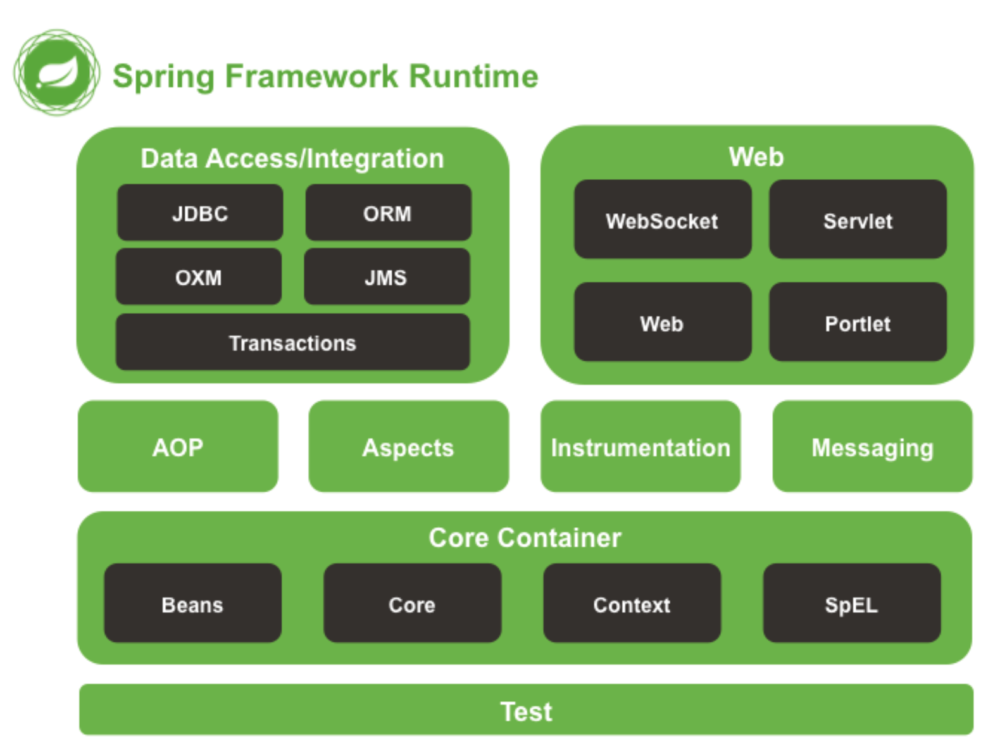
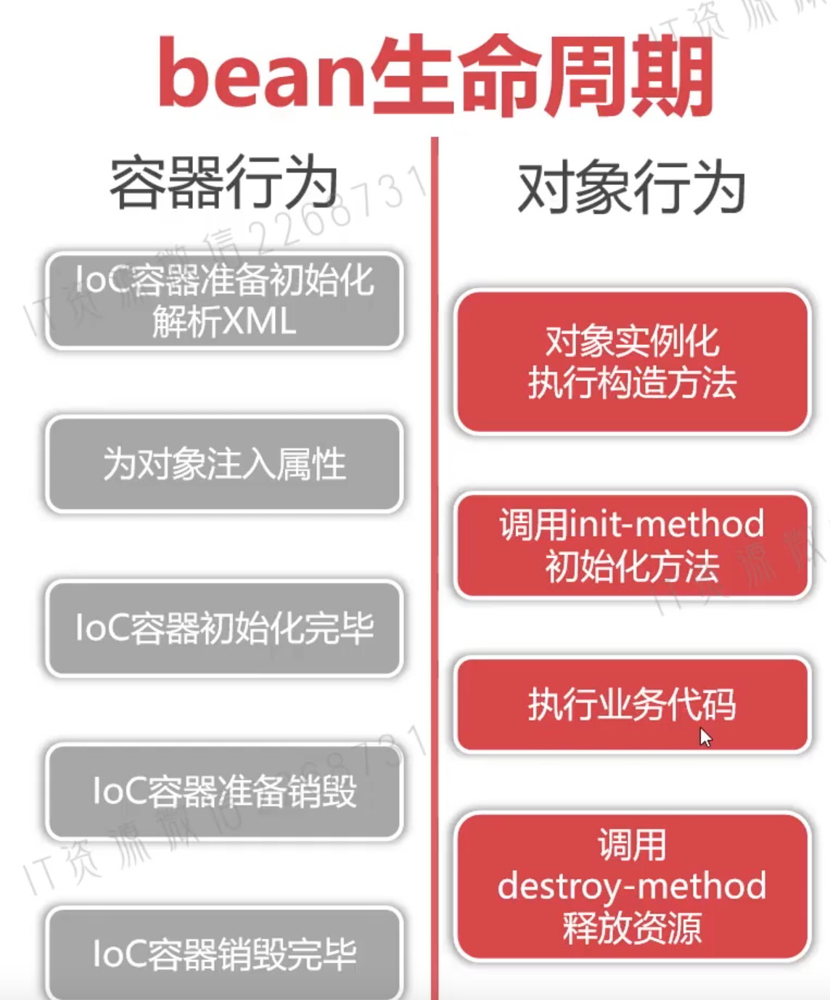

## What
Spring Framework is a Java platform that provides comprehensive <u>infrastructure</u> support for developing Java applications.

Portlet has been removed
* Spring Core: IoC / DI
* Spring AOP: Aspect-oriented-programming implementation
* Spring Aspects: supports integration with AspectJ
* Spring JDBC: connects to databases
* Spring JMS: Java message service
* Spring ORM: supports ORM tools such as Hibernate
* Spring Web: supports creating web application
* Spring Test: JUnit, TestNG

## IoC and Spring IoC

## Dependency Injection


## Configure Application Context
* XML
  ```XML
    <beans xmlns="http://www.springframework.org/schema/beans"
         xmlns:xsi="http://www.w3.org/2001/XMLSchema-instance"
         xsi:schemaLocation="http://www.springframework.org/schema/beans
          https://www.springframework.org/schema/beans/spring-beans.xsd
  				http://www.springframework.org/schema/context
          https://www.springframework.org/schema/context/spring-context.xsd">

        <!-- inject value -->
        <bean id="sweetApple" class="com.ll.spring.ioc.entity.Apple">
          <property name="title" value="红富士"></property>
          <property name="origin" value="欧洲"></property>
        </bean>

        <!-- inject an object using setter -->
        <bean id="lily" class="com.ll.spring.ioc.entity.Child">
            <property name="name" value="莉莉"/>
            <property name="apple" ref="sweetApple"/>
        </bean>

        <!-- constructor -->
        <bean id="andy" class="com.ll.spring.ioc.entity.Child">
        		<constructor-arg name="name" value="Andy"/>
        		<constructor-arg name="apple" ref="sourApple"/>
        </bean>

        <!--static factory-->
        <bean id="apple4" class="com.ll.spring.ioc.factory.AppleStaticFactory"
              factory-method="createSweetApple"/>

        <!--factory instance-->
        <bean id="factoryInstance" class="com.ll.spring.ioc.factory.AppleFactoryInstance"/>
        <bean id="apple5" factory-bean="factoryInstance" factory-method="createSweetApple"/>

        <bean id="company" class="com.ll.spring.ioc.entity.Company">

            <property name="list1">
              <!-- inject a list of values-->
              <list>
                <value>1</value>
              </list>
            </property>

            <property name="list2">
              <!-- inject a list of objects-->
              <list>
                <ref bean="beanId"></ref>
              </list>
            </property>

            <property name="rooms1">
                <!-- inject a set of values-->
                <set>
                    <value>room1</value>
                </set>
            </property>

            <property name="rooms2">
                <!-- inject a set of objects-->
                <set>
                    <ref bean="beanId"></ref>
                </set>
            </property>

            <property name="computers">
                <map>
                    <entry key="dev-88172" value-ref="computer1"/>
                    <entry key="dev-88173">
                        <!-- String[] beanNames = context.getBeanDefitionNames() will not get inner beans -->
                        <bean class="com.ll.spring.ioc.entity.Computer">
                            <constructor-arg name="brand" value="联想"/>
                            <constructor-arg name="type" value="笔记本"/>
                        </bean>
                    </entry>
                </map>
            </property>

            <property name="computers">
                <map>
                    <entry key="k1" value="v1"/>
                </map>
            </property>

            <property name="info">
                <props>
                    <prop key="phone">010-12345678</prop>
                    <prop key="address">北京市朝阳区XX路XX大厦</prop>
                </props>
            </property>
        </bean>

        <!--init-method, destroy-method -->
        <bean id="order1" class="com.ll.spring.ioc.entity.Order" init-method="init" destroy-method="destroy">
            <property name="price" value="19.8"/>
            <property name="quantity" value="1000"/>
        </bean>
    </beans>

    <!--通知Spring IoC容器初始化时加载属性文件-->
    <context:property-placeholder location="classpath:config.properties"/>

    <!-- 在IoC容器初始化时自动扫描四种组件类型注解并完成实例化
            @Repository
            @Service
            @Controller
            @Component
         -->
    <context:component-scan base-package="com.ll"/>


  ```
    - id and name
      - camel naming
      - cannot repeat in the same xml file
      - name allows multiple aliases
* Java config

## config.properties
```
metaData=ll.com
connection.driver=xxxxx
connection.url=xxx
connection.username=xxx
connection.password=xxx
```

## xxApplication.java
```
// use XML
String[] configLocations = new String[]{"classpath:applicationContext-1.xml","classpath:applicationContext-2.xml"};
ApplicationContext context = new ClassPathXmlApplicationContext(configLocations);

// use Java config
ApplicationContext context = new AnnotationConfigApplicationContext(Config.class);
```


## @RestController vs @Controller
 * @Controller without @ResponseBoby returns a view, used when you don't want to separate front end and back end
 * @RestController returns JSON or XML
 * @Controller + @ResponseBody = @RestController


## AOP
* Aspect Oriented Programming
* Aspect
* Target class / method
* PointCut
* JoinPoint
* Advice

### Spring AOP
#### Steps
* dependency
* create an Aspect class
  ```Java
  package com.ll.spring.aop.aspect;

  import org.aspectj.lang.JoinPoint;

  import java.text.SimpleDateFormat;
  import java.util.Date;

  //切面类
  public class MethodAspect {
      //切面方法,用于扩展额外功能
      //JoinPoint 连接点,通过连接点可以获取目标类/方法的信息
      public void printExecutionTime(JoinPoint joinPoint){
          SimpleDateFormat sdf = new SimpleDateFormat("yyyy-MM-dd HH:mm:ss SSS");
          String now = sdf.format(new Date());
          String className = joinPoint.getTarget().getClass().getName();//获取目标类的名称
          String methodName = joinPoint.getSignature().getName();//获取目标方法名称
          System.out.println("---->" + now + ":" + className + "." + methodName);
          Object[] args = joinPoint.getArgs();
          System.out.println("---->参数个数:" + args.length);
          for (Object arg:args) {
              System.out.println("---->参数:" + arg);
          }
      }

      public void doAfterReturning(JoinPoint joinPoint, Object ret){
          System.out.println("<----返回后通知:" + ret);
      }
      public void doAfterThrowing(JoinPoint joinPoint, Throwable th){
          System.out.println("<----异常通知:" + th.getMessage());
      }
      public void doAfter(JoinPoint joinPoint){
          System.out.println("<----触发后置通知");
      }
  }

  ```
* configure Aspect Bean
  ```XML
  <?xml version="1.0" encoding="UTF-8"?>
  <beans xmlns:xsi="http://www.w3.org/2001/XMLSchema-instance"
         xmlns:context="http://www.springframework.org/schema/context"
         xmlns:aop="http://www.springframework.org/schema/aop"
         xmlns="http://www.springframework.org/schema/beans"
         xsi:schemaLocation="http://www.springframework.org/schema/beans
          http://www.springframework.org/schema/beans/spring-beans.xsd
          http://www.springframework.org/schema/context
          http://www.springframework.org/schema/context/spring-context.xsd
          http://www.springframework.org/schema/aop
          http://www.springframework.org/schema/aop/spring-aop.xsd">
      <bean id="userDao" class="com.ll.spring.aop.dao.UserDao"/>
      <bean id="employeeDao" class="com.ll.spring.aop.dao.EmployeeDao"/>
      <bean id="userService" class="com.ll.spring.aop.service.UserService">
          <property name="userDao" ref="userDao"/>
      </bean>
      <bean id="employeeService" class="com.ll.spring.aop.service.EmployeeService">
          <property name="employeeDao" ref="employeeDao"/>
      </bean>
      <!-- AOP配置 -->
      <bean id="methodAspect" class="com.ll.spring.aop.aspect.MethodAspect"></bean>
      <aop:config>
          <!-- PointCut 切点,使用execution表达式描述切面的作用范围 -->
          <!-- execution(public * com.ll..*.*(..)) 说明切面作用在com.ll包下的所有类的所有方法上 -->
          <!--public void com.ll.service.UserService.createUser(param1, param2, ..) -->
          <!-- can omit public -->
          <!--<aop:pointcut id="pointcut" expression="execution(public * com.ll..*.*(..))"></aop:pointcut>-->
          <!--只对所有Service类生效-->
          <aop:pointcut id="pointcut" expression="execution(* com.ll..*Service.*(..))"></aop:pointcut>
          <!--只对所有返回值为String类型方法生效-->
          <!--<aop:pointcut id="pointcut" expression="execution(String com.ll..*Service.*(..))"></aop:pointcut>-->
          <!--对方法名进行约束 -->
          <!--<aop:pointcut id="pointcut" expression="execution(* com.ll..*Service.create*(..))"></aop:pointcut>-->
          <!-- 对参数进行约束 -->
          <!--<aop:pointcut id="pointcut" expression="execution(* com.ll..*Service.*(String,*))"></aop:pointcut>-->
          <!-- 定义切面类 -->
          <aop:aspect ref="methodAspect">
              <!-- before通知(Advice),代表在目标方法运行前先执行methodAspect.printExecutionTime() -->
              <aop:before method="printExecutionTime" pointcut-ref="pointcut"/>
              <aop:after-returning method="doAfterReturning" returning="ret" pointcut-ref="pointcut"/>
              <aop:after-throwing method="doAfterThrowing" throwing="th" pointcut-ref="pointcut"/>
              <aop:after method="doAfter" pointcut-ref="pointcut"></aop:after>
          </aop:aspect>
      </aop:config>
  </beans>
  ```
* PointCut
  - * 通配符
  - .. 包通配符
  - (..) 参数通配符
* Advice
  - Before Advice: before target method executed
  - After Returning Advice
  - After Throwing Advice
  - After Advice
  - Around Advice
  ```Java
  package com.ll.spring.aop.aspect;

  import org.aspectj.lang.ProceedingJoinPoint;

  import java.text.SimpleDateFormat;
  import java.util.Date;

  public class MethodChecker {
      ////ProceedingJoinPoint是JoinPoint的升级版,在原有功能外,还可以控制目标方法是否执行
      public Object check(ProceedingJoinPoint pjp) throws Throwable {
          try {
              long startTime = new Date().getTime();
              Object ret = pjp.proceed();//执行目标方法
              long endTime = new Date().getTime();
              long duration = endTime - startTime; //执行时长
              if (duration >= 1000) {
                  String className = pjp.getTarget().getClass().getName();
                  String methodName = pjp.getSignature().getName();
                  SimpleDateFormat sdf = new SimpleDateFormat("yyyy-MM-dd HH:mm:ss SSS");
                  String now = sdf.format(new Date());
                  System.out.println("=======" + now + ":" + className + "." + methodName + "(" + duration + "ms)======");
              }
              return ret;
          } catch (Throwable throwable) {
              System.out.println("Exception message:" + throwable.getMessage());
              throw throwable;
          }
      }
  }
  ```
  ```XML
  <bean id="methodChecker" class="com.ll.spring.aop.aspect.MethodChecker"></bean>
  <aop:config>
      <aop:pointcut id="pointcut" expression="execution(* com.ll..*.*(..))"></aop:pointcut>
      <aop:aspect ref="methodChecker">
          <!--环绕通知-->
          <aop:around method="check" pointcut-ref="pointcut"/>
      </aop:aspect>
  </aop:config>
  ```

### Application
* log slow methods
### Annotation
* need `<aop:aspectj-autoproxy/>` in applicationContext.xml to use annotations
* `@Component` and `@Aspect` on the Aspect class
* `@Around("execution(* com.ll..*Service.*(..))")` on the method


### 实现原理
* design pattern is proxy; 代理模式中，代理类和委托类实现相同接口；代理类持有委托类对象；可以有多个代理类，代理类1对象持有代理类2对象
* if the target class implements an interface, use JDK dynamic proxy
  ```Java
  package com.ll.spring.aop.service;

  import java.lang.reflect.InvocationHandler;
  import java.lang.reflect.Method;
  import java.lang.reflect.Proxy;
  import java.text.SimpleDateFormat;
  import java.util.Date;

  /**
   * InvocationHandler是JDK提供的反射类,用于在JDK动态代理中对目标方法进行增强
   * InvocationHandler实现类与切面类的环绕通知类似
   */
  public class ProxyInvocationHandler implements InvocationHandler {
      private Object target;//目标对象
      private ProxyInvocationHandler(Object target){
          this.target = target;
      }
      /**
       * 在invoke()方法对目标方法进行增强
       * @param proxy 代理类对象
       * @param method 目标方法对象
       * @param args 目标方法实参
       * @return 目标方法运行后返回值
       * @throws Throwable 目标方法抛出的异常
       */
      public Object invoke(Object proxy, Method method, Object[] args) throws Throwable {
          System.out.println("=====" + new SimpleDateFormat("yyyy-MM-dd HH:mm:ss SSS").format(new Date()) +"=========");
          Object ret = method.invoke(target, args);//调用目标方法,ProceedingJoinPoint.proceed()
          return ret;
      }

      public static void main(String[] args) {
          UserService userService = new UserServiceImpl();
          ProxyInvocationHandler invocationHandler = new ProxyInvocationHandler(userService);
          //动态创建代理类
          UserService userServiceProxy = (UserService)Proxy.newProxyInstance(userService.getClass().getClassLoader(),
                  userService.getClass().getInterfaces(),
                  invocationHandler);
          userServiceProxy.createUser();

          //动态代理,必须实现接口才可以运行
          EmployeeService employeeService = new EmployeeServiceImpl();
          EmployeeService employeeServiceProxy = (EmployeeService)Proxy.newProxyInstance(employeeService.getClass().getClassLoader(),
                  employeeService.getClass().getInterfaces(),
                  new ProxyInvocationHandler(employeeService));
          employeeServiceProxy.createEmployee();
      }
  }

  ```
* if the target class does not implement an interface, use CGLib
  - CGLib 是运行时字节码增强技术
  - AOP运行时生成目标继承类字节码，进行行为扩展
### Spring AOP vs AspectJ AOP
* Spring AOP uses AspectJ Weaver to match classes and methods


## Bean

### Configure Bean
* XML: better for maintenance at a large company
* Annotation: faster to write, more readable, suitable for light app
* Java config: avoid XML, avoid making annotations everywhere, check dependencies during compilation to prevent errors, agile

### Bean Scope
* singleton: constructed when IoC container starts, unless postpone construction by "lazy-init" until using; default
* prototype: constructed when getBean() or injected; not managed by IoC container, will not trigger destroy-method, will destory by GC;
* request
* session
* application
* websocket


### Bean Lifecycle


### Get bean
```
Apple sweetApple1 = context.getBean("sweetApple", Apple.class);
Apple sweetApple2 = (Apple)context.getBean("sweetApple");
```

### @Component vs @Bean


Reference: https://springframework.guru/spring-framework-annotations/


## Annotation
### Spring Framework Stereotype Annotations
* `@Component`: will be created and managed by IoC container
* `@Controller`: request and response
* `@service`: business logic
* `@Repository`: persistency

### Injection Annotations
* `@Autowired`: by class
* `@Inject`: by class, not support "required"
* `@Named`: by name
* `@Resource`: by name first, then by class

### Meta Annotations
* `@Primary`: inject this object among objects of the same type
* `@PostConstruct`: on a method, "init-method"
* `@PreDestroy`: on a method, "destroy-method"
* `@Scope`
* `@Value`: inject value, e.g. `@Value(${metaDate})` // get metaData in config.properties, which need to be configured in applicationContext.xml

### Java Config Annotations
* `@Configuration`: 当前类是一个配置类,用于替代applicationContext.xml
* `@ComponentScan(basePackages = "com.ll")`
* `@Bean`: Java Config利用方法创建对象,将方法返回对象放入容器,beanId=方法名
* `@ImportResource`: `@ImportResource({"classpath*:applicationContext.xml"})`
 ... To be continued


## Spring JDBC
### Steps
* dependency
* applicationContext.xml配置DataSource数据源
  ```XML
  <?xml version="1.0" encoding="UTF-8"?>
  <beans xmlns="http://www.springframework.org/schema/beans"
         xmlns:xsi="http://www.w3.org/2001/XMLSchema-instance"
         xmlns:context="http://www.springframework.org/schema/context"
         xsi:schemaLocation="http://www.springframework.org/schema/beans
          https://www.springframework.org/schema/beans/spring-beans.xsd
          http://www.springframework.org/schema/context
          https://www.springframework.org/schema/context/spring-context.xsd">
      <!-- 数据源 -->
      <bean id="dataSource" class="org.springframework.jdbc.datasource.DriverManagerDataSource">
          <property name="driverClassName" value="com.mysql.cj.jdbc.Driver"/>
          <property name="url"
                    value="jdbc:mysql://localhost:3306/ll?useSSL=false&amp;useUnicode=true&amp;characterEncoding=UTF-8&amp;serverTimezone=Asia/Shanghai&amp;allowPublicKeyRetrieval=true"/>
          <property name="username" value="root"/>
          <property name="password" value="root"/>
      </bean>
      <!--JdbcTemplate提供数据CRUD的API-->
      <bean id="jdbcTemplate" class="org.springframework.jdbc.core.JdbcTemplate">
          <property name="dataSource" ref="dataSource"/>
      </bean>

      <bean id="employeeDao" class="com.ll.spring.jdbc.dao.EmployeeDao">
          <!--为Dao注入JdbcTemplate对象-->
          <property name="jdbcTemplate" ref="jdbcTemplate"/>
      </bean>

      <bean id="employeeService" class="com.ll.spring.jdbc.service.EmployeeService">
          <property name="employeeDao" ref="employeeDao"/>
          <property name="transactionManager" ref="transactionManager"/>
      </bean>
      <!--事务管理器-->
      <bean id="transactionManager" class="org.springframework.jdbc.datasource.DataSourceTransactionManager">
          <property name="dataSource" ref="dataSource"></property>
      </bean>
  </beans>
  ```
* 在Dao注入JdbcTemplate对象,实现数据CRUD
  ```Java
  package com.ll.spring.jdbc.dao;

  import com.ll.spring.jdbc.entity.Employee;
  import org.springframework.jdbc.core.BeanPropertyRowMapper;
  import org.springframework.jdbc.core.JdbcTemplate;

  import java.util.List;
  import java.util.Map;

  public class EmployeeDao {
      private JdbcTemplate jdbcTemplate;

      public Employee findById(Integer eno){
          String sql = "select * from employee where eno = ?";
          //查询单条数据
          Employee employee = jdbcTemplate.queryForObject(sql, new Object[]{eno}, new BeanPropertyRowMapper<Employee>(Employee.class));
          return employee;
      }

      public List<Employee> findByDname(String dname){
          String sql = "select * from employee where dname = ?";
          //查询复合数据
          List<Employee> list = jdbcTemplate.query(sql, new Object[]{dname}, new BeanPropertyRowMapper<Employee>(Employee.class));
          return list;
      }

      public List<Map<String, Object>> findMapByDname(String dname){
          String sql = "select eno as empno , salary as s from employee where dname = ?";
          //将查询结果作为Map进行封装
          List<Map<String, Object>> maps = jdbcTemplate.queryForList(sql, new Object[]{dname});
          return maps;
      }

      public void insert(Employee employee){
          String sql = "insert into employee(eno,ename,salary,dname,hiredate) values(?,?,?,?,?)";
          //利用update方法实现数据写入操作
          jdbcTemplate.update(sql, new Object[]{
             employee.getEno() , employee.getEname(),employee.getSalary(),employee.getDname() , employee.getHiredate()
          });
      }

      public int update(Employee employee){
          String sql = "UPDATE employee SET ename = ?, salary = ?, dname = ?, hiredate = ? WHERE eno = ?";
          int count = jdbcTemplate.update(sql, new Object[]{employee.getEname(), employee.getSalary(), employee.getDname(), employee.getHiredate(), employee.getEno()});
          return count;
      }

      public int delete(Integer eno){
          String sql = "delete from employee where eno = ?";
          return jdbcTemplate.update(sql, new Object[]{eno});
      }


      public JdbcTemplate getJdbcTemplate() {
          return jdbcTemplate;
      }

      public void setJdbcTemplate(JdbcTemplate jdbcTemplate) {
          this.jdbcTemplate = jdbcTemplate;
      }
  }

  ```
### 编程式事务
* 通过代码手动提交回滚事务；Transaction Manageer提供commit/rollback方法
### 声明式事务
* 用配置或注解
* 本质是AOP环绕通知
* 目标方法执行时，提交事务
* 目标方法抛出异常时，回滚
* steps
  - 配置TransactionManager事务管理器
  - 配置事务通知与事务属性
  - 为事务通知绑定PointCut切点
  ```
  <?xml version="1.0" encoding="UTF-8"?>
  <beans xmlns="http://www.springframework.org/schema/beans"
         xmlns:xsi="http://www.w3.org/2001/XMLSchema-instance"
         xmlns:context="http://www.springframework.org/schema/context"
         xmlns:tx="http://www.springframework.org/schema/tx"
         xmlns:aop="http://www.springframework.org/schema/aop"
         xsi:schemaLocation="http://www.springframework.org/schema/beans
          https://www.springframework.org/schema/beans/spring-beans.xsd
          http://www.springframework.org/schema/context
          https://www.springframework.org/schema/context/spring-context.xsd
          http://www.springframework.org/schema/tx
          https://www.springframework.org/schema/tx/spring-tx.xsd
          http://www.springframework.org/schema/aop
          https://www.springframework.org/schema/aop/spring-aop.xsd">
      <!-- 数据源 -->
      <bean id="dataSource" class="org.springframework.jdbc.datasource.DriverManagerDataSource">
          <property name="driverClassName" value="com.mysql.cj.jdbc.Driver"/>
          <property name="url"
                    value="jdbc:mysql://localhost:3306/imooc?useSSL=false&amp;useUnicode=true&amp;characterEncoding=UTF-8&amp;serverTimezone=Asia/Shanghai&amp;allowPublicKeyRetrieval=true"/>
          <property name="username" value="root"/>
          <property name="password" value="root"/>
      </bean>
      <!--JdbcTemplate提供数据CRUD的API-->
      <bean id="jdbcTemplate" class="org.springframework.jdbc.core.JdbcTemplate">
          <property name="dataSource" ref="dataSource"/>
      </bean>

      <bean id="employeeDao" class="com.imooc.spring.jdbc.dao.EmployeeDao">
          <!--为Dao注入JdbcTemplate对象-->
          <property name="jdbcTemplate" ref="jdbcTemplate"/>
      </bean>

      <bean id="employeeService" class="com.imooc.spring.jdbc.service.EmployeeService">
          <property name="employeeDao" ref="employeeDao"/>
          <property name="batchService" ref="batchService"/>
      </bean>

      <bean id="batchService" class="com.imooc.spring.jdbc.service.BatchService">
          <property name="employeeDao" ref="employeeDao"/>
      </bean>

      <!-- 1.事务管理器,用于创建事务/提交/回滚 -->
      <bean id="transactionManager" class="org.springframework.jdbc.datasource.DataSourceTransactionManager">
          <property name="dataSource" ref="dataSource"/>
      </bean>

      <!--2.事务通知配置,决定哪些方法使用事务,哪些方法不使用事务 -->
      <tx:advice id="txAdvice" transaction-manager="transactionManager">
          <tx:attributes>
              <!-- 目标方法名为batchImport时,启用声明式事务,成功提交,运行时异常回滚 -->
              <tx:method name="batchImport" propagation="REQUIRED"/>
              <tx:method name="batch*" propagation="REQUIRED"/>
              <!-- 设置所有findXXX方法不需要使用事务 -->
              <tx:method name="find*" propagation="NOT_SUPPORTED" read-only="true"/>
              <tx:method name="get*" propagation="NOT_SUPPORTED" read-only="true"/>

              <tx:method name="importJob1" propagation="REQUIRES_NEW"/>
              <tx:method name="importJob2" propagation="REQUIRES_NEW"/>
              <tx:method name="*" propagation="REQUIRED"/>
          </tx:attributes>
      </tx:advice>

      <!--3. 定义声明式事务的作用范围-->
      <aop:config>
          <aop:pointcut id="pointcut" expression="execution(* com.imooc..*Service.*(..))"/>
          <aop:advisor advice-ref="txAdvice" pointcut-ref="pointcut"/>
      </aop:config>
  </beans>
  ```
  ```
  <!-- 启用注解形式声明式事务 -->
  <tx:annotation-driven transaction-manager="transactionManager"/>
  ```
### Spring事务传播行为
* 多个拥有事务的方法在嵌套调用时的事务控制方式
* `XML:<tx:method name="..." propagation="REQUIRED"/>`
* `@Transactional(propagation=Propagation.REQUIRED)`

* 重点：PROPAGATION_REQUIRED(默认): 如果当前没有事务，就新建一个事务，如果已经存在一个事务中，加入到这个事务中。这是最常见的选择
* PROPAGATION_SUPPORTS 使用当前的事务，如果当前没有事务，就以非事务方式执行
* PROPAGATION_MANDATORY 使用当前的事务，如果当前没有事务，就抛出异常
* 重点：PROPAGATION_REQUIRES_NEW 新建事务，如果当前存在事务，把当前事务挂起
* 重点：PROPAGATION_NOT_SUPPORTED 以非事务方式执行操作，如果当前存在事务，就把当前事务挂起
* PROPAGATION_NEVER 以非事务方式执行，如果当前存在事务，则抛出异常
* PROPAGATION_NESTED 如果当前存在事务，则在嵌套事务内执行。如果当前没有事务，则执行与PROPAGATION_REQUIRED类似的操作
