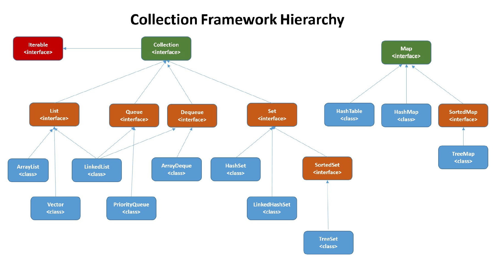

## List
* ArrayList: Object[]
* Vector: Object[], thread-safe
* LinkedList: doubly-linked

## Set
* HashSet: based on HashMap; can have null
* LinkedHashSet: extends HashSet, use LinkedHashMap
* TreeSet: RedBlackTree; cannot have null

## Map
* HashMap: if array length < 64, array + linked list, resizes the array, otherwise converts the linked list to RedBlackTree
* LinkedHashMap: extends HashMap, adds a doubly-linked list to save the order of keys
* HashTable: array + linked list; thread-safe
* TreeMap: RedBlackTree

# Thread-safe
* CopyOnWriteArrayList
* ConcurrentLinkedQueue
* BlockingQueue
* ConcurrentHashMap
* ConcurrentSkipListMap

## Why not array?
* fixed length

## Iterator
Safe: when an element is modified, throws concurrentModificationException

## ArrayList vs LinkedList
* base structure
* time complexity
* random access: Arrays.binarySearch(arr, val)
* memory: empty array cells vs pointers

## ArrayList resize

## Arrays
* `Arrays.sort(arr);` or `sort(T[] a, Comparator<? super T> c)`
* `static <T> List<T>	asList(T... a)` Returns a fixed-size list backed by the specified array.
* `Arrays.binarySearch(a, key)` or `Arrays.binarySearch(a, fromIndex, toIndex, key)`
* `static <T> T[] copyOf(T[] original, int newLength)` Copies the specified array, truncating or padding with nulls (if necessary) so the copy has the specified length.
* `copyOfRange(T[] original, int from, int to)` Copies the specified range of the specified array into a new array.
* `toString(Object[] a)`

## Collection sort
* `Collections.sort(List<T) list)`

## Comparator and Comparable
* Comparable接口可以作为实现类的默认排序算法，Comparator接口则用于一个类的扩展排序
### Comparator
* `int compare(T o1, T o2)`
### Comparable
* `int compareTo(T o)`

to do: frequently used methods
... To be continued
